<!-- markdownlint-capture -->
<!-- markdownlint-disable -->

# Code Metrics

This file is dynamically maintained by a bot, *please do not* edit this by hand. It represents various [code metrics](https://aka.ms/dotnet/code-metrics), such as cyclomatic complexity, maintainability index, and so on.

<div id='myjetwallet-connector-ftx'></div>

## MyJetWallet.Connector.Ftx :exploding_head:

The *MyJetWallet.Connector.Ftx.csproj* project file contains:

- 10 namespaces.
- 47 named types.
- 2,246 total lines of source code.
- Approximately 889 lines of executable code.
- The highest cyclomatic complexity is 22 :exploding_head:.

<details>
<summary>
  <strong id="ftxapi-enums">
    FtxApi.Enums :heavy_check_mark:
  </strong>
</summary>
<br>

The `FtxApi.Enums` namespace contains 3 named types.

- 3 named types.
- 22 total lines of source code.
- Approximately 0 lines of executable code.
- The highest cyclomatic complexity is 0 :heavy_check_mark:.

<details>
<summary>
  <strong id="ordertype">
    OrderType :heavy_check_mark:
  </strong>
</summary>
<br>

- The `OrderType` contains 2 members.
- 5 total lines of source code.
- Approximately 0 lines of executable code.
- The highest cyclomatic complexity is 0 :heavy_check_mark:.

| Member kind | Line number | Maintainability index | Cyclomatic complexity | Depth of inheritance | Class coupling | Lines of source / executable code |
| :-: | :-: | :-: | :-: | :-: | :-: | :-: |
| Field | <a href='https://github.com/MyJetWallet/MyJetWallet.Connector.Ftx/blob/master/src/MyJetWallet.Connector.Ftx/Rest/Enums/OrderType.cs#L5' title='OrderType.limit'>5</a> | 100 | 0 :heavy_check_mark: | 0 | 0 | 1 / 0 |
| Field | <a href='https://github.com/MyJetWallet/MyJetWallet.Connector.Ftx/blob/master/src/MyJetWallet.Connector.Ftx/Rest/Enums/OrderType.cs#L6' title='OrderType.market'>6</a> | 100 | 0 :heavy_check_mark: | 0 | 0 | 1 / 0 |

<a href="#OrderType-class-diagram">:link: to `OrderType` class diagram</a>

<a href="#ftxapi-enums">:top: back to FtxApi.Enums</a>

</details>

<details>
<summary>
  <strong id="sidetype">
    SideType :heavy_check_mark:
  </strong>
</summary>
<br>

- The `SideType` contains 2 members.
- 5 total lines of source code.
- Approximately 0 lines of executable code.
- The highest cyclomatic complexity is 0 :heavy_check_mark:.

| Member kind | Line number | Maintainability index | Cyclomatic complexity | Depth of inheritance | Class coupling | Lines of source / executable code |
| :-: | :-: | :-: | :-: | :-: | :-: | :-: |
| Field | <a href='https://github.com/MyJetWallet/MyJetWallet.Connector.Ftx/blob/master/src/MyJetWallet.Connector.Ftx/Rest/Enums/SideType.cs#L5' title='SideType.buy'>5</a> | 100 | 0 :heavy_check_mark: | 0 | 0 | 1 / 0 |
| Field | <a href='https://github.com/MyJetWallet/MyJetWallet.Connector.Ftx/blob/master/src/MyJetWallet.Connector.Ftx/Rest/Enums/SideType.cs#L6' title='SideType.sell'>6</a> | 100 | 0 :heavy_check_mark: | 0 | 0 | 1 / 0 |

<a href="#SideType-class-diagram">:link: to `SideType` class diagram</a>

<a href="#ftxapi-enums">:top: back to FtxApi.Enums</a>

</details>

<details>
<summary>
  <strong id="triggertype">
    TriggerType :heavy_check_mark:
  </strong>
</summary>
<br>

- The `TriggerType` contains 3 members.
- 6 total lines of source code.
- Approximately 0 lines of executable code.
- The highest cyclomatic complexity is 0 :heavy_check_mark:.

| Member kind | Line number | Maintainability index | Cyclomatic complexity | Depth of inheritance | Class coupling | Lines of source / executable code |
| :-: | :-: | :-: | :-: | :-: | :-: | :-: |
| Field | <a href='https://github.com/MyJetWallet/MyJetWallet.Connector.Ftx/blob/master/src/MyJetWallet.Connector.Ftx/Rest/Enums/TriggerType.cs#L5' title='TriggerType.stop'>5</a> | 100 | 0 :heavy_check_mark: | 0 | 0 | 1 / 0 |
| Field | <a href='https://github.com/MyJetWallet/MyJetWallet.Connector.Ftx/blob/master/src/MyJetWallet.Connector.Ftx/Rest/Enums/TriggerType.cs#L7' title='TriggerType.takeProfit'>7</a> | 100 | 0 :heavy_check_mark: | 0 | 0 | 1 / 0 |
| Field | <a href='https://github.com/MyJetWallet/MyJetWallet.Connector.Ftx/blob/master/src/MyJetWallet.Connector.Ftx/Rest/Enums/TriggerType.cs#L6' title='TriggerType.trailingStop'>6</a> | 100 | 0 :heavy_check_mark: | 0 | 0 | 1 / 0 |

<a href="#TriggerType-class-diagram">:link: to `TriggerType` class diagram</a>

<a href="#ftxapi-enums">:top: back to FtxApi.Enums</a>

</details>

</details>

<details>
<summary>
  <strong id="ftxapi">
    FtxApi :heavy_check_mark:
  </strong>
</summary>
<br>

The `FtxApi` namespace contains 2 named types.

- 2 named types.
- 666 total lines of source code.
- Approximately 223 lines of executable code.
- The highest cyclomatic complexity is 3 :heavy_check_mark:.

<details>
<summary>
  <strong id="client">
    Client :heavy_check_mark:
  </strong>
</summary>
<br>

- The `Client` contains 5 members.
- 22 total lines of source code.
- Approximately 7 lines of executable code.
- The highest cyclomatic complexity is 1 :heavy_check_mark:.

| Member kind | Line number | Maintainability index | Cyclomatic complexity | Depth of inheritance | Class coupling | Lines of source / executable code |
| :-: | :-: | :-: | :-: | :-: | :-: | :-: |
| Method | <a href='https://github.com/MyJetWallet/MyJetWallet.Connector.Ftx/blob/master/src/MyJetWallet.Connector.Ftx/Rest/Client.cs#L11' title='Client.Client()'>11</a> | 80 | 1 :heavy_check_mark: | 0 | 0 | 6 / 3 |
| Method | <a href='https://github.com/MyJetWallet/MyJetWallet.Connector.Ftx/blob/master/src/MyJetWallet.Connector.Ftx/Rest/Client.cs#L18' title='Client.Client(string apiKey, string apiSecret, string subAccount = "")'>18</a> | 74 | 1 :heavy_check_mark: | 0 | 0 | 6 / 4 |
| Property | <a href='https://github.com/MyJetWallet/MyJetWallet.Connector.Ftx/blob/master/src/MyJetWallet.Connector.Ftx/Rest/Client.cs#L5' title='string Client.ApiKey'>5</a> | 100 | 1 :heavy_check_mark: | 0 | 0 | 1 / 0 |
| Property | <a href='https://github.com/MyJetWallet/MyJetWallet.Connector.Ftx/blob/master/src/MyJetWallet.Connector.Ftx/Rest/Client.cs#L7' title='string Client.ApiSecret'>7</a> | 100 | 1 :heavy_check_mark: | 0 | 0 | 1 / 0 |
| Property | <a href='https://github.com/MyJetWallet/MyJetWallet.Connector.Ftx/blob/master/src/MyJetWallet.Connector.Ftx/Rest/Client.cs#L9' title='string Client.SubAccount'>9</a> | 100 | 1 :heavy_check_mark: | 0 | 0 | 1 / 0 |

<a href="#Client-class-diagram">:link: to `Client` class diagram</a>

<a href="#ftxapi">:top: back to FtxApi</a>

</details>

<details>
<summary>
  <strong id="ftxrestapi">
    FtxRestApi :heavy_check_mark:
  </strong>
</summary>
<br>

- The `FtxRestApi` contains 55 members.
- 639 total lines of source code.
- Approximately 216 lines of executable code.
- The highest cyclomatic complexity is 3 :heavy_check_mark:.

| Member kind | Line number | Maintainability index | Cyclomatic complexity | Depth of inheritance | Class coupling | Lines of source / executable code |
| :-: | :-: | :-: | :-: | :-: | :-: | :-: |
| Field | <a href='https://github.com/MyJetWallet/MyJetWallet.Connector.Ftx/blob/master/src/MyJetWallet.Connector.Ftx/Rest/FtxRestApi.cs#L20' title='Client FtxRestApi._client'>20</a> | 100 | 0 :heavy_check_mark: | 0 | 1 | 1 / 0 |
| Field | <a href='https://github.com/MyJetWallet/MyJetWallet.Connector.Ftx/blob/master/src/MyJetWallet.Connector.Ftx/Rest/FtxRestApi.cs#L24' title='HMACSHA256 FtxRestApi._hashMaker'>24</a> | 100 | 0 :heavy_check_mark: | 0 | 1 | 1 / 0 |
| Field | <a href='https://github.com/MyJetWallet/MyJetWallet.Connector.Ftx/blob/master/src/MyJetWallet.Connector.Ftx/Rest/FtxRestApi.cs#L22' title='HttpClient FtxRestApi._httpClient'>22</a> | 100 | 0 :heavy_check_mark: | 0 | 1 | 1 / 0 |
| Field | <a href='https://github.com/MyJetWallet/MyJetWallet.Connector.Ftx/blob/master/src/MyJetWallet.Connector.Ftx/Rest/FtxRestApi.cs#L26' title='long FtxRestApi._nonce'>26</a> | 100 | 0 :heavy_check_mark: | 0 | 0 | 1 / 0 |
| Field | <a href='https://github.com/MyJetWallet/MyJetWallet.Connector.Ftx/blob/master/src/MyJetWallet.Connector.Ftx/Rest/FtxRestApi.cs#L28' title='string FtxRestApi._urlEncodedSubAccount'>28</a> | 100 | 0 :heavy_check_mark: | 0 | 0 | 1 / 0 |
| Method | <a href='https://github.com/MyJetWallet/MyJetWallet.Connector.Ftx/blob/master/src/MyJetWallet.Connector.Ftx/Rest/FtxRestApi.cs#L30' title='FtxRestApi.FtxRestApi(Client client)'>30</a> | 71 | 2 :heavy_check_mark: | 0 | 5 | 16 / 5 |
| Method | <a href='https://github.com/MyJetWallet/MyJetWallet.Connector.Ftx/blob/master/src/MyJetWallet.Connector.Ftx/Rest/FtxRestApi.cs#L592' title='Task<string> FtxRestApi.CallAsync(HttpMethod method, string endpoint, string body = null)'>592</a> | 66 | 2 :heavy_check_mark: | 0 | 6 | 19 / 7 |
| Method | <a href='https://github.com/MyJetWallet/MyJetWallet.Connector.Ftx/blob/master/src/MyJetWallet.Connector.Ftx/Rest/FtxRestApi.cs#L608' title='Task<string> FtxRestApi.CallAsyncSign(HttpMethod method, string endpoint, string sign, string body = null)'>608</a> | 59 | 3 :heavy_check_mark: | 0 | 7 | 24 / 12 |
| Method | <a href='https://github.com/MyJetWallet/MyJetWallet.Connector.Ftx/blob/master/src/MyJetWallet.Connector.Ftx/Rest/FtxRestApi.cs#L431' title='Task<FtxResult<string>> FtxRestApi.CancelAllOrdersAsync(string instrument)'>431</a> | 73 | 1 :heavy_check_mark: | 0 | 3 | 12 / 5 |
| Method | <a href='https://github.com/MyJetWallet/MyJetWallet.Connector.Ftx/blob/master/src/MyJetWallet.Connector.Ftx/Rest/FtxRestApi.cs#L409' title='Task<FtxResult<string>> FtxRestApi.CancelOrderAsync(string id)'>409</a> | 76 | 1 :heavy_check_mark: | 0 | 3 | 10 / 4 |
| Method | <a href='https://github.com/MyJetWallet/MyJetWallet.Connector.Ftx/blob/master/src/MyJetWallet.Connector.Ftx/Rest/FtxRestApi.cs#L420' title='Task<FtxResult<string>> FtxRestApi.CancelOrderByClientIdAsync(string clientOrderId)'>420</a> | 76 | 1 :heavy_check_mark: | 0 | 3 | 10 / 4 |
| Method | <a href='https://github.com/MyJetWallet/MyJetWallet.Connector.Ftx/blob/master/src/MyJetWallet.Connector.Ftx/Rest/FtxRestApi.cs#L184' title='Task<AccountLeverage> FtxRestApi.ChangeAccountLeverageAsync(int leverage)'>184</a> | 73 | 1 :heavy_check_mark: | 0 | 3 | 12 / 5 |
| Method | <a href='https://github.com/MyJetWallet/MyJetWallet.Connector.Ftx/blob/master/src/MyJetWallet.Connector.Ftx/Rest/FtxRestApi.cs#L633' title='string FtxRestApi.GenerateSignature(HttpMethod method, string url, string requestBody)'>633</a> | 71 | 1 :heavy_check_mark: | 0 | 3 | 8 / 5 |
| Method | <a href='https://github.com/MyJetWallet/MyJetWallet.Connector.Ftx/blob/master/src/MyJetWallet.Connector.Ftx/Rest/FtxRestApi.cs#L164' title='Task<FtxResult<AccountInfo>> FtxRestApi.GetAccountInfoAsync()'>164</a> | 76 | 1 :heavy_check_mark: | 0 | 4 | 13 / 4 |
| Method | <a href='https://github.com/MyJetWallet/MyJetWallet.Connector.Ftx/blob/master/src/MyJetWallet.Connector.Ftx/Rest/FtxRestApi.cs#L62' title='Task<FtxResult<List<Future>>> FtxRestApi.GetAllFuturesAsync()'>62</a> | 81 | 1 :heavy_check_mark: | 0 | 5 | 11 / 3 |
| Method | <a href='https://github.com/MyJetWallet/MyJetWallet.Connector.Ftx/blob/master/src/MyJetWallet.Connector.Ftx/Rest/FtxRestApi.cs#L212' title='Task<FtxResult<List<Balance>>> FtxRestApi.GetBalancesAsync()'>212</a> | 76 | 1 :heavy_check_mark: | 0 | 5 | 10 / 4 |
| Method | <a href='https://github.com/MyJetWallet/MyJetWallet.Connector.Ftx/blob/master/src/MyJetWallet.Connector.Ftx/Rest/FtxRestApi.cs#L201' title='Task<FtxResult<List<Coin>>> FtxRestApi.GetCoinAsync()'>201</a> | 76 | 1 :heavy_check_mark: | 0 | 5 | 14 / 4 |
| Method | <a href='https://github.com/MyJetWallet/MyJetWallet.Connector.Ftx/blob/master/src/MyJetWallet.Connector.Ftx/Rest/FtxRestApi.cs#L49' title='Task<FtxResult<List<Coin>>> FtxRestApi.GetCoinsAsync()'>49</a> | 81 | 1 :heavy_check_mark: | 0 | 5 | 10 / 3 |
| Method | <a href='https://github.com/MyJetWallet/MyJetWallet.Connector.Ftx/blob/master/src/MyJetWallet.Connector.Ftx/Rest/FtxRestApi.cs#L223' title='Task<FtxResult<DepositAddress>> FtxRestApi.GetDepositAddressAsync(string coin)'>223</a> | 76 | 1 :heavy_check_mark: | 0 | 4 | 10 / 4 |
| Method | <a href='https://github.com/MyJetWallet/MyJetWallet.Connector.Ftx/blob/master/src/MyJetWallet.Connector.Ftx/Rest/FtxRestApi.cs#L234' title='Task<FtxResult<List<DepositHistory>>> FtxRestApi.GetDepositHistoryAsync()'>234</a> | 76 | 1 :heavy_check_mark: | 0 | 5 | 10 / 4 |
| Method | <a href='https://github.com/MyJetWallet/MyJetWallet.Connector.Ftx/blob/master/src/MyJetWallet.Connector.Ftx/Rest/FtxRestApi.cs#L448' title='Task<FtxResult<List<Fill>>> FtxRestApi.GetFillsAsync(string market, int limit, DateTime start, DateTime end)'>448</a> | 74 | 1 :heavy_check_mark: | 0 | 7 | 14 / 4 |
| Method | <a href='https://github.com/MyJetWallet/MyJetWallet.Connector.Ftx/blob/master/src/MyJetWallet.Connector.Ftx/Rest/FtxRestApi.cs#L459' title='Task<FtxResult<List<Fill>>> FtxRestApi.GetFillsAsync(int limit, DateTime start)'>459</a> | 75 | 1 :heavy_check_mark: | 0 | 7 | 10 / 4 |
| Method | <a href='https://github.com/MyJetWallet/MyJetWallet.Connector.Ftx/blob/master/src/MyJetWallet.Connector.Ftx/Rest/FtxRestApi.cs#L470' title='Task<FtxResult<List<Fill>>> FtxRestApi.GetFillsAsync(DateTime start, DateTime end)'>470</a> | 74 | 1 :heavy_check_mark: | 0 | 7 | 10 / 4 |
| Method | <a href='https://github.com/MyJetWallet/MyJetWallet.Connector.Ftx/blob/master/src/MyJetWallet.Connector.Ftx/Rest/FtxRestApi.cs#L481' title='Task<FtxResult<List<Fill>>> FtxRestApi.GetFillsAsync(decimal orderId)'>481</a> | 76 | 1 :heavy_check_mark: | 0 | 6 | 10 / 4 |
| Method | <a href='https://github.com/MyJetWallet/MyJetWallet.Connector.Ftx/blob/master/src/MyJetWallet.Connector.Ftx/Rest/FtxRestApi.cs#L496' title='Task<FtxResult<List<FundingPayment>>> FtxRestApi.GetFundingPaymentAsync(DateTime start, DateTime end)'>496</a> | 74 | 1 :heavy_check_mark: | 0 | 7 | 14 / 4 |
| Method | <a href='https://github.com/MyJetWallet/MyJetWallet.Connector.Ftx/blob/master/src/MyJetWallet.Connector.Ftx/Rest/FtxRestApi.cs#L88' title='Task<List<FundingRate>> FtxRestApi.GetFundingRatesAsync(DateTime start, DateTime end)'>88</a> | 62 | 3 :heavy_check_mark: | 0 | 6 | 22 / 11 |
| Method | <a href='https://github.com/MyJetWallet/MyJetWallet.Connector.Ftx/blob/master/src/MyJetWallet.Connector.Ftx/Rest/FtxRestApi.cs#L70' title='Task<FtxResult<Future>> FtxRestApi.GetFutureAsync(string future)'>70</a> | 81 | 1 :heavy_check_mark: | 0 | 4 | 8 / 3 |
| Method | <a href='https://github.com/MyJetWallet/MyJetWallet.Connector.Ftx/blob/master/src/MyJetWallet.Connector.Ftx/Rest/FtxRestApi.cs#L79' title='Task<FtxResult<FutureStats>> FtxRestApi.GetFutureStatsAsync(string future)'>79</a> | 81 | 1 :heavy_check_mark: | 0 | 4 | 8 / 3 |
| Method | <a href='https://github.com/MyJetWallet/MyJetWallet.Connector.Ftx/blob/master/src/MyJetWallet.Connector.Ftx/Rest/FtxRestApi.cs#L111' title='Task<FtxResult<List<Candle>>> FtxRestApi.GetHistoricalPricesAsync(string futureName, int resolution, int limit, DateTime start, DateTime end)'>111</a> | 77 | 1 :heavy_check_mark: | 0 | 7 | 8 / 3 |
| Method | <a href='https://github.com/MyJetWallet/MyJetWallet.Connector.Ftx/blob/master/src/MyJetWallet.Connector.Ftx/Rest/FtxRestApi.cs#L529' title='Task<FtxResult<List<LeveragedTokenBalance>>> FtxRestApi.GetLeveragedTokenBalancesAsync()'>529</a> | 76 | 1 :heavy_check_mark: | 0 | 5 | 10 / 4 |
| Method | <a href='https://github.com/MyJetWallet/MyJetWallet.Connector.Ftx/blob/master/src/MyJetWallet.Connector.Ftx/Rest/FtxRestApi.cs#L540' title='Task<FtxResult<List<LeveragedTokenCreation>>> FtxRestApi.GetLeveragedTokenCreationListAsync()'>540</a> | 76 | 1 :heavy_check_mark: | 0 | 5 | 10 / 4 |
| Method | <a href='https://github.com/MyJetWallet/MyJetWallet.Connector.Ftx/blob/master/src/MyJetWallet.Connector.Ftx/Rest/FtxRestApi.cs#L564' title='Task<FtxResult<List<LeveragedTokenRedemptionRequest>>> FtxRestApi.GetLeveragedTokenRedemptionListAsync()'>564</a> | 76 | 1 :heavy_check_mark: | 0 | 5 | 10 / 4 |
| Method | <a href='https://github.com/MyJetWallet/MyJetWallet.Connector.Ftx/blob/master/src/MyJetWallet.Connector.Ftx/Rest/FtxRestApi.cs#L511' title='Task<FtxResult<List<LeveragedToken>>> FtxRestApi.GetLeveragedTokensListAsync()'>511</a> | 81 | 1 :heavy_check_mark: | 0 | 5 | 12 / 3 |
| Method | <a href='https://github.com/MyJetWallet/MyJetWallet.Connector.Ftx/blob/master/src/MyJetWallet.Connector.Ftx/Rest/FtxRestApi.cs#L142' title='Task<FtxResult<Orderbook>> FtxRestApi.GetMarketOrderBookAsync(string marketName, int depth = 20)'>142</a> | 75 | 1 :heavy_check_mark: | 0 | 4 | 8 / 4 |
| Method | <a href='https://github.com/MyJetWallet/MyJetWallet.Connector.Ftx/blob/master/src/MyJetWallet.Connector.Ftx/Rest/FtxRestApi.cs#L124' title='Task<FtxResult<List<Market>>> FtxRestApi.GetMarketsAsync()'>124</a> | 81 | 1 :heavy_check_mark: | 0 | 5 | 12 / 3 |
| Method | <a href='https://github.com/MyJetWallet/MyJetWallet.Connector.Ftx/blob/master/src/MyJetWallet.Connector.Ftx/Rest/FtxRestApi.cs#L151' title='Task<FtxResult<List<Trade>>> FtxRestApi.GetMarketTradesAsync(string marketName, int limit, DateTime start, DateTime end)'>151</a> | 78 | 1 :heavy_check_mark: | 0 | 7 | 8 / 3 |
| Method | <a href='https://github.com/MyJetWallet/MyJetWallet.Connector.Ftx/blob/master/src/MyJetWallet.Connector.Ftx/Rest/FtxRestApi.cs#L642' title='long FtxRestApi.GetNonce()'>642</a> | 100 | 1 :heavy_check_mark: | 0 | 1 | 4 / 1 |
| Method | <a href='https://github.com/MyJetWallet/MyJetWallet.Connector.Ftx/blob/master/src/MyJetWallet.Connector.Ftx/Rest/FtxRestApi.cs#L376' title='Task<FtxResult<List<Order>>> FtxRestApi.GetOpenOrdersAsync(string instrument)'>376</a> | 76 | 1 :heavy_check_mark: | 0 | 5 | 10 / 4 |
| Method | <a href='https://github.com/MyJetWallet/MyJetWallet.Connector.Ftx/blob/master/src/MyJetWallet.Connector.Ftx/Rest/FtxRestApi.cs#L365' title='Task<FtxResult<List<Order>>> FtxRestApi.GetOrdersAsync(string instrument)'>365</a> | 76 | 1 :heavy_check_mark: | 0 | 5 | 10 / 4 |
| Method | <a href='https://github.com/MyJetWallet/MyJetWallet.Connector.Ftx/blob/master/src/MyJetWallet.Connector.Ftx/Rest/FtxRestApi.cs#L387' title='Task<FtxResult<OrderStatus>> FtxRestApi.GetOrderStatusAsync(string id)'>387</a> | 76 | 1 :heavy_check_mark: | 0 | 4 | 10 / 4 |
| Method | <a href='https://github.com/MyJetWallet/MyJetWallet.Connector.Ftx/blob/master/src/MyJetWallet.Connector.Ftx/Rest/FtxRestApi.cs#L398' title='Task<FtxResult<Order>> FtxRestApi.GetOrderStatusByClientIdAsync(string clientOrderId)'>398</a> | 76 | 1 :heavy_check_mark: | 0 | 4 | 10 / 4 |
| Method | <a href='https://github.com/MyJetWallet/MyJetWallet.Connector.Ftx/blob/master/src/MyJetWallet.Connector.Ftx/Rest/FtxRestApi.cs#L174' title='Task<FtxResult<List<Position>>> FtxRestApi.GetPositionsAsync()'>174</a> | 76 | 1 :heavy_check_mark: | 0 | 5 | 9 / 4 |
| Method | <a href='https://github.com/MyJetWallet/MyJetWallet.Connector.Ftx/blob/master/src/MyJetWallet.Connector.Ftx/Rest/FtxRestApi.cs#L133' title='Task<FtxResult<Market>> FtxRestApi.GetSingleMarketsAsync(string marketName)'>133</a> | 81 | 1 :heavy_check_mark: | 0 | 4 | 8 / 3 |
| Method | <a href='https://github.com/MyJetWallet/MyJetWallet.Connector.Ftx/blob/master/src/MyJetWallet.Connector.Ftx/Rest/FtxRestApi.cs#L520' title='Task<FtxResult<LeveragedToken>> FtxRestApi.GetTokenInfoAsync(string tokenName)'>520</a> | 81 | 1 :heavy_check_mark: | 0 | 4 | 8 / 3 |
| Method | <a href='https://github.com/MyJetWallet/MyJetWallet.Connector.Ftx/blob/master/src/MyJetWallet.Connector.Ftx/Rest/FtxRestApi.cs#L245' title='Task<FtxResult<List<WithdrawalHistory>>> FtxRestApi.GetWithdrawalHistoryAsync()'>245</a> | 76 | 1 :heavy_check_mark: | 0 | 5 | 10 / 4 |
| Method | <a href='https://github.com/MyJetWallet/MyJetWallet.Connector.Ftx/blob/master/src/MyJetWallet.Connector.Ftx/Rest/FtxRestApi.cs#L256' title='Task<FtxResult<List<WithdrawalHistory>>> FtxRestApi.GetWithdrawalHistoryAsync(DateTime start, DateTime end)'>256</a> | 74 | 1 :heavy_check_mark: | 0 | 7 | 10 / 4 |
| Method | <a href='https://github.com/MyJetWallet/MyJetWallet.Connector.Ftx/blob/master/src/MyJetWallet.Connector.Ftx/Rest/FtxRestApi.cs#L647' title='dynamic FtxRestApi.ParseResponce(string responce)'>647</a> | 100 | 1 :heavy_check_mark: | 0 | 0 | 4 / 1 |
| Method | <a href='https://github.com/MyJetWallet/MyJetWallet.Connector.Ftx/blob/master/src/MyJetWallet.Connector.Ftx/Rest/FtxRestApi.cs#L291' title='Task<FtxResult<Order>> FtxRestApi.PlaceOrderAsync(string instrument, SideType side, decimal price, OrderType orderType, decimal amount, string clientId = null, bool ioc = false, bool reduceOnly = false)'>291</a> | 61 | 1 :heavy_check_mark: | 0 | 7 | 23 / 8 |
| Method | <a href='https://github.com/MyJetWallet/MyJetWallet.Connector.Ftx/blob/master/src/MyJetWallet.Connector.Ftx/Rest/FtxRestApi.cs#L311' title='Task<FtxResult<TriggerOrder>> FtxRestApi.PlaceStopOrderAsync(string instrument, SideType side, decimal triggerPrice, decimal amount, bool reduceOnly = false)'>311</a> | 67 | 1 :heavy_check_mark: | 0 | 6 | 17 / 6 |
| Method | <a href='https://github.com/MyJetWallet/MyJetWallet.Connector.Ftx/blob/master/src/MyJetWallet.Connector.Ftx/Rest/FtxRestApi.cs#L347' title='Task<FtxResult<TriggerOrder>> FtxRestApi.PlaceTakeProfitOrderAsync(string instrument, SideType side, decimal triggerPrice, decimal amount, bool reduceOnly = false)'>347</a> | 67 | 1 :heavy_check_mark: | 0 | 6 | 17 / 6 |
| Method | <a href='https://github.com/MyJetWallet/MyJetWallet.Connector.Ftx/blob/master/src/MyJetWallet.Connector.Ftx/Rest/FtxRestApi.cs#L329' title='Task<FtxResult<TriggerOrder>> FtxRestApi.PlaceTrailingStopOrderAsync(string instrument, SideType side, decimal trailValue, decimal amount, bool reduceOnly = false)'>329</a> | 67 | 1 :heavy_check_mark: | 0 | 6 | 17 / 6 |
| Method | <a href='https://github.com/MyJetWallet/MyJetWallet.Connector.Ftx/blob/master/src/MyJetWallet.Connector.Ftx/Rest/FtxRestApi.cs#L551' title='Task<FtxResult<LeveragedTokenCreationRequest>> FtxRestApi.RequestLeveragedTokenCreationAsync(string tokenName, decimal size)'>551</a> | 72 | 1 :heavy_check_mark: | 0 | 5 | 12 / 5 |
| Method | <a href='https://github.com/MyJetWallet/MyJetWallet.Connector.Ftx/blob/master/src/MyJetWallet.Connector.Ftx/Rest/FtxRestApi.cs#L575' title='Task<FtxResult<LeveragedTokenRedemption>> FtxRestApi.RequestLeveragedTokenRedemptionAsync(string tokenName, decimal size)'>575</a> | 72 | 1 :heavy_check_mark: | 0 | 5 | 12 / 5 |
| Method | <a href='https://github.com/MyJetWallet/MyJetWallet.Connector.Ftx/blob/master/src/MyJetWallet.Connector.Ftx/Rest/FtxRestApi.cs#L267' title='Task<FtxResult<WithdrawalHistory>> FtxRestApi.RequestWithdrawalAsync(string coin, decimal size, string addr, string tag, string pass, string code)'>267</a> | 69 | 1 :heavy_check_mark: | 0 | 5 | 19 / 5 |
| Field | <a href='https://github.com/MyJetWallet/MyJetWallet.Connector.Ftx/blob/master/src/MyJetWallet.Connector.Ftx/Rest/FtxRestApi.cs#L18' title='string FtxRestApi.Url'>18</a> | 93 | 0 :heavy_check_mark: | 0 | 0 | 1 / 1 |

<a href="#FtxRestApi-class-diagram">:link: to `FtxRestApi` class diagram</a>

<a href="#ftxapi">:top: back to FtxApi</a>

</details>

</details>

<details>
<summary>
  <strong id="ftxapi-models-leveragedtokens">
    FtxApi.Models.LeveragedTokens :heavy_check_mark:
  </strong>
</summary>
<br>

The `FtxApi.Models.LeveragedTokens` namespace contains 6 named types.

- 6 named types.
- 162 total lines of source code.
- Approximately 88 lines of executable code.
- The highest cyclomatic complexity is 2 :heavy_check_mark:.

<details>
<summary>
  <strong id="leveragedtoken">
    LeveragedToken :heavy_check_mark:
  </strong>
</summary>
<br>

- The `LeveragedToken` contains 10 members.
- 32 total lines of source code.
- Approximately 20 lines of executable code.
- The highest cyclomatic complexity is 2 :heavy_check_mark:.

| Member kind | Line number | Maintainability index | Cyclomatic complexity | Depth of inheritance | Class coupling | Lines of source / executable code |
| :-: | :-: | :-: | :-: | :-: | :-: | :-: |
| Property | <a href='https://github.com/MyJetWallet/MyJetWallet.Connector.Ftx/blob/master/src/MyJetWallet.Connector.Ftx/Rest/Models/LeveragedTokens/LeveragedToken.cs#L32' title='decimal LeveragedToken.Change1h'>32</a> | 100 | 2 :heavy_check_mark: | 0 | 2 | 2 / 2 |
| Property | <a href='https://github.com/MyJetWallet/MyJetWallet.Connector.Ftx/blob/master/src/MyJetWallet.Connector.Ftx/Rest/Models/LeveragedTokens/LeveragedToken.cs#L35' title='decimal LeveragedToken.Change24h'>35</a> | 100 | 2 :heavy_check_mark: | 0 | 2 | 2 / 2 |
| Property | <a href='https://github.com/MyJetWallet/MyJetWallet.Connector.Ftx/blob/master/src/MyJetWallet.Connector.Ftx/Rest/Models/LeveragedTokens/LeveragedToken.cs#L29' title='string LeveragedToken.ContractAddress'>29</a> | 100 | 2 :heavy_check_mark: | 0 | 1 | 2 / 2 |
| Property | <a href='https://github.com/MyJetWallet/MyJetWallet.Connector.Ftx/blob/master/src/MyJetWallet.Connector.Ftx/Rest/Models/LeveragedTokens/LeveragedToken.cs#L11' title='string LeveragedToken.Description'>11</a> | 100 | 2 :heavy_check_mark: | 0 | 1 | 2 / 2 |
| Property | <a href='https://github.com/MyJetWallet/MyJetWallet.Connector.Ftx/blob/master/src/MyJetWallet.Connector.Ftx/Rest/Models/LeveragedTokens/LeveragedToken.cs#L8' title='string LeveragedToken.Name'>8</a> | 100 | 2 :heavy_check_mark: | 0 | 1 | 2 / 2 |
| Property | <a href='https://github.com/MyJetWallet/MyJetWallet.Connector.Ftx/blob/master/src/MyJetWallet.Connector.Ftx/Rest/Models/LeveragedTokens/LeveragedToken.cs#L17' title='decimal LeveragedToken.Outstanding'>17</a> | 100 | 2 :heavy_check_mark: | 0 | 2 | 2 / 2 |
| Property | <a href='https://github.com/MyJetWallet/MyJetWallet.Connector.Ftx/blob/master/src/MyJetWallet.Connector.Ftx/Rest/Models/LeveragedTokens/LeveragedToken.cs#L23' title='decimal LeveragedToken.PositionPerShare'>23</a> | 100 | 2 :heavy_check_mark: | 0 | 2 | 2 / 2 |
| Property | <a href='https://github.com/MyJetWallet/MyJetWallet.Connector.Ftx/blob/master/src/MyJetWallet.Connector.Ftx/Rest/Models/LeveragedTokens/LeveragedToken.cs#L20' title='decimal LeveragedToken.PricePerShare'>20</a> | 100 | 2 :heavy_check_mark: | 0 | 2 | 2 / 2 |
| Property | <a href='https://github.com/MyJetWallet/MyJetWallet.Connector.Ftx/blob/master/src/MyJetWallet.Connector.Ftx/Rest/Models/LeveragedTokens/LeveragedToken.cs#L14' title='string LeveragedToken.Underlying'>14</a> | 100 | 2 :heavy_check_mark: | 0 | 1 | 2 / 2 |
| Property | <a href='https://github.com/MyJetWallet/MyJetWallet.Connector.Ftx/blob/master/src/MyJetWallet.Connector.Ftx/Rest/Models/LeveragedTokens/LeveragedToken.cs#L26' title='decimal LeveragedToken.UnderlyingMark'>26</a> | 100 | 2 :heavy_check_mark: | 0 | 2 | 2 / 2 |

<a href="#LeveragedToken-class-diagram">:link: to `LeveragedToken` class diagram</a>

<a href="#ftxapi-models-leveragedtokens">:top: back to FtxApi.Models.LeveragedTokens</a>

</details>

<details>
<summary>
  <strong id="leveragedtokenbalance">
    LeveragedTokenBalance :heavy_check_mark:
  </strong>
</summary>
<br>

- The `LeveragedTokenBalance` contains 2 members.
- 8 total lines of source code.
- Approximately 4 lines of executable code.
- The highest cyclomatic complexity is 2 :heavy_check_mark:.

| Member kind | Line number | Maintainability index | Cyclomatic complexity | Depth of inheritance | Class coupling | Lines of source / executable code |
| :-: | :-: | :-: | :-: | :-: | :-: | :-: |
| Property | <a href='https://github.com/MyJetWallet/MyJetWallet.Connector.Ftx/blob/master/src/MyJetWallet.Connector.Ftx/Rest/Models/LeveragedTokens/LeveragedTokenBalance.cs#L11' title='decimal LeveragedTokenBalance.Balance'>11</a> | 100 | 2 :heavy_check_mark: | 0 | 2 | 2 / 2 |
| Property | <a href='https://github.com/MyJetWallet/MyJetWallet.Connector.Ftx/blob/master/src/MyJetWallet.Connector.Ftx/Rest/Models/LeveragedTokens/LeveragedTokenBalance.cs#L8' title='string LeveragedTokenBalance.Token'>8</a> | 100 | 2 :heavy_check_mark: | 0 | 1 | 2 / 2 |

<a href="#LeveragedTokenBalance-class-diagram">:link: to `LeveragedTokenBalance` class diagram</a>

<a href="#ftxapi-models-leveragedtokens">:top: back to FtxApi.Models.LeveragedTokens</a>

</details>

<details>
<summary>
  <strong id="leveragedtokencreation">
    LeveragedTokenCreation :heavy_check_mark:
  </strong>
</summary>
<br>

- The `LeveragedTokenCreation` contains 10 members.
- 32 total lines of source code.
- Approximately 20 lines of executable code.
- The highest cyclomatic complexity is 2 :heavy_check_mark:.

| Member kind | Line number | Maintainability index | Cyclomatic complexity | Depth of inheritance | Class coupling | Lines of source / executable code |
| :-: | :-: | :-: | :-: | :-: | :-: | :-: |
| Property | <a href='https://github.com/MyJetWallet/MyJetWallet.Connector.Ftx/blob/master/src/MyJetWallet.Connector.Ftx/Rest/Models/LeveragedTokens/LeveragedTokenCreation.cs#L27' title='decimal LeveragedTokenCreation.Cost'>27</a> | 100 | 2 :heavy_check_mark: | 0 | 2 | 2 / 2 |
| Property | <a href='https://github.com/MyJetWallet/MyJetWallet.Connector.Ftx/blob/master/src/MyJetWallet.Connector.Ftx/Rest/Models/LeveragedTokens/LeveragedTokenCreation.cs#L21' title='decimal LeveragedTokenCreation.CreatedSize'>21</a> | 100 | 2 :heavy_check_mark: | 0 | 2 | 2 / 2 |
| Property | <a href='https://github.com/MyJetWallet/MyJetWallet.Connector.Ftx/blob/master/src/MyJetWallet.Connector.Ftx/Rest/Models/LeveragedTokens/LeveragedTokenCreation.cs#L30' title='decimal LeveragedTokenCreation.Fee'>30</a> | 100 | 2 :heavy_check_mark: | 0 | 2 | 2 / 2 |
| Property | <a href='https://github.com/MyJetWallet/MyJetWallet.Connector.Ftx/blob/master/src/MyJetWallet.Connector.Ftx/Rest/Models/LeveragedTokens/LeveragedTokenCreation.cs#L36' title='DateTime LeveragedTokenCreation.FulfilledAt'>36</a> | 100 | 2 :heavy_check_mark: | 0 | 2 | 2 / 2 |
| Property | <a href='https://github.com/MyJetWallet/MyJetWallet.Connector.Ftx/blob/master/src/MyJetWallet.Connector.Ftx/Rest/Models/LeveragedTokens/LeveragedTokenCreation.cs#L9' title='decimal LeveragedTokenCreation.Id'>9</a> | 100 | 2 :heavy_check_mark: | 0 | 2 | 2 / 2 |
| Property | <a href='https://github.com/MyJetWallet/MyJetWallet.Connector.Ftx/blob/master/src/MyJetWallet.Connector.Ftx/Rest/Models/LeveragedTokens/LeveragedTokenCreation.cs#L18' title='bool LeveragedTokenCreation.Pending'>18</a> | 100 | 2 :heavy_check_mark: | 0 | 1 | 2 / 2 |
| Property | <a href='https://github.com/MyJetWallet/MyJetWallet.Connector.Ftx/blob/master/src/MyJetWallet.Connector.Ftx/Rest/Models/LeveragedTokens/LeveragedTokenCreation.cs#L24' title='decimal LeveragedTokenCreation.Price'>24</a> | 100 | 2 :heavy_check_mark: | 0 | 2 | 2 / 2 |
| Property | <a href='https://github.com/MyJetWallet/MyJetWallet.Connector.Ftx/blob/master/src/MyJetWallet.Connector.Ftx/Rest/Models/LeveragedTokens/LeveragedTokenCreation.cs#L33' title='DateTime LeveragedTokenCreation.RequestedAt'>33</a> | 100 | 2 :heavy_check_mark: | 0 | 2 | 2 / 2 |
| Property | <a href='https://github.com/MyJetWallet/MyJetWallet.Connector.Ftx/blob/master/src/MyJetWallet.Connector.Ftx/Rest/Models/LeveragedTokens/LeveragedTokenCreation.cs#L15' title='decimal LeveragedTokenCreation.RequestedSize'>15</a> | 100 | 2 :heavy_check_mark: | 0 | 2 | 2 / 2 |
| Property | <a href='https://github.com/MyJetWallet/MyJetWallet.Connector.Ftx/blob/master/src/MyJetWallet.Connector.Ftx/Rest/Models/LeveragedTokens/LeveragedTokenCreation.cs#L12' title='string LeveragedTokenCreation.Token'>12</a> | 100 | 2 :heavy_check_mark: | 0 | 1 | 2 / 2 |

<a href="#LeveragedTokenCreation-class-diagram">:link: to `LeveragedTokenCreation` class diagram</a>

<a href="#ftxapi-models-leveragedtokens">:top: back to FtxApi.Models.LeveragedTokens</a>

</details>

<details>
<summary>
  <strong id="leveragedtokencreationrequest">
    LeveragedTokenCreationRequest :heavy_check_mark:
  </strong>
</summary>
<br>

- The `LeveragedTokenCreationRequest` contains 7 members.
- 23 total lines of source code.
- Approximately 14 lines of executable code.
- The highest cyclomatic complexity is 2 :heavy_check_mark:.

| Member kind | Line number | Maintainability index | Cyclomatic complexity | Depth of inheritance | Class coupling | Lines of source / executable code |
| :-: | :-: | :-: | :-: | :-: | :-: | :-: |
| Property | <a href='https://github.com/MyJetWallet/MyJetWallet.Connector.Ftx/blob/master/src/MyJetWallet.Connector.Ftx/Rest/Models/LeveragedTokens/LeveragedTokenCreationRequest.cs#L21' title='decimal LeveragedTokenCreationRequest.Cost'>21</a> | 100 | 2 :heavy_check_mark: | 0 | 2 | 2 / 2 |
| Property | <a href='https://github.com/MyJetWallet/MyJetWallet.Connector.Ftx/blob/master/src/MyJetWallet.Connector.Ftx/Rest/Models/LeveragedTokens/LeveragedTokenCreationRequest.cs#L24' title='decimal LeveragedTokenCreationRequest.Fee'>24</a> | 100 | 2 :heavy_check_mark: | 0 | 2 | 2 / 2 |
| Property | <a href='https://github.com/MyJetWallet/MyJetWallet.Connector.Ftx/blob/master/src/MyJetWallet.Connector.Ftx/Rest/Models/LeveragedTokens/LeveragedTokenCreationRequest.cs#L9' title='decimal LeveragedTokenCreationRequest.Id'>9</a> | 100 | 2 :heavy_check_mark: | 0 | 2 | 2 / 2 |
| Property | <a href='https://github.com/MyJetWallet/MyJetWallet.Connector.Ftx/blob/master/src/MyJetWallet.Connector.Ftx/Rest/Models/LeveragedTokens/LeveragedTokenCreationRequest.cs#L18' title='bool LeveragedTokenCreationRequest.Pending'>18</a> | 100 | 2 :heavy_check_mark: | 0 | 1 | 2 / 2 |
| Property | <a href='https://github.com/MyJetWallet/MyJetWallet.Connector.Ftx/blob/master/src/MyJetWallet.Connector.Ftx/Rest/Models/LeveragedTokens/LeveragedTokenCreationRequest.cs#L27' title='DateTime LeveragedTokenCreationRequest.RequestedAt'>27</a> | 100 | 2 :heavy_check_mark: | 0 | 2 | 2 / 2 |
| Property | <a href='https://github.com/MyJetWallet/MyJetWallet.Connector.Ftx/blob/master/src/MyJetWallet.Connector.Ftx/Rest/Models/LeveragedTokens/LeveragedTokenCreationRequest.cs#L15' title='decimal LeveragedTokenCreationRequest.RequestedSize'>15</a> | 100 | 2 :heavy_check_mark: | 0 | 2 | 2 / 2 |
| Property | <a href='https://github.com/MyJetWallet/MyJetWallet.Connector.Ftx/blob/master/src/MyJetWallet.Connector.Ftx/Rest/Models/LeveragedTokens/LeveragedTokenCreationRequest.cs#L12' title='string LeveragedTokenCreationRequest.Token'>12</a> | 100 | 2 :heavy_check_mark: | 0 | 1 | 2 / 2 |

<a href="#LeveragedTokenCreationRequest-class-diagram">:link: to `LeveragedTokenCreationRequest` class diagram</a>

<a href="#ftxapi-models-leveragedtokens">:top: back to FtxApi.Models.LeveragedTokens</a>

</details>

<details>
<summary>
  <strong id="leveragedtokenredemption">
    LeveragedTokenRedemption :heavy_check_mark:
  </strong>
</summary>
<br>

- The `LeveragedTokenRedemption` contains 6 members.
- 20 total lines of source code.
- Approximately 12 lines of executable code.
- The highest cyclomatic complexity is 2 :heavy_check_mark:.

| Member kind | Line number | Maintainability index | Cyclomatic complexity | Depth of inheritance | Class coupling | Lines of source / executable code |
| :-: | :-: | :-: | :-: | :-: | :-: | :-: |
| Property | <a href='https://github.com/MyJetWallet/MyJetWallet.Connector.Ftx/blob/master/src/MyJetWallet.Connector.Ftx/Rest/Models/LeveragedTokens/LeveragedTokenRedemption.cs#L9' title='decimal LeveragedTokenRedemption.Id'>9</a> | 100 | 2 :heavy_check_mark: | 0 | 2 | 2 / 2 |
| Property | <a href='https://github.com/MyJetWallet/MyJetWallet.Connector.Ftx/blob/master/src/MyJetWallet.Connector.Ftx/Rest/Models/LeveragedTokens/LeveragedTokenRedemption.cs#L21' title='bool LeveragedTokenRedemption.Pending'>21</a> | 100 | 2 :heavy_check_mark: | 0 | 1 | 2 / 2 |
| Property | <a href='https://github.com/MyJetWallet/MyJetWallet.Connector.Ftx/blob/master/src/MyJetWallet.Connector.Ftx/Rest/Models/LeveragedTokens/LeveragedTokenRedemption.cs#L18' title='decimal LeveragedTokenRedemption.ProjectedProceeds'>18</a> | 100 | 2 :heavy_check_mark: | 0 | 2 | 2 / 2 |
| Property | <a href='https://github.com/MyJetWallet/MyJetWallet.Connector.Ftx/blob/master/src/MyJetWallet.Connector.Ftx/Rest/Models/LeveragedTokens/LeveragedTokenRedemption.cs#L24' title='DateTime LeveragedTokenRedemption.RequestedAt'>24</a> | 100 | 2 :heavy_check_mark: | 0 | 2 | 2 / 2 |
| Property | <a href='https://github.com/MyJetWallet/MyJetWallet.Connector.Ftx/blob/master/src/MyJetWallet.Connector.Ftx/Rest/Models/LeveragedTokens/LeveragedTokenRedemption.cs#L15' title='decimal LeveragedTokenRedemption.Size'>15</a> | 100 | 2 :heavy_check_mark: | 0 | 2 | 2 / 2 |
| Property | <a href='https://github.com/MyJetWallet/MyJetWallet.Connector.Ftx/blob/master/src/MyJetWallet.Connector.Ftx/Rest/Models/LeveragedTokens/LeveragedTokenRedemption.cs#L12' title='string LeveragedTokenRedemption.Token'>12</a> | 100 | 2 :heavy_check_mark: | 0 | 1 | 2 / 2 |

<a href="#LeveragedTokenRedemption-class-diagram">:link: to `LeveragedTokenRedemption` class diagram</a>

<a href="#ftxapi-models-leveragedtokens">:top: back to FtxApi.Models.LeveragedTokens</a>

</details>

<details>
<summary>
  <strong id="leveragedtokenredemptionrequest">
    LeveragedTokenRedemptionRequest :heavy_check_mark:
  </strong>
</summary>
<br>

- The `LeveragedTokenRedemptionRequest` contains 9 members.
- 29 total lines of source code.
- Approximately 18 lines of executable code.
- The highest cyclomatic complexity is 2 :heavy_check_mark:.

| Member kind | Line number | Maintainability index | Cyclomatic complexity | Depth of inheritance | Class coupling | Lines of source / executable code |
| :-: | :-: | :-: | :-: | :-: | :-: | :-: |
| Property | <a href='https://github.com/MyJetWallet/MyJetWallet.Connector.Ftx/blob/master/src/MyJetWallet.Connector.Ftx/Rest/Models/LeveragedTokens/LeveragedTokenRedemptionRequest.cs#L27' title='decimal LeveragedTokenRedemptionRequest.Fee'>27</a> | 100 | 2 :heavy_check_mark: | 0 | 2 | 2 / 2 |
| Property | <a href='https://github.com/MyJetWallet/MyJetWallet.Connector.Ftx/blob/master/src/MyJetWallet.Connector.Ftx/Rest/Models/LeveragedTokens/LeveragedTokenRedemptionRequest.cs#L33' title='DateTime LeveragedTokenRedemptionRequest.FulfilledAt'>33</a> | 100 | 2 :heavy_check_mark: | 0 | 2 | 2 / 2 |
| Property | <a href='https://github.com/MyJetWallet/MyJetWallet.Connector.Ftx/blob/master/src/MyJetWallet.Connector.Ftx/Rest/Models/LeveragedTokens/LeveragedTokenRedemptionRequest.cs#L9' title='decimal LeveragedTokenRedemptionRequest.Id'>9</a> | 100 | 2 :heavy_check_mark: | 0 | 2 | 2 / 2 |
| Property | <a href='https://github.com/MyJetWallet/MyJetWallet.Connector.Ftx/blob/master/src/MyJetWallet.Connector.Ftx/Rest/Models/LeveragedTokens/LeveragedTokenRedemptionRequest.cs#L18' title='bool LeveragedTokenRedemptionRequest.Pending'>18</a> | 100 | 2 :heavy_check_mark: | 0 | 1 | 2 / 2 |
| Property | <a href='https://github.com/MyJetWallet/MyJetWallet.Connector.Ftx/blob/master/src/MyJetWallet.Connector.Ftx/Rest/Models/LeveragedTokens/LeveragedTokenRedemptionRequest.cs#L21' title='decimal LeveragedTokenRedemptionRequest.Price'>21</a> | 100 | 2 :heavy_check_mark: | 0 | 2 | 2 / 2 |
| Property | <a href='https://github.com/MyJetWallet/MyJetWallet.Connector.Ftx/blob/master/src/MyJetWallet.Connector.Ftx/Rest/Models/LeveragedTokens/LeveragedTokenRedemptionRequest.cs#L24' title='decimal LeveragedTokenRedemptionRequest.Proceeds'>24</a> | 100 | 2 :heavy_check_mark: | 0 | 2 | 2 / 2 |
| Property | <a href='https://github.com/MyJetWallet/MyJetWallet.Connector.Ftx/blob/master/src/MyJetWallet.Connector.Ftx/Rest/Models/LeveragedTokens/LeveragedTokenRedemptionRequest.cs#L30' title='DateTime LeveragedTokenRedemptionRequest.RequestedAt'>30</a> | 100 | 2 :heavy_check_mark: | 0 | 2 | 2 / 2 |
| Property | <a href='https://github.com/MyJetWallet/MyJetWallet.Connector.Ftx/blob/master/src/MyJetWallet.Connector.Ftx/Rest/Models/LeveragedTokens/LeveragedTokenRedemptionRequest.cs#L15' title='decimal LeveragedTokenRedemptionRequest.Size'>15</a> | 100 | 2 :heavy_check_mark: | 0 | 2 | 2 / 2 |
| Property | <a href='https://github.com/MyJetWallet/MyJetWallet.Connector.Ftx/blob/master/src/MyJetWallet.Connector.Ftx/Rest/Models/LeveragedTokens/LeveragedTokenRedemptionRequest.cs#L12' title='string LeveragedTokenRedemptionRequest.Token'>12</a> | 100 | 2 :heavy_check_mark: | 0 | 1 | 2 / 2 |

<a href="#LeveragedTokenRedemptionRequest-class-diagram">:link: to `LeveragedTokenRedemptionRequest` class diagram</a>

<a href="#ftxapi-models-leveragedtokens">:top: back to FtxApi.Models.LeveragedTokens</a>

</details>

</details>

<details>
<summary>
  <strong id="ftxapi-models-markets">
    FtxApi.Models.Markets :heavy_check_mark:
  </strong>
</summary>
<br>

The `FtxApi.Models.Markets` namespace contains 3 named types.

- 3 named types.
- 77 total lines of source code.
- Approximately 40 lines of executable code.
- The highest cyclomatic complexity is 2 :heavy_check_mark:.

<details>
<summary>
  <strong id="market">
    Market :heavy_check_mark:
  </strong>
</summary>
<br>

- The `Market` contains 12 members.
- 40 total lines of source code.
- Approximately 24 lines of executable code.
- The highest cyclomatic complexity is 2 :heavy_check_mark:.

| Member kind | Line number | Maintainability index | Cyclomatic complexity | Depth of inheritance | Class coupling | Lines of source / executable code |
| :-: | :-: | :-: | :-: | :-: | :-: | :-: |
| Property | <a href='https://github.com/MyJetWallet/MyJetWallet.Connector.Ftx/blob/master/src/MyJetWallet.Connector.Ftx/Rest/Models/Markets/Market.cs#L29' title='decimal? Market.Ask'>29</a> | 100 | 2 :heavy_check_mark: | 0 | 3 | 2 / 2 |
| Property | <a href='https://github.com/MyJetWallet/MyJetWallet.Connector.Ftx/blob/master/src/MyJetWallet.Connector.Ftx/Rest/Models/Markets/Market.cs#L20' title='string Market.BaseCurreny'>20</a> | 100 | 2 :heavy_check_mark: | 0 | 1 | 2 / 2 |
| Property | <a href='https://github.com/MyJetWallet/MyJetWallet.Connector.Ftx/blob/master/src/MyJetWallet.Connector.Ftx/Rest/Models/Markets/Market.cs#L32' title='decimal? Market.Bid'>32</a> | 100 | 2 :heavy_check_mark: | 0 | 3 | 2 / 2 |
| Property | <a href='https://github.com/MyJetWallet/MyJetWallet.Connector.Ftx/blob/master/src/MyJetWallet.Connector.Ftx/Rest/Models/Markets/Market.cs#L26' title='bool Market.Enabled'>26</a> | 100 | 2 :heavy_check_mark: | 0 | 1 | 2 / 2 |
| Property | <a href='https://github.com/MyJetWallet/MyJetWallet.Connector.Ftx/blob/master/src/MyJetWallet.Connector.Ftx/Rest/Models/Markets/Market.cs#L35' title='decimal? Market.Last'>35</a> | 100 | 2 :heavy_check_mark: | 0 | 3 | 2 / 2 |
| Property | <a href='https://github.com/MyJetWallet/MyJetWallet.Connector.Ftx/blob/master/src/MyJetWallet.Connector.Ftx/Rest/Models/Markets/Market.cs#L44' title='decimal? Market.MinProvideSize'>44</a> | 100 | 2 :heavy_check_mark: | 0 | 3 | 2 / 2 |
| Property | <a href='https://github.com/MyJetWallet/MyJetWallet.Connector.Ftx/blob/master/src/MyJetWallet.Connector.Ftx/Rest/Models/Markets/Market.cs#L14' title='string Market.Name'>14</a> | 100 | 2 :heavy_check_mark: | 0 | 1 | 2 / 2 |
| Property | <a href='https://github.com/MyJetWallet/MyJetWallet.Connector.Ftx/blob/master/src/MyJetWallet.Connector.Ftx/Rest/Models/Markets/Market.cs#L38' title='decimal? Market.PriceIncrement'>38</a> | 100 | 2 :heavy_check_mark: | 0 | 3 | 2 / 2 |
| Property | <a href='https://github.com/MyJetWallet/MyJetWallet.Connector.Ftx/blob/master/src/MyJetWallet.Connector.Ftx/Rest/Models/Markets/Market.cs#L23' title='string Market.QuoteCurrency'>23</a> | 100 | 2 :heavy_check_mark: | 0 | 1 | 2 / 2 |
| Property | <a href='https://github.com/MyJetWallet/MyJetWallet.Connector.Ftx/blob/master/src/MyJetWallet.Connector.Ftx/Rest/Models/Markets/Market.cs#L41' title='decimal? Market.SizeIncrement'>41</a> | 100 | 2 :heavy_check_mark: | 0 | 3 | 2 / 2 |
| Property | <a href='https://github.com/MyJetWallet/MyJetWallet.Connector.Ftx/blob/master/src/MyJetWallet.Connector.Ftx/Rest/Models/Markets/Market.cs#L11' title='string Market.Type'>11</a> | 100 | 2 :heavy_check_mark: | 0 | 1 | 2 / 2 |
| Property | <a href='https://github.com/MyJetWallet/MyJetWallet.Connector.Ftx/blob/master/src/MyJetWallet.Connector.Ftx/Rest/Models/Markets/Market.cs#L17' title='string Market.Underlying'>17</a> | 100 | 2 :heavy_check_mark: | 0 | 1 | 2 / 2 |

<a href="#Market-class-diagram">:link: to `Market` class diagram</a>

<a href="#ftxapi-models-markets">:top: back to FtxApi.Models.Markets</a>

</details>

<details>
<summary>
  <strong id="orderbook">
    Orderbook :heavy_check_mark:
  </strong>
</summary>
<br>

- The `Orderbook` contains 2 members.
- 8 total lines of source code.
- Approximately 4 lines of executable code.
- The highest cyclomatic complexity is 2 :heavy_check_mark:.

| Member kind | Line number | Maintainability index | Cyclomatic complexity | Depth of inheritance | Class coupling | Lines of source / executable code |
| :-: | :-: | :-: | :-: | :-: | :-: | :-: |
| Property | <a href='https://github.com/MyJetWallet/MyJetWallet.Connector.Ftx/blob/master/src/MyJetWallet.Connector.Ftx/Rest/Models/Markets/Orderbook.cs#L12' title='List<List<decimal>> Orderbook.Asks'>12</a> | 100 | 2 :heavy_check_mark: | 0 | 3 | 2 / 2 |
| Property | <a href='https://github.com/MyJetWallet/MyJetWallet.Connector.Ftx/blob/master/src/MyJetWallet.Connector.Ftx/Rest/Models/Markets/Orderbook.cs#L9' title='List<List<decimal>> Orderbook.Bids'>9</a> | 100 | 2 :heavy_check_mark: | 0 | 3 | 2 / 2 |

<a href="#Orderbook-class-diagram">:link: to `Orderbook` class diagram</a>

<a href="#ftxapi-models-markets">:top: back to FtxApi.Models.Markets</a>

</details>

<details>
<summary>
  <strong id="trade">
    Trade :heavy_check_mark:
  </strong>
</summary>
<br>

- The `Trade` contains 6 members.
- 20 total lines of source code.
- Approximately 12 lines of executable code.
- The highest cyclomatic complexity is 2 :heavy_check_mark:.

| Member kind | Line number | Maintainability index | Cyclomatic complexity | Depth of inheritance | Class coupling | Lines of source / executable code |
| :-: | :-: | :-: | :-: | :-: | :-: | :-: |
| Property | <a href='https://github.com/MyJetWallet/MyJetWallet.Connector.Ftx/blob/master/src/MyJetWallet.Connector.Ftx/Rest/Models/Markets/Trade.cs#L11' title='decimal Trade.Id'>11</a> | 100 | 2 :heavy_check_mark: | 0 | 2 | 2 / 2 |
| Property | <a href='https://github.com/MyJetWallet/MyJetWallet.Connector.Ftx/blob/master/src/MyJetWallet.Connector.Ftx/Rest/Models/Markets/Trade.cs#L14' title='bool Trade.Liquidation'>14</a> | 100 | 2 :heavy_check_mark: | 0 | 1 | 2 / 2 |
| Property | <a href='https://github.com/MyJetWallet/MyJetWallet.Connector.Ftx/blob/master/src/MyJetWallet.Connector.Ftx/Rest/Models/Markets/Trade.cs#L17' title='decimal Trade.Price'>17</a> | 100 | 2 :heavy_check_mark: | 0 | 2 | 2 / 2 |
| Property | <a href='https://github.com/MyJetWallet/MyJetWallet.Connector.Ftx/blob/master/src/MyJetWallet.Connector.Ftx/Rest/Models/Markets/Trade.cs#L20' title='string Trade.Side'>20</a> | 100 | 2 :heavy_check_mark: | 0 | 1 | 2 / 2 |
| Property | <a href='https://github.com/MyJetWallet/MyJetWallet.Connector.Ftx/blob/master/src/MyJetWallet.Connector.Ftx/Rest/Models/Markets/Trade.cs#L23' title='decimal Trade.Size'>23</a> | 100 | 2 :heavy_check_mark: | 0 | 2 | 2 / 2 |
| Property | <a href='https://github.com/MyJetWallet/MyJetWallet.Connector.Ftx/blob/master/src/MyJetWallet.Connector.Ftx/Rest/Models/Markets/Trade.cs#L26' title='DateTime Trade.Time'>26</a> | 100 | 2 :heavy_check_mark: | 0 | 2 | 2 / 2 |

<a href="#Trade-class-diagram">:link: to `Trade` class diagram</a>

<a href="#ftxapi-models-markets">:top: back to FtxApi.Models.Markets</a>

</details>

</details>

<details>
<summary>
  <strong id="ftxapi-models">
    FtxApi.Models :heavy_check_mark:
  </strong>
</summary>
<br>

The `FtxApi.Models` namespace contains 18 named types.

- 18 named types.
- 616 total lines of source code.
- Approximately 350 lines of executable code.
- The highest cyclomatic complexity is 2 :heavy_check_mark:.

<details>
<summary>
  <strong id="accountinfo">
    AccountInfo :heavy_check_mark:
  </strong>
</summary>
<br>

- The `AccountInfo` contains 15 members.
- 47 total lines of source code.
- Approximately 30 lines of executable code.
- The highest cyclomatic complexity is 2 :heavy_check_mark:.

| Member kind | Line number | Maintainability index | Cyclomatic complexity | Depth of inheritance | Class coupling | Lines of source / executable code |
| :-: | :-: | :-: | :-: | :-: | :-: | :-: |
| Property | <a href='https://github.com/MyJetWallet/MyJetWallet.Connector.Ftx/blob/master/src/MyJetWallet.Connector.Ftx/Rest/Models/AccountInfo.cs#L9' title='bool AccountInfo.BackstopProvider'>9</a> | 100 | 2 :heavy_check_mark: | 0 | 1 | 2 / 2 |
| Property | <a href='https://github.com/MyJetWallet/MyJetWallet.Connector.Ftx/blob/master/src/MyJetWallet.Connector.Ftx/Rest/Models/AccountInfo.cs#L12' title='decimal AccountInfo.Collateral'>12</a> | 100 | 2 :heavy_check_mark: | 0 | 2 | 2 / 2 |
| Property | <a href='https://github.com/MyJetWallet/MyJetWallet.Connector.Ftx/blob/master/src/MyJetWallet.Connector.Ftx/Rest/Models/AccountInfo.cs#L15' title='decimal AccountInfo.FreeCollateral'>15</a> | 100 | 2 :heavy_check_mark: | 0 | 2 | 2 / 2 |
| Property | <a href='https://github.com/MyJetWallet/MyJetWallet.Connector.Ftx/blob/master/src/MyJetWallet.Connector.Ftx/Rest/Models/AccountInfo.cs#L18' title='decimal AccountInfo.InitialMarginRequirement'>18</a> | 100 | 2 :heavy_check_mark: | 0 | 2 | 2 / 2 |
| Property | <a href='https://github.com/MyJetWallet/MyJetWallet.Connector.Ftx/blob/master/src/MyJetWallet.Connector.Ftx/Rest/Models/AccountInfo.cs#L48' title='decimal AccountInfo.Leverage'>48</a> | 100 | 2 :heavy_check_mark: | 0 | 2 | 2 / 2 |
| Property | <a href='https://github.com/MyJetWallet/MyJetWallet.Connector.Ftx/blob/master/src/MyJetWallet.Connector.Ftx/Rest/Models/AccountInfo.cs#L21' title='bool AccountInfo.Liquidating'>21</a> | 100 | 2 :heavy_check_mark: | 0 | 1 | 2 / 2 |
| Property | <a href='https://github.com/MyJetWallet/MyJetWallet.Connector.Ftx/blob/master/src/MyJetWallet.Connector.Ftx/Rest/Models/AccountInfo.cs#L24' title='decimal AccountInfo.MaintenanceMarginRequirement'>24</a> | 100 | 2 :heavy_check_mark: | 0 | 2 | 2 / 2 |
| Property | <a href='https://github.com/MyJetWallet/MyJetWallet.Connector.Ftx/blob/master/src/MyJetWallet.Connector.Ftx/Rest/Models/AccountInfo.cs#L27' title='decimal AccountInfo.MakerFee'>27</a> | 100 | 2 :heavy_check_mark: | 0 | 2 | 2 / 2 |
| Property | <a href='https://github.com/MyJetWallet/MyJetWallet.Connector.Ftx/blob/master/src/MyJetWallet.Connector.Ftx/Rest/Models/AccountInfo.cs#L30' title='decimal? AccountInfo.MarginFraction'>30</a> | 100 | 2 :heavy_check_mark: | 0 | 3 | 2 / 2 |
| Property | <a href='https://github.com/MyJetWallet/MyJetWallet.Connector.Ftx/blob/master/src/MyJetWallet.Connector.Ftx/Rest/Models/AccountInfo.cs#L33' title='decimal? AccountInfo.OpenMarginFraction'>33</a> | 100 | 2 :heavy_check_mark: | 0 | 3 | 2 / 2 |
| Property | <a href='https://github.com/MyJetWallet/MyJetWallet.Connector.Ftx/blob/master/src/MyJetWallet.Connector.Ftx/Rest/Models/AccountInfo.cs#L51' title='List<Position> AccountInfo.Positions'>51</a> | 100 | 2 :heavy_check_mark: | 0 | 3 | 2 / 2 |
| Property | <a href='https://github.com/MyJetWallet/MyJetWallet.Connector.Ftx/blob/master/src/MyJetWallet.Connector.Ftx/Rest/Models/AccountInfo.cs#L36' title='decimal AccountInfo.TakerFee'>36</a> | 100 | 2 :heavy_check_mark: | 0 | 2 | 2 / 2 |
| Property | <a href='https://github.com/MyJetWallet/MyJetWallet.Connector.Ftx/blob/master/src/MyJetWallet.Connector.Ftx/Rest/Models/AccountInfo.cs#L39' title='decimal AccountInfo.TotalAccountValue'>39</a> | 100 | 2 :heavy_check_mark: | 0 | 2 | 2 / 2 |
| Property | <a href='https://github.com/MyJetWallet/MyJetWallet.Connector.Ftx/blob/master/src/MyJetWallet.Connector.Ftx/Rest/Models/AccountInfo.cs#L42' title='decimal AccountInfo.TotalPositionSize'>42</a> | 100 | 2 :heavy_check_mark: | 0 | 2 | 2 / 2 |
| Property | <a href='https://github.com/MyJetWallet/MyJetWallet.Connector.Ftx/blob/master/src/MyJetWallet.Connector.Ftx/Rest/Models/AccountInfo.cs#L45' title='string AccountInfo.Username'>45</a> | 100 | 2 :heavy_check_mark: | 0 | 1 | 2 / 2 |

<a href="#AccountInfo-class-diagram">:link: to `AccountInfo` class diagram</a>

<a href="#ftxapi-models">:top: back to FtxApi.Models</a>

</details>

<details>
<summary>
  <strong id="accountleverage">
    AccountLeverage :heavy_check_mark:
  </strong>
</summary>
<br>

- The `AccountLeverage` contains 1 members.
- 5 total lines of source code.
- Approximately 2 lines of executable code.
- The highest cyclomatic complexity is 2 :heavy_check_mark:.

| Member kind | Line number | Maintainability index | Cyclomatic complexity | Depth of inheritance | Class coupling | Lines of source / executable code |
| :-: | :-: | :-: | :-: | :-: | :-: | :-: |
| Property | <a href='https://github.com/MyJetWallet/MyJetWallet.Connector.Ftx/blob/master/src/MyJetWallet.Connector.Ftx/Rest/Models/AccountLeverage.cs#L8' title='int AccountLeverage.Leverage'>8</a> | 100 | 2 :heavy_check_mark: | 0 | 1 | 2 / 2 |

<a href="#AccountLeverage-class-diagram">:link: to `AccountLeverage` class diagram</a>

<a href="#ftxapi-models">:top: back to FtxApi.Models</a>

</details>

<details>
<summary>
  <strong id="balance">
    Balance :heavy_check_mark:
  </strong>
</summary>
<br>

- The `Balance` contains 3 members.
- 11 total lines of source code.
- Approximately 6 lines of executable code.
- The highest cyclomatic complexity is 2 :heavy_check_mark:.

| Member kind | Line number | Maintainability index | Cyclomatic complexity | Depth of inheritance | Class coupling | Lines of source / executable code |
| :-: | :-: | :-: | :-: | :-: | :-: | :-: |
| Property | <a href='https://github.com/MyJetWallet/MyJetWallet.Connector.Ftx/blob/master/src/MyJetWallet.Connector.Ftx/Rest/Models/Balance.cs#L8' title='string Balance.Coin'>8</a> | 100 | 2 :heavy_check_mark: | 0 | 1 | 2 / 2 |
| Property | <a href='https://github.com/MyJetWallet/MyJetWallet.Connector.Ftx/blob/master/src/MyJetWallet.Connector.Ftx/Rest/Models/Balance.cs#L11' title='decimal Balance.Free'>11</a> | 100 | 2 :heavy_check_mark: | 0 | 2 | 2 / 2 |
| Property | <a href='https://github.com/MyJetWallet/MyJetWallet.Connector.Ftx/blob/master/src/MyJetWallet.Connector.Ftx/Rest/Models/Balance.cs#L14' title='decimal Balance.Total'>14</a> | 100 | 2 :heavy_check_mark: | 0 | 2 | 2 / 2 |

<a href="#Balance-class-diagram">:link: to `Balance` class diagram</a>

<a href="#ftxapi-models">:top: back to FtxApi.Models</a>

</details>

<details>
<summary>
  <strong id="candle">
    Candle :heavy_check_mark:
  </strong>
</summary>
<br>

- The `Candle` contains 6 members.
- 20 total lines of source code.
- Approximately 12 lines of executable code.
- The highest cyclomatic complexity is 2 :heavy_check_mark:.

| Member kind | Line number | Maintainability index | Cyclomatic complexity | Depth of inheritance | Class coupling | Lines of source / executable code |
| :-: | :-: | :-: | :-: | :-: | :-: | :-: |
| Property | <a href='https://github.com/MyJetWallet/MyJetWallet.Connector.Ftx/blob/master/src/MyJetWallet.Connector.Ftx/Rest/Models/Candle.cs#L9' title='decimal Candle.Close'>9</a> | 100 | 2 :heavy_check_mark: | 0 | 2 | 2 / 2 |
| Property | <a href='https://github.com/MyJetWallet/MyJetWallet.Connector.Ftx/blob/master/src/MyJetWallet.Connector.Ftx/Rest/Models/Candle.cs#L12' title='decimal Candle.High'>12</a> | 100 | 2 :heavy_check_mark: | 0 | 2 | 2 / 2 |
| Property | <a href='https://github.com/MyJetWallet/MyJetWallet.Connector.Ftx/blob/master/src/MyJetWallet.Connector.Ftx/Rest/Models/Candle.cs#L15' title='decimal Candle.Low'>15</a> | 100 | 2 :heavy_check_mark: | 0 | 2 | 2 / 2 |
| Property | <a href='https://github.com/MyJetWallet/MyJetWallet.Connector.Ftx/blob/master/src/MyJetWallet.Connector.Ftx/Rest/Models/Candle.cs#L18' title='decimal Candle.Open'>18</a> | 100 | 2 :heavy_check_mark: | 0 | 2 | 2 / 2 |
| Property | <a href='https://github.com/MyJetWallet/MyJetWallet.Connector.Ftx/blob/master/src/MyJetWallet.Connector.Ftx/Rest/Models/Candle.cs#L21' title='DateTime Candle.StartTime'>21</a> | 100 | 2 :heavy_check_mark: | 0 | 2 | 2 / 2 |
| Property | <a href='https://github.com/MyJetWallet/MyJetWallet.Connector.Ftx/blob/master/src/MyJetWallet.Connector.Ftx/Rest/Models/Candle.cs#L24' title='decimal Candle.Volume'>24</a> | 100 | 2 :heavy_check_mark: | 0 | 2 | 2 / 2 |

<a href="#Candle-class-diagram">:link: to `Candle` class diagram</a>

<a href="#ftxapi-models">:top: back to FtxApi.Models</a>

</details>

<details>
<summary>
  <strong id="coin">
    Coin :heavy_check_mark:
  </strong>
</summary>
<br>

- The `Coin` contains 5 members.
- 17 total lines of source code.
- Approximately 10 lines of executable code.
- The highest cyclomatic complexity is 2 :heavy_check_mark:.

| Member kind | Line number | Maintainability index | Cyclomatic complexity | Depth of inheritance | Class coupling | Lines of source / executable code |
| :-: | :-: | :-: | :-: | :-: | :-: | :-: |
| Property | <a href='https://github.com/MyJetWallet/MyJetWallet.Connector.Ftx/blob/master/src/MyJetWallet.Connector.Ftx/Rest/Models/Coin.cs#L8' title='bool Coin.CanDeposit'>8</a> | 100 | 2 :heavy_check_mark: | 0 | 1 | 2 / 2 |
| Property | <a href='https://github.com/MyJetWallet/MyJetWallet.Connector.Ftx/blob/master/src/MyJetWallet.Connector.Ftx/Rest/Models/Coin.cs#L11' title='bool Coin.CanWithdraw'>11</a> | 100 | 2 :heavy_check_mark: | 0 | 1 | 2 / 2 |
| Property | <a href='https://github.com/MyJetWallet/MyJetWallet.Connector.Ftx/blob/master/src/MyJetWallet.Connector.Ftx/Rest/Models/Coin.cs#L14' title='bool Coin.HasTag'>14</a> | 100 | 2 :heavy_check_mark: | 0 | 1 | 2 / 2 |
| Property | <a href='https://github.com/MyJetWallet/MyJetWallet.Connector.Ftx/blob/master/src/MyJetWallet.Connector.Ftx/Rest/Models/Coin.cs#L17' title='string Coin.Id'>17</a> | 100 | 2 :heavy_check_mark: | 0 | 1 | 2 / 2 |
| Property | <a href='https://github.com/MyJetWallet/MyJetWallet.Connector.Ftx/blob/master/src/MyJetWallet.Connector.Ftx/Rest/Models/Coin.cs#L20' title='string Coin.Name'>20</a> | 100 | 2 :heavy_check_mark: | 0 | 1 | 2 / 2 |

<a href="#Coin-class-diagram">:link: to `Coin` class diagram</a>

<a href="#ftxapi-models">:top: back to FtxApi.Models</a>

</details>

<details>
<summary>
  <strong id="depositaddress">
    DepositAddress :heavy_check_mark:
  </strong>
</summary>
<br>

- The `DepositAddress` contains 2 members.
- 8 total lines of source code.
- Approximately 4 lines of executable code.
- The highest cyclomatic complexity is 2 :heavy_check_mark:.

| Member kind | Line number | Maintainability index | Cyclomatic complexity | Depth of inheritance | Class coupling | Lines of source / executable code |
| :-: | :-: | :-: | :-: | :-: | :-: | :-: |
| Property | <a href='https://github.com/MyJetWallet/MyJetWallet.Connector.Ftx/blob/master/src/MyJetWallet.Connector.Ftx/Rest/Models/DepositAddress.cs#L8' title='string DepositAddress.Address'>8</a> | 100 | 2 :heavy_check_mark: | 0 | 1 | 2 / 2 |
| Property | <a href='https://github.com/MyJetWallet/MyJetWallet.Connector.Ftx/blob/master/src/MyJetWallet.Connector.Ftx/Rest/Models/DepositAddress.cs#L11' title='string DepositAddress.Tag'>11</a> | 100 | 2 :heavy_check_mark: | 0 | 1 | 2 / 2 |

<a href="#DepositAddress-class-diagram">:link: to `DepositAddress` class diagram</a>

<a href="#ftxapi-models">:top: back to FtxApi.Models</a>

</details>

<details>
<summary>
  <strong id="deposithistory">
    DepositHistory :heavy_check_mark:
  </strong>
</summary>
<br>

- The `DepositHistory` contains 11 members.
- 35 total lines of source code.
- Approximately 22 lines of executable code.
- The highest cyclomatic complexity is 2 :heavy_check_mark:.

| Member kind | Line number | Maintainability index | Cyclomatic complexity | Depth of inheritance | Class coupling | Lines of source / executable code |
| :-: | :-: | :-: | :-: | :-: | :-: | :-: |
| Property | <a href='https://github.com/MyJetWallet/MyJetWallet.Connector.Ftx/blob/master/src/MyJetWallet.Connector.Ftx/Rest/Models/DepositHistory.cs#L9' title='string DepositHistory.Coin'>9</a> | 100 | 2 :heavy_check_mark: | 0 | 1 | 2 / 2 |
| Property | <a href='https://github.com/MyJetWallet/MyJetWallet.Connector.Ftx/blob/master/src/MyJetWallet.Connector.Ftx/Rest/Models/DepositHistory.cs#L12' title='decimal DepositHistory.Confirmations'>12</a> | 100 | 2 :heavy_check_mark: | 0 | 2 | 2 / 2 |
| Property | <a href='https://github.com/MyJetWallet/MyJetWallet.Connector.Ftx/blob/master/src/MyJetWallet.Connector.Ftx/Rest/Models/DepositHistory.cs#L15' title='DateTime DepositHistory.ConfirmedTime'>15</a> | 100 | 2 :heavy_check_mark: | 0 | 2 | 2 / 2 |
| Property | <a href='https://github.com/MyJetWallet/MyJetWallet.Connector.Ftx/blob/master/src/MyJetWallet.Connector.Ftx/Rest/Models/DepositHistory.cs#L18' title='decimal DepositHistory.Fee'>18</a> | 100 | 2 :heavy_check_mark: | 0 | 2 | 2 / 2 |
| Property | <a href='https://github.com/MyJetWallet/MyJetWallet.Connector.Ftx/blob/master/src/MyJetWallet.Connector.Ftx/Rest/Models/DepositHistory.cs#L21' title='decimal DepositHistory.Id'>21</a> | 100 | 2 :heavy_check_mark: | 0 | 2 | 2 / 2 |
| Property | <a href='https://github.com/MyJetWallet/MyJetWallet.Connector.Ftx/blob/master/src/MyJetWallet.Connector.Ftx/Rest/Models/DepositHistory.cs#L39' title='string DepositHistory.Notes'>39</a> | 100 | 2 :heavy_check_mark: | 0 | 1 | 2 / 2 |
| Property | <a href='https://github.com/MyJetWallet/MyJetWallet.Connector.Ftx/blob/master/src/MyJetWallet.Connector.Ftx/Rest/Models/DepositHistory.cs#L24' title='DateTime DepositHistory.SentTime'>24</a> | 100 | 2 :heavy_check_mark: | 0 | 2 | 2 / 2 |
| Property | <a href='https://github.com/MyJetWallet/MyJetWallet.Connector.Ftx/blob/master/src/MyJetWallet.Connector.Ftx/Rest/Models/DepositHistory.cs#L27' title='decimal DepositHistory.Size'>27</a> | 100 | 2 :heavy_check_mark: | 0 | 2 | 2 / 2 |
| Property | <a href='https://github.com/MyJetWallet/MyJetWallet.Connector.Ftx/blob/master/src/MyJetWallet.Connector.Ftx/Rest/Models/DepositHistory.cs#L30' title='string DepositHistory.Status'>30</a> | 100 | 2 :heavy_check_mark: | 0 | 1 | 2 / 2 |
| Property | <a href='https://github.com/MyJetWallet/MyJetWallet.Connector.Ftx/blob/master/src/MyJetWallet.Connector.Ftx/Rest/Models/DepositHistory.cs#L33' title='DateTime DepositHistory.Time'>33</a> | 100 | 2 :heavy_check_mark: | 0 | 2 | 2 / 2 |
| Property | <a href='https://github.com/MyJetWallet/MyJetWallet.Connector.Ftx/blob/master/src/MyJetWallet.Connector.Ftx/Rest/Models/DepositHistory.cs#L36' title='string DepositHistory.TxId'>36</a> | 100 | 2 :heavy_check_mark: | 0 | 1 | 2 / 2 |

<a href="#DepositHistory-class-diagram">:link: to `DepositHistory` class diagram</a>

<a href="#ftxapi-models">:top: back to FtxApi.Models</a>

</details>

<details>
<summary>
  <strong id="fill">
    Fill :heavy_check_mark:
  </strong>
</summary>
<br>

- The `Fill` contains 16 members.
- 50 total lines of source code.
- Approximately 32 lines of executable code.
- The highest cyclomatic complexity is 2 :heavy_check_mark:.

| Member kind | Line number | Maintainability index | Cyclomatic complexity | Depth of inheritance | Class coupling | Lines of source / executable code |
| :-: | :-: | :-: | :-: | :-: | :-: | :-: |
| Property | <a href='https://github.com/MyJetWallet/MyJetWallet.Connector.Ftx/blob/master/src/MyJetWallet.Connector.Ftx/Rest/Models/Fill.cs#L32' title='string Fill.BaseCurrency'>32</a> | 100 | 2 :heavy_check_mark: | 0 | 1 | 2 / 2 |
| Property | <a href='https://github.com/MyJetWallet/MyJetWallet.Connector.Ftx/blob/master/src/MyJetWallet.Connector.Ftx/Rest/Models/Fill.cs#L11' title='decimal Fill.Fee'>11</a> | 100 | 2 :heavy_check_mark: | 0 | 2 | 2 / 2 |
| Property | <a href='https://github.com/MyJetWallet/MyJetWallet.Connector.Ftx/blob/master/src/MyJetWallet.Connector.Ftx/Rest/Models/Fill.cs#L14' title='string Fill.FeeCurrency'>14</a> | 100 | 2 :heavy_check_mark: | 0 | 1 | 2 / 2 |
| Property | <a href='https://github.com/MyJetWallet/MyJetWallet.Connector.Ftx/blob/master/src/MyJetWallet.Connector.Ftx/Rest/Models/Fill.cs#L17' title='decimal Fill.FeeRate'>17</a> | 100 | 2 :heavy_check_mark: | 0 | 2 | 2 / 2 |
| Property | <a href='https://github.com/MyJetWallet/MyJetWallet.Connector.Ftx/blob/master/src/MyJetWallet.Connector.Ftx/Rest/Models/Fill.cs#L20' title='string Fill.Future'>20</a> | 100 | 2 :heavy_check_mark: | 0 | 1 | 2 / 2 |
| Property | <a href='https://github.com/MyJetWallet/MyJetWallet.Connector.Ftx/blob/master/src/MyJetWallet.Connector.Ftx/Rest/Models/Fill.cs#L23' title='decimal Fill.Id'>23</a> | 100 | 2 :heavy_check_mark: | 0 | 2 | 2 / 2 |
| Property | <a href='https://github.com/MyJetWallet/MyJetWallet.Connector.Ftx/blob/master/src/MyJetWallet.Connector.Ftx/Rest/Models/Fill.cs#L26' title='string Fill.Liquidity'>26</a> | 100 | 2 :heavy_check_mark: | 0 | 1 | 2 / 2 |
| Property | <a href='https://github.com/MyJetWallet/MyJetWallet.Connector.Ftx/blob/master/src/MyJetWallet.Connector.Ftx/Rest/Models/Fill.cs#L29' title='string Fill.Market'>29</a> | 100 | 2 :heavy_check_mark: | 0 | 1 | 2 / 2 |
| Property | <a href='https://github.com/MyJetWallet/MyJetWallet.Connector.Ftx/blob/master/src/MyJetWallet.Connector.Ftx/Rest/Models/Fill.cs#L38' title='decimal? Fill.OrderId'>38</a> | 100 | 2 :heavy_check_mark: | 0 | 3 | 2 / 2 |
| Property | <a href='https://github.com/MyJetWallet/MyJetWallet.Connector.Ftx/blob/master/src/MyJetWallet.Connector.Ftx/Rest/Models/Fill.cs#L44' title='decimal Fill.Price'>44</a> | 100 | 2 :heavy_check_mark: | 0 | 2 | 2 / 2 |
| Property | <a href='https://github.com/MyJetWallet/MyJetWallet.Connector.Ftx/blob/master/src/MyJetWallet.Connector.Ftx/Rest/Models/Fill.cs#L35' title='string Fill.QuoteCurrency'>35</a> | 100 | 2 :heavy_check_mark: | 0 | 1 | 2 / 2 |
| Property | <a href='https://github.com/MyJetWallet/MyJetWallet.Connector.Ftx/blob/master/src/MyJetWallet.Connector.Ftx/Rest/Models/Fill.cs#L47' title='string Fill.Side'>47</a> | 100 | 2 :heavy_check_mark: | 0 | 1 | 2 / 2 |
| Property | <a href='https://github.com/MyJetWallet/MyJetWallet.Connector.Ftx/blob/master/src/MyJetWallet.Connector.Ftx/Rest/Models/Fill.cs#L50' title='decimal Fill.Size'>50</a> | 100 | 2 :heavy_check_mark: | 0 | 2 | 2 / 2 |
| Property | <a href='https://github.com/MyJetWallet/MyJetWallet.Connector.Ftx/blob/master/src/MyJetWallet.Connector.Ftx/Rest/Models/Fill.cs#L53' title='DateTime Fill.Time'>53</a> | 100 | 2 :heavy_check_mark: | 0 | 2 | 2 / 2 |
| Property | <a href='https://github.com/MyJetWallet/MyJetWallet.Connector.Ftx/blob/master/src/MyJetWallet.Connector.Ftx/Rest/Models/Fill.cs#L41' title='decimal? Fill.TradeId'>41</a> | 100 | 2 :heavy_check_mark: | 0 | 3 | 2 / 2 |
| Property | <a href='https://github.com/MyJetWallet/MyJetWallet.Connector.Ftx/blob/master/src/MyJetWallet.Connector.Ftx/Rest/Models/Fill.cs#L56' title='string Fill.Type'>56</a> | 100 | 2 :heavy_check_mark: | 0 | 1 | 2 / 2 |

<a href="#Fill-class-diagram">:link: to `Fill` class diagram</a>

<a href="#ftxapi-models">:top: back to FtxApi.Models</a>

</details>

<details>
<summary>
  <strong id="ftxresultt">
    FtxResult&lt;T&gt; :heavy_check_mark:
  </strong>
</summary>
<br>

- The `FtxResult<T>` contains 3 members.
- 12 total lines of source code.
- Approximately 6 lines of executable code.
- The highest cyclomatic complexity is 2 :heavy_check_mark:.

| Member kind | Line number | Maintainability index | Cyclomatic complexity | Depth of inheritance | Class coupling | Lines of source / executable code |
| :-: | :-: | :-: | :-: | :-: | :-: | :-: |
| Property | <a href='https://github.com/MyJetWallet/MyJetWallet.Connector.Ftx/blob/master/src/MyJetWallet.Connector.Ftx/Rest/Models/FtxResult.cs#L15' title='string FtxResult<T>.Error'>15</a> | 100 | 2 :heavy_check_mark: | 0 | 1 | 2 / 2 |
| Property | <a href='https://github.com/MyJetWallet/MyJetWallet.Connector.Ftx/blob/master/src/MyJetWallet.Connector.Ftx/Rest/Models/FtxResult.cs#L12' title='T FtxResult<T>.Result'>12</a> | 100 | 2 :heavy_check_mark: | 0 | 1 | 2 / 2 |
| Property | <a href='https://github.com/MyJetWallet/MyJetWallet.Connector.Ftx/blob/master/src/MyJetWallet.Connector.Ftx/Rest/Models/FtxResult.cs#L9' title='bool FtxResult<T>.Success'>9</a> | 100 | 2 :heavy_check_mark: | 0 | 1 | 2 / 2 |

<a href="#FtxResult&lt;T&gt;-class-diagram">:link: to `FtxResult&lt;T&gt;` class diagram</a>

<a href="#ftxapi-models">:top: back to FtxApi.Models</a>

</details>

<details>
<summary>
  <strong id="fundingpayment">
    FundingPayment :heavy_check_mark:
  </strong>
</summary>
<br>

- The `FundingPayment` contains 4 members.
- 14 total lines of source code.
- Approximately 8 lines of executable code.
- The highest cyclomatic complexity is 2 :heavy_check_mark:.

| Member kind | Line number | Maintainability index | Cyclomatic complexity | Depth of inheritance | Class coupling | Lines of source / executable code |
| :-: | :-: | :-: | :-: | :-: | :-: | :-: |
| Property | <a href='https://github.com/MyJetWallet/MyJetWallet.Connector.Ftx/blob/master/src/MyJetWallet.Connector.Ftx/Rest/Models/FundingPayment.cs#L9' title='string FundingPayment.Future'>9</a> | 100 | 2 :heavy_check_mark: | 0 | 1 | 2 / 2 |
| Property | <a href='https://github.com/MyJetWallet/MyJetWallet.Connector.Ftx/blob/master/src/MyJetWallet.Connector.Ftx/Rest/Models/FundingPayment.cs#L12' title='decimal FundingPayment.Id'>12</a> | 100 | 2 :heavy_check_mark: | 0 | 2 | 2 / 2 |
| Property | <a href='https://github.com/MyJetWallet/MyJetWallet.Connector.Ftx/blob/master/src/MyJetWallet.Connector.Ftx/Rest/Models/FundingPayment.cs#L15' title='decimal FundingPayment.Payment'>15</a> | 100 | 2 :heavy_check_mark: | 0 | 2 | 2 / 2 |
| Property | <a href='https://github.com/MyJetWallet/MyJetWallet.Connector.Ftx/blob/master/src/MyJetWallet.Connector.Ftx/Rest/Models/FundingPayment.cs#L18' title='DateTime FundingPayment.Time'>18</a> | 100 | 2 :heavy_check_mark: | 0 | 2 | 2 / 2 |

<a href="#FundingPayment-class-diagram">:link: to `FundingPayment` class diagram</a>

<a href="#ftxapi-models">:top: back to FtxApi.Models</a>

</details>

<details>
<summary>
  <strong id="fundingrate">
    FundingRate :heavy_check_mark:
  </strong>
</summary>
<br>

- The `FundingRate` contains 3 members.
- 11 total lines of source code.
- Approximately 6 lines of executable code.
- The highest cyclomatic complexity is 2 :heavy_check_mark:.

| Member kind | Line number | Maintainability index | Cyclomatic complexity | Depth of inheritance | Class coupling | Lines of source / executable code |
| :-: | :-: | :-: | :-: | :-: | :-: | :-: |
| Property | <a href='https://github.com/MyJetWallet/MyJetWallet.Connector.Ftx/blob/master/src/MyJetWallet.Connector.Ftx/Rest/Models/FundingRate.cs#L9' title='string FundingRate.Future'>9</a> | 100 | 2 :heavy_check_mark: | 0 | 1 | 2 / 2 |
| Property | <a href='https://github.com/MyJetWallet/MyJetWallet.Connector.Ftx/blob/master/src/MyJetWallet.Connector.Ftx/Rest/Models/FundingRate.cs#L12' title='decimal FundingRate.Rate'>12</a> | 100 | 2 :heavy_check_mark: | 0 | 2 | 2 / 2 |
| Property | <a href='https://github.com/MyJetWallet/MyJetWallet.Connector.Ftx/blob/master/src/MyJetWallet.Connector.Ftx/Rest/Models/FundingRate.cs#L15' title='DateTime FundingRate.Time'>15</a> | 100 | 2 :heavy_check_mark: | 0 | 2 | 2 / 2 |

<a href="#FundingRate-class-diagram">:link: to `FundingRate` class diagram</a>

<a href="#ftxapi-models">:top: back to FtxApi.Models</a>

</details>

<details>
<summary>
  <strong id="future">
    Future :heavy_check_mark:
  </strong>
</summary>
<br>

- The `Future` contains 25 members.
- 77 total lines of source code.
- Approximately 50 lines of executable code.
- The highest cyclomatic complexity is 2 :heavy_check_mark:.

| Member kind | Line number | Maintainability index | Cyclomatic complexity | Depth of inheritance | Class coupling | Lines of source / executable code |
| :-: | :-: | :-: | :-: | :-: | :-: | :-: |
| Property | <a href='https://github.com/MyJetWallet/MyJetWallet.Connector.Ftx/blob/master/src/MyJetWallet.Connector.Ftx/Rest/Models/Future.cs#L8' title='decimal Future.Ask'>8</a> | 100 | 2 :heavy_check_mark: | 0 | 2 | 2 / 2 |
| Property | <a href='https://github.com/MyJetWallet/MyJetWallet.Connector.Ftx/blob/master/src/MyJetWallet.Connector.Ftx/Rest/Models/Future.cs#L11' title='decimal Future.Bid'>11</a> | 100 | 2 :heavy_check_mark: | 0 | 2 | 2 / 2 |
| Property | <a href='https://github.com/MyJetWallet/MyJetWallet.Connector.Ftx/blob/master/src/MyJetWallet.Connector.Ftx/Rest/Models/Future.cs#L14' title='decimal Future.Change1h'>14</a> | 100 | 2 :heavy_check_mark: | 0 | 2 | 2 / 2 |
| Property | <a href='https://github.com/MyJetWallet/MyJetWallet.Connector.Ftx/blob/master/src/MyJetWallet.Connector.Ftx/Rest/Models/Future.cs#L17' title='decimal Future.Change24h'>17</a> | 100 | 2 :heavy_check_mark: | 0 | 2 | 2 / 2 |
| Property | <a href='https://github.com/MyJetWallet/MyJetWallet.Connector.Ftx/blob/master/src/MyJetWallet.Connector.Ftx/Rest/Models/Future.cs#L20' title='decimal Future.ChangeBod'>20</a> | 100 | 2 :heavy_check_mark: | 0 | 2 | 2 / 2 |
| Property | <a href='https://github.com/MyJetWallet/MyJetWallet.Connector.Ftx/blob/master/src/MyJetWallet.Connector.Ftx/Rest/Models/Future.cs#L29' title='string Future.Description'>29</a> | 100 | 2 :heavy_check_mark: | 0 | 1 | 2 / 2 |
| Property | <a href='https://github.com/MyJetWallet/MyJetWallet.Connector.Ftx/blob/master/src/MyJetWallet.Connector.Ftx/Rest/Models/Future.cs#L32' title='bool Future.Enabled'>32</a> | 100 | 2 :heavy_check_mark: | 0 | 1 | 2 / 2 |
| Property | <a href='https://github.com/MyJetWallet/MyJetWallet.Connector.Ftx/blob/master/src/MyJetWallet.Connector.Ftx/Rest/Models/Future.cs#L35' title='bool Future.Expired'>35</a> | 100 | 2 :heavy_check_mark: | 0 | 1 | 2 / 2 |
| Property | <a href='https://github.com/MyJetWallet/MyJetWallet.Connector.Ftx/blob/master/src/MyJetWallet.Connector.Ftx/Rest/Models/Future.cs#L38' title='string Future.Expiry'>38</a> | 100 | 2 :heavy_check_mark: | 0 | 1 | 2 / 2 |
| Property | <a href='https://github.com/MyJetWallet/MyJetWallet.Connector.Ftx/blob/master/src/MyJetWallet.Connector.Ftx/Rest/Models/Future.cs#L44' title='decimal Future.ImfFactor'>44</a> | 100 | 2 :heavy_check_mark: | 0 | 2 | 2 / 2 |
| Property | <a href='https://github.com/MyJetWallet/MyJetWallet.Connector.Ftx/blob/master/src/MyJetWallet.Connector.Ftx/Rest/Models/Future.cs#L41' title='decimal Future.Index'>41</a> | 100 | 2 :heavy_check_mark: | 0 | 2 | 2 / 2 |
| Property | <a href='https://github.com/MyJetWallet/MyJetWallet.Connector.Ftx/blob/master/src/MyJetWallet.Connector.Ftx/Rest/Models/Future.cs#L47' title='decimal Future.Last'>47</a> | 100 | 2 :heavy_check_mark: | 0 | 2 | 2 / 2 |
| Property | <a href='https://github.com/MyJetWallet/MyJetWallet.Connector.Ftx/blob/master/src/MyJetWallet.Connector.Ftx/Rest/Models/Future.cs#L50' title='decimal Future.LowerBound'>50</a> | 100 | 2 :heavy_check_mark: | 0 | 2 | 2 / 2 |
| Property | <a href='https://github.com/MyJetWallet/MyJetWallet.Connector.Ftx/blob/master/src/MyJetWallet.Connector.Ftx/Rest/Models/Future.cs#L53' title='decimal Future.Mark'>53</a> | 100 | 2 :heavy_check_mark: | 0 | 2 | 2 / 2 |
| Property | <a href='https://github.com/MyJetWallet/MyJetWallet.Connector.Ftx/blob/master/src/MyJetWallet.Connector.Ftx/Rest/Models/Future.cs#L56' title='string Future.Name'>56</a> | 100 | 2 :heavy_check_mark: | 0 | 1 | 2 / 2 |
| Property | <a href='https://github.com/MyJetWallet/MyJetWallet.Connector.Ftx/blob/master/src/MyJetWallet.Connector.Ftx/Rest/Models/Future.cs#L59' title='bool Future.Perpetual'>59</a> | 100 | 2 :heavy_check_mark: | 0 | 1 | 2 / 2 |
| Property | <a href='https://github.com/MyJetWallet/MyJetWallet.Connector.Ftx/blob/master/src/MyJetWallet.Connector.Ftx/Rest/Models/Future.cs#L62' title='decimal Future.PositionLimitWeight'>62</a> | 100 | 2 :heavy_check_mark: | 0 | 2 | 2 / 2 |
| Property | <a href='https://github.com/MyJetWallet/MyJetWallet.Connector.Ftx/blob/master/src/MyJetWallet.Connector.Ftx/Rest/Models/Future.cs#L65' title='bool Future.PostOnly'>65</a> | 100 | 2 :heavy_check_mark: | 0 | 1 | 2 / 2 |
| Property | <a href='https://github.com/MyJetWallet/MyJetWallet.Connector.Ftx/blob/master/src/MyJetWallet.Connector.Ftx/Rest/Models/Future.cs#L68' title='decimal Future.PriceIncrement'>68</a> | 100 | 2 :heavy_check_mark: | 0 | 2 | 2 / 2 |
| Property | <a href='https://github.com/MyJetWallet/MyJetWallet.Connector.Ftx/blob/master/src/MyJetWallet.Connector.Ftx/Rest/Models/Future.cs#L71' title='decimal Future.SizeIncrement'>71</a> | 100 | 2 :heavy_check_mark: | 0 | 2 | 2 / 2 |
| Property | <a href='https://github.com/MyJetWallet/MyJetWallet.Connector.Ftx/blob/master/src/MyJetWallet.Connector.Ftx/Rest/Models/Future.cs#L80' title='string Future.Type'>80</a> | 100 | 2 :heavy_check_mark: | 0 | 1 | 2 / 2 |
| Property | <a href='https://github.com/MyJetWallet/MyJetWallet.Connector.Ftx/blob/master/src/MyJetWallet.Connector.Ftx/Rest/Models/Future.cs#L74' title='string Future.Underlying'>74</a> | 100 | 2 :heavy_check_mark: | 0 | 1 | 2 / 2 |
| Property | <a href='https://github.com/MyJetWallet/MyJetWallet.Connector.Ftx/blob/master/src/MyJetWallet.Connector.Ftx/Rest/Models/Future.cs#L77' title='decimal Future.UpperBound'>77</a> | 100 | 2 :heavy_check_mark: | 0 | 2 | 2 / 2 |
| Property | <a href='https://github.com/MyJetWallet/MyJetWallet.Connector.Ftx/blob/master/src/MyJetWallet.Connector.Ftx/Rest/Models/Future.cs#L26' title='decimal Future.Volume'>26</a> | 100 | 2 :heavy_check_mark: | 0 | 2 | 2 / 2 |
| Property | <a href='https://github.com/MyJetWallet/MyJetWallet.Connector.Ftx/blob/master/src/MyJetWallet.Connector.Ftx/Rest/Models/Future.cs#L23' title='decimal Future.VolumeUsd24h'>23</a> | 100 | 2 :heavy_check_mark: | 0 | 2 | 2 / 2 |

<a href="#Future-class-diagram">:link: to `Future` class diagram</a>

<a href="#ftxapi-models">:top: back to FtxApi.Models</a>

</details>

<details>
<summary>
  <strong id="futurestats">
    FutureStats :heavy_check_mark:
  </strong>
</summary>
<br>

- The `FutureStats` contains 7 members.
- 23 total lines of source code.
- Approximately 14 lines of executable code.
- The highest cyclomatic complexity is 2 :heavy_check_mark:.

| Member kind | Line number | Maintainability index | Cyclomatic complexity | Depth of inheritance | Class coupling | Lines of source / executable code |
| :-: | :-: | :-: | :-: | :-: | :-: | :-: |
| Property | <a href='https://github.com/MyJetWallet/MyJetWallet.Connector.Ftx/blob/master/src/MyJetWallet.Connector.Ftx/Rest/Models/FutureStats.cs#L17' title='decimal FutureStats.ExpirationPrice'>17</a> | 100 | 2 :heavy_check_mark: | 0 | 2 | 2 / 2 |
| Property | <a href='https://github.com/MyJetWallet/MyJetWallet.Connector.Ftx/blob/master/src/MyJetWallet.Connector.Ftx/Rest/Models/FutureStats.cs#L11' title='decimal FutureStats.NextFundingRate'>11</a> | 100 | 2 :heavy_check_mark: | 0 | 2 | 2 / 2 |
| Property | <a href='https://github.com/MyJetWallet/MyJetWallet.Connector.Ftx/blob/master/src/MyJetWallet.Connector.Ftx/Rest/Models/FutureStats.cs#L14' title='string FutureStats.NextFundingTime'>14</a> | 100 | 2 :heavy_check_mark: | 0 | 1 | 2 / 2 |
| Property | <a href='https://github.com/MyJetWallet/MyJetWallet.Connector.Ftx/blob/master/src/MyJetWallet.Connector.Ftx/Rest/Models/FutureStats.cs#L23' title='decimal FutureStats.OpenInterest'>23</a> | 100 | 2 :heavy_check_mark: | 0 | 2 | 2 / 2 |
| Property | <a href='https://github.com/MyJetWallet/MyJetWallet.Connector.Ftx/blob/master/src/MyJetWallet.Connector.Ftx/Rest/Models/FutureStats.cs#L20' title='decimal FutureStats.PredictedExpirationPrice'>20</a> | 100 | 2 :heavy_check_mark: | 0 | 2 | 2 / 2 |
| Property | <a href='https://github.com/MyJetWallet/MyJetWallet.Connector.Ftx/blob/master/src/MyJetWallet.Connector.Ftx/Rest/Models/FutureStats.cs#L26' title='decimal FutureStats.StrikePrice'>26</a> | 100 | 2 :heavy_check_mark: | 0 | 2 | 2 / 2 |
| Property | <a href='https://github.com/MyJetWallet/MyJetWallet.Connector.Ftx/blob/master/src/MyJetWallet.Connector.Ftx/Rest/Models/FutureStats.cs#L8' title='decimal FutureStats.Volume'>8</a> | 100 | 2 :heavy_check_mark: | 0 | 2 | 2 / 2 |

<a href="#FutureStats-class-diagram">:link: to `FutureStats` class diagram</a>

<a href="#ftxapi-models">:top: back to FtxApi.Models</a>

</details>

<details>
<summary>
  <strong id="order">
    Order :heavy_check_mark:
  </strong>
</summary>
<br>

- The `Order` contains 16 members.
- 50 total lines of source code.
- Approximately 32 lines of executable code.
- The highest cyclomatic complexity is 2 :heavy_check_mark:.

| Member kind | Line number | Maintainability index | Cyclomatic complexity | Depth of inheritance | Class coupling | Lines of source / executable code |
| :-: | :-: | :-: | :-: | :-: | :-: | :-: |
| Property | <a href='https://github.com/MyJetWallet/MyJetWallet.Connector.Ftx/blob/master/src/MyJetWallet.Connector.Ftx/Rest/Models/Order.cs#L29' title='decimal? Order.AvgFillPrice'>29</a> | 100 | 2 :heavy_check_mark: | 0 | 3 | 2 / 2 |
| Property | <a href='https://github.com/MyJetWallet/MyJetWallet.Connector.Ftx/blob/master/src/MyJetWallet.Connector.Ftx/Rest/Models/Order.cs#L56' title='string Order.ClientId'>56</a> | 100 | 2 :heavy_check_mark: | 0 | 1 | 2 / 2 |
| Property | <a href='https://github.com/MyJetWallet/MyJetWallet.Connector.Ftx/blob/master/src/MyJetWallet.Connector.Ftx/Rest/Models/Order.cs#L11' title='DateTime Order.CreatedAt'>11</a> | 100 | 2 :heavy_check_mark: | 0 | 2 | 2 / 2 |
| Property | <a href='https://github.com/MyJetWallet/MyJetWallet.Connector.Ftx/blob/master/src/MyJetWallet.Connector.Ftx/Rest/Models/Order.cs#L14' title='decimal? Order.FilledSize'>14</a> | 100 | 2 :heavy_check_mark: | 0 | 3 | 2 / 2 |
| Property | <a href='https://github.com/MyJetWallet/MyJetWallet.Connector.Ftx/blob/master/src/MyJetWallet.Connector.Ftx/Rest/Models/Order.cs#L17' title='string Order.Future'>17</a> | 100 | 2 :heavy_check_mark: | 0 | 1 | 2 / 2 |
| Property | <a href='https://github.com/MyJetWallet/MyJetWallet.Connector.Ftx/blob/master/src/MyJetWallet.Connector.Ftx/Rest/Models/Order.cs#L20' title='decimal? Order.Id'>20</a> | 100 | 2 :heavy_check_mark: | 0 | 3 | 2 / 2 |
| Property | <a href='https://github.com/MyJetWallet/MyJetWallet.Connector.Ftx/blob/master/src/MyJetWallet.Connector.Ftx/Rest/Models/Order.cs#L50' title='bool Order.Ioc'>50</a> | 100 | 2 :heavy_check_mark: | 0 | 1 | 2 / 2 |
| Property | <a href='https://github.com/MyJetWallet/MyJetWallet.Connector.Ftx/blob/master/src/MyJetWallet.Connector.Ftx/Rest/Models/Order.cs#L23' title='string Order.Market'>23</a> | 100 | 2 :heavy_check_mark: | 0 | 1 | 2 / 2 |
| Property | <a href='https://github.com/MyJetWallet/MyJetWallet.Connector.Ftx/blob/master/src/MyJetWallet.Connector.Ftx/Rest/Models/Order.cs#L53' title='bool Order.PostOnly'>53</a> | 100 | 2 :heavy_check_mark: | 0 | 1 | 2 / 2 |
| Property | <a href='https://github.com/MyJetWallet/MyJetWallet.Connector.Ftx/blob/master/src/MyJetWallet.Connector.Ftx/Rest/Models/Order.cs#L26' title='decimal? Order.Price'>26</a> | 100 | 2 :heavy_check_mark: | 0 | 3 | 2 / 2 |
| Property | <a href='https://github.com/MyJetWallet/MyJetWallet.Connector.Ftx/blob/master/src/MyJetWallet.Connector.Ftx/Rest/Models/Order.cs#L47' title='bool Order.ReduceOnly'>47</a> | 100 | 2 :heavy_check_mark: | 0 | 1 | 2 / 2 |
| Property | <a href='https://github.com/MyJetWallet/MyJetWallet.Connector.Ftx/blob/master/src/MyJetWallet.Connector.Ftx/Rest/Models/Order.cs#L32' title='decimal? Order.RemainingSize'>32</a> | 100 | 2 :heavy_check_mark: | 0 | 3 | 2 / 2 |
| Property | <a href='https://github.com/MyJetWallet/MyJetWallet.Connector.Ftx/blob/master/src/MyJetWallet.Connector.Ftx/Rest/Models/Order.cs#L35' title='string Order.Side'>35</a> | 100 | 2 :heavy_check_mark: | 0 | 1 | 2 / 2 |
| Property | <a href='https://github.com/MyJetWallet/MyJetWallet.Connector.Ftx/blob/master/src/MyJetWallet.Connector.Ftx/Rest/Models/Order.cs#L38' title='decimal? Order.Size'>38</a> | 100 | 2 :heavy_check_mark: | 0 | 3 | 2 / 2 |
| Property | <a href='https://github.com/MyJetWallet/MyJetWallet.Connector.Ftx/blob/master/src/MyJetWallet.Connector.Ftx/Rest/Models/Order.cs#L41' title='string Order.Status'>41</a> | 100 | 2 :heavy_check_mark: | 0 | 1 | 2 / 2 |
| Property | <a href='https://github.com/MyJetWallet/MyJetWallet.Connector.Ftx/blob/master/src/MyJetWallet.Connector.Ftx/Rest/Models/Order.cs#L44' title='string Order.Type'>44</a> | 100 | 2 :heavy_check_mark: | 0 | 1 | 2 / 2 |

<a href="#Order-class-diagram">:link: to `Order` class diagram</a>

<a href="#ftxapi-models">:top: back to FtxApi.Models</a>

</details>

<details>
<summary>
  <strong id="orderstatus">
    OrderStatus :heavy_check_mark:
  </strong>
</summary>
<br>

- The `OrderStatus` contains 16 members.
- 50 total lines of source code.
- Approximately 32 lines of executable code.
- The highest cyclomatic complexity is 2 :heavy_check_mark:.

| Member kind | Line number | Maintainability index | Cyclomatic complexity | Depth of inheritance | Class coupling | Lines of source / executable code |
| :-: | :-: | :-: | :-: | :-: | :-: | :-: |
| Property | <a href='https://github.com/MyJetWallet/MyJetWallet.Connector.Ftx/blob/master/src/MyJetWallet.Connector.Ftx/Rest/Models/OrderStatus.cs#L27' title='decimal? OrderStatus.AvgFillPrice'>27</a> | 100 | 2 :heavy_check_mark: | 0 | 3 | 2 / 2 |
| Property | <a href='https://github.com/MyJetWallet/MyJetWallet.Connector.Ftx/blob/master/src/MyJetWallet.Connector.Ftx/Rest/Models/OrderStatus.cs#L54' title='string OrderStatus.ClientId'>54</a> | 100 | 2 :heavy_check_mark: | 0 | 1 | 2 / 2 |
| Property | <a href='https://github.com/MyJetWallet/MyJetWallet.Connector.Ftx/blob/master/src/MyJetWallet.Connector.Ftx/Rest/Models/OrderStatus.cs#L9' title='DateTime OrderStatus.CreatedAt'>9</a> | 100 | 2 :heavy_check_mark: | 0 | 2 | 2 / 2 |
| Property | <a href='https://github.com/MyJetWallet/MyJetWallet.Connector.Ftx/blob/master/src/MyJetWallet.Connector.Ftx/Rest/Models/OrderStatus.cs#L12' title='decimal? OrderStatus.FilledSize'>12</a> | 100 | 2 :heavy_check_mark: | 0 | 3 | 2 / 2 |
| Property | <a href='https://github.com/MyJetWallet/MyJetWallet.Connector.Ftx/blob/master/src/MyJetWallet.Connector.Ftx/Rest/Models/OrderStatus.cs#L15' title='string OrderStatus.Future'>15</a> | 100 | 2 :heavy_check_mark: | 0 | 1 | 2 / 2 |
| Property | <a href='https://github.com/MyJetWallet/MyJetWallet.Connector.Ftx/blob/master/src/MyJetWallet.Connector.Ftx/Rest/Models/OrderStatus.cs#L18' title='decimal? OrderStatus.Id'>18</a> | 100 | 2 :heavy_check_mark: | 0 | 3 | 2 / 2 |
| Property | <a href='https://github.com/MyJetWallet/MyJetWallet.Connector.Ftx/blob/master/src/MyJetWallet.Connector.Ftx/Rest/Models/OrderStatus.cs#L48' title='bool OrderStatus.Ioc'>48</a> | 100 | 2 :heavy_check_mark: | 0 | 1 | 2 / 2 |
| Property | <a href='https://github.com/MyJetWallet/MyJetWallet.Connector.Ftx/blob/master/src/MyJetWallet.Connector.Ftx/Rest/Models/OrderStatus.cs#L21' title='string OrderStatus.Market'>21</a> | 100 | 2 :heavy_check_mark: | 0 | 1 | 2 / 2 |
| Property | <a href='https://github.com/MyJetWallet/MyJetWallet.Connector.Ftx/blob/master/src/MyJetWallet.Connector.Ftx/Rest/Models/OrderStatus.cs#L51' title='bool OrderStatus.PostOnly'>51</a> | 100 | 2 :heavy_check_mark: | 0 | 1 | 2 / 2 |
| Property | <a href='https://github.com/MyJetWallet/MyJetWallet.Connector.Ftx/blob/master/src/MyJetWallet.Connector.Ftx/Rest/Models/OrderStatus.cs#L24' title='decimal? OrderStatus.Price'>24</a> | 100 | 2 :heavy_check_mark: | 0 | 3 | 2 / 2 |
| Property | <a href='https://github.com/MyJetWallet/MyJetWallet.Connector.Ftx/blob/master/src/MyJetWallet.Connector.Ftx/Rest/Models/OrderStatus.cs#L45' title='bool OrderStatus.ReduceOnly'>45</a> | 100 | 2 :heavy_check_mark: | 0 | 1 | 2 / 2 |
| Property | <a href='https://github.com/MyJetWallet/MyJetWallet.Connector.Ftx/blob/master/src/MyJetWallet.Connector.Ftx/Rest/Models/OrderStatus.cs#L30' title='decimal? OrderStatus.RemainingSize'>30</a> | 100 | 2 :heavy_check_mark: | 0 | 3 | 2 / 2 |
| Property | <a href='https://github.com/MyJetWallet/MyJetWallet.Connector.Ftx/blob/master/src/MyJetWallet.Connector.Ftx/Rest/Models/OrderStatus.cs#L33' title='string OrderStatus.Side'>33</a> | 100 | 2 :heavy_check_mark: | 0 | 1 | 2 / 2 |
| Property | <a href='https://github.com/MyJetWallet/MyJetWallet.Connector.Ftx/blob/master/src/MyJetWallet.Connector.Ftx/Rest/Models/OrderStatus.cs#L36' title='decimal? OrderStatus.Size'>36</a> | 100 | 2 :heavy_check_mark: | 0 | 3 | 2 / 2 |
| Property | <a href='https://github.com/MyJetWallet/MyJetWallet.Connector.Ftx/blob/master/src/MyJetWallet.Connector.Ftx/Rest/Models/OrderStatus.cs#L39' title='string OrderStatus.Status'>39</a> | 100 | 2 :heavy_check_mark: | 0 | 1 | 2 / 2 |
| Property | <a href='https://github.com/MyJetWallet/MyJetWallet.Connector.Ftx/blob/master/src/MyJetWallet.Connector.Ftx/Rest/Models/OrderStatus.cs#L42' title='string OrderStatus.Type'>42</a> | 100 | 2 :heavy_check_mark: | 0 | 1 | 2 / 2 |

<a href="#OrderStatus-class-diagram">:link: to `OrderStatus` class diagram</a>

<a href="#ftxapi-models">:top: back to FtxApi.Models</a>

</details>

<details>
<summary>
  <strong id="position">
    Position :heavy_check_mark:
  </strong>
</summary>
<br>

- The `Position` contains 15 members.
- 47 total lines of source code.
- Approximately 30 lines of executable code.
- The highest cyclomatic complexity is 2 :heavy_check_mark:.

| Member kind | Line number | Maintainability index | Cyclomatic complexity | Depth of inheritance | Class coupling | Lines of source / executable code |
| :-: | :-: | :-: | :-: | :-: | :-: | :-: |
| Property | <a href='https://github.com/MyJetWallet/MyJetWallet.Connector.Ftx/blob/master/src/MyJetWallet.Connector.Ftx/Rest/Models/Position.cs#L9' title='decimal? Position.CollateralUsed'>9</a> | 100 | 2 :heavy_check_mark: | 0 | 3 | 2 / 2 |
| Property | <a href='https://github.com/MyJetWallet/MyJetWallet.Connector.Ftx/blob/master/src/MyJetWallet.Connector.Ftx/Rest/Models/Position.cs#L12' title='decimal? Position.Cost'>12</a> | 100 | 2 :heavy_check_mark: | 0 | 3 | 2 / 2 |
| Property | <a href='https://github.com/MyJetWallet/MyJetWallet.Connector.Ftx/blob/master/src/MyJetWallet.Connector.Ftx/Rest/Models/Position.cs#L15' title='decimal? Position.EntryPrice'>15</a> | 100 | 2 :heavy_check_mark: | 0 | 3 | 2 / 2 |
| Property | <a href='https://github.com/MyJetWallet/MyJetWallet.Connector.Ftx/blob/master/src/MyJetWallet.Connector.Ftx/Rest/Models/Position.cs#L18' title='decimal? Position.EstimatedLiquidationPrice'>18</a> | 100 | 2 :heavy_check_mark: | 0 | 3 | 2 / 2 |
| Property | <a href='https://github.com/MyJetWallet/MyJetWallet.Connector.Ftx/blob/master/src/MyJetWallet.Connector.Ftx/Rest/Models/Position.cs#L21' title='string Position.Future'>21</a> | 100 | 2 :heavy_check_mark: | 0 | 1 | 2 / 2 |
| Property | <a href='https://github.com/MyJetWallet/MyJetWallet.Connector.Ftx/blob/master/src/MyJetWallet.Connector.Ftx/Rest/Models/Position.cs#L24' title='decimal? Position.InitialMarginRequirement'>24</a> | 100 | 2 :heavy_check_mark: | 0 | 3 | 2 / 2 |
| Property | <a href='https://github.com/MyJetWallet/MyJetWallet.Connector.Ftx/blob/master/src/MyJetWallet.Connector.Ftx/Rest/Models/Position.cs#L27' title='decimal? Position.LongOrderSize'>27</a> | 100 | 2 :heavy_check_mark: | 0 | 3 | 2 / 2 |
| Property | <a href='https://github.com/MyJetWallet/MyJetWallet.Connector.Ftx/blob/master/src/MyJetWallet.Connector.Ftx/Rest/Models/Position.cs#L30' title='decimal? Position.MaintenanceMarginRequirement'>30</a> | 100 | 2 :heavy_check_mark: | 0 | 3 | 2 / 2 |
| Property | <a href='https://github.com/MyJetWallet/MyJetWallet.Connector.Ftx/blob/master/src/MyJetWallet.Connector.Ftx/Rest/Models/Position.cs#L33' title='decimal? Position.NetSize'>33</a> | 100 | 2 :heavy_check_mark: | 0 | 3 | 2 / 2 |
| Property | <a href='https://github.com/MyJetWallet/MyJetWallet.Connector.Ftx/blob/master/src/MyJetWallet.Connector.Ftx/Rest/Models/Position.cs#L36' title='decimal? Position.OpenSize'>36</a> | 100 | 2 :heavy_check_mark: | 0 | 3 | 2 / 2 |
| Property | <a href='https://github.com/MyJetWallet/MyJetWallet.Connector.Ftx/blob/master/src/MyJetWallet.Connector.Ftx/Rest/Models/Position.cs#L39' title='decimal? Position.RealizedPnl'>39</a> | 100 | 2 :heavy_check_mark: | 0 | 3 | 2 / 2 |
| Property | <a href='https://github.com/MyJetWallet/MyJetWallet.Connector.Ftx/blob/master/src/MyJetWallet.Connector.Ftx/Rest/Models/Position.cs#L42' title='decimal? Position.ShortOrderSize'>42</a> | 100 | 2 :heavy_check_mark: | 0 | 3 | 2 / 2 |
| Property | <a href='https://github.com/MyJetWallet/MyJetWallet.Connector.Ftx/blob/master/src/MyJetWallet.Connector.Ftx/Rest/Models/Position.cs#L45' title='string Position.Side'>45</a> | 100 | 2 :heavy_check_mark: | 0 | 1 | 2 / 2 |
| Property | <a href='https://github.com/MyJetWallet/MyJetWallet.Connector.Ftx/blob/master/src/MyJetWallet.Connector.Ftx/Rest/Models/Position.cs#L48' title='decimal? Position.Size'>48</a> | 100 | 2 :heavy_check_mark: | 0 | 3 | 2 / 2 |
| Property | <a href='https://github.com/MyJetWallet/MyJetWallet.Connector.Ftx/blob/master/src/MyJetWallet.Connector.Ftx/Rest/Models/Position.cs#L51' title='decimal? Position.UnrealizedPnl'>51</a> | 100 | 2 :heavy_check_mark: | 0 | 3 | 2 / 2 |

<a href="#Position-class-diagram">:link: to `Position` class diagram</a>

<a href="#ftxapi-models">:top: back to FtxApi.Models</a>

</details>

<details>
<summary>
  <strong id="triggerorder">
    TriggerOrder :heavy_check_mark:
  </strong>
</summary>
<br>

- The `TriggerOrder` contains 16 members.
- 50 total lines of source code.
- Approximately 32 lines of executable code.
- The highest cyclomatic complexity is 2 :heavy_check_mark:.

| Member kind | Line number | Maintainability index | Cyclomatic complexity | Depth of inheritance | Class coupling | Lines of source / executable code |
| :-: | :-: | :-: | :-: | :-: | :-: | :-: |
| Property | <a href='https://github.com/MyJetWallet/MyJetWallet.Connector.Ftx/blob/master/src/MyJetWallet.Connector.Ftx/Rest/Models/TriggerOrder.cs#L11' title='DateTime TriggerOrder.CreatedAt'>11</a> | 100 | 2 :heavy_check_mark: | 0 | 2 | 2 / 2 |
| Property | <a href='https://github.com/MyJetWallet/MyJetWallet.Connector.Ftx/blob/master/src/MyJetWallet.Connector.Ftx/Rest/Models/TriggerOrder.cs#L44' title='string TriggerOrder.Error'>44</a> | 100 | 2 :heavy_check_mark: | 0 | 1 | 2 / 2 |
| Property | <a href='https://github.com/MyJetWallet/MyJetWallet.Connector.Ftx/blob/master/src/MyJetWallet.Connector.Ftx/Rest/Models/TriggerOrder.cs#L14' title='string TriggerOrder.Future'>14</a> | 100 | 2 :heavy_check_mark: | 0 | 1 | 2 / 2 |
| Property | <a href='https://github.com/MyJetWallet/MyJetWallet.Connector.Ftx/blob/master/src/MyJetWallet.Connector.Ftx/Rest/Models/TriggerOrder.cs#L17' title='decimal? TriggerOrder.Id'>17</a> | 100 | 2 :heavy_check_mark: | 0 | 3 | 2 / 2 |
| Property | <a href='https://github.com/MyJetWallet/MyJetWallet.Connector.Ftx/blob/master/src/MyJetWallet.Connector.Ftx/Rest/Models/TriggerOrder.cs#L20' title='string TriggerOrder.Market'>20</a> | 100 | 2 :heavy_check_mark: | 0 | 1 | 2 / 2 |
| Property | <a href='https://github.com/MyJetWallet/MyJetWallet.Connector.Ftx/blob/master/src/MyJetWallet.Connector.Ftx/Rest/Models/TriggerOrder.cs#L26' title='decimal? TriggerOrder.OrderId'>26</a> | 100 | 2 :heavy_check_mark: | 0 | 3 | 2 / 2 |
| Property | <a href='https://github.com/MyJetWallet/MyJetWallet.Connector.Ftx/blob/master/src/MyJetWallet.Connector.Ftx/Rest/Models/TriggerOrder.cs#L41' title='decimal? TriggerOrder.OrderPrice'>41</a> | 100 | 2 :heavy_check_mark: | 0 | 3 | 2 / 2 |
| Property | <a href='https://github.com/MyJetWallet/MyJetWallet.Connector.Ftx/blob/master/src/MyJetWallet.Connector.Ftx/Rest/Models/TriggerOrder.cs#L53' title='string TriggerOrder.OrderType'>53</a> | 100 | 2 :heavy_check_mark: | 0 | 1 | 2 / 2 |
| Property | <a href='https://github.com/MyJetWallet/MyJetWallet.Connector.Ftx/blob/master/src/MyJetWallet.Connector.Ftx/Rest/Models/TriggerOrder.cs#L50' title='bool TriggerOrder.ReduceOnly'>50</a> | 100 | 2 :heavy_check_mark: | 0 | 1 | 2 / 2 |
| Property | <a href='https://github.com/MyJetWallet/MyJetWallet.Connector.Ftx/blob/master/src/MyJetWallet.Connector.Ftx/Rest/Models/TriggerOrder.cs#L56' title='bool TriggerOrder.RetryUntilFilled'>56</a> | 100 | 2 :heavy_check_mark: | 0 | 1 | 2 / 2 |
| Property | <a href='https://github.com/MyJetWallet/MyJetWallet.Connector.Ftx/blob/master/src/MyJetWallet.Connector.Ftx/Rest/Models/TriggerOrder.cs#L29' title='string TriggerOrder.Side'>29</a> | 100 | 2 :heavy_check_mark: | 0 | 1 | 2 / 2 |
| Property | <a href='https://github.com/MyJetWallet/MyJetWallet.Connector.Ftx/blob/master/src/MyJetWallet.Connector.Ftx/Rest/Models/TriggerOrder.cs#L32' title='decimal? TriggerOrder.Size'>32</a> | 100 | 2 :heavy_check_mark: | 0 | 3 | 2 / 2 |
| Property | <a href='https://github.com/MyJetWallet/MyJetWallet.Connector.Ftx/blob/master/src/MyJetWallet.Connector.Ftx/Rest/Models/TriggerOrder.cs#L35' title='string TriggerOrder.Status'>35</a> | 100 | 2 :heavy_check_mark: | 0 | 1 | 2 / 2 |
| Property | <a href='https://github.com/MyJetWallet/MyJetWallet.Connector.Ftx/blob/master/src/MyJetWallet.Connector.Ftx/Rest/Models/TriggerOrder.cs#L47' title='DateTime? TriggerOrder.TriggeredAt'>47</a> | 100 | 2 :heavy_check_mark: | 0 | 3 | 2 / 2 |
| Property | <a href='https://github.com/MyJetWallet/MyJetWallet.Connector.Ftx/blob/master/src/MyJetWallet.Connector.Ftx/Rest/Models/TriggerOrder.cs#L23' title='decimal? TriggerOrder.TriggerPrice'>23</a> | 100 | 2 :heavy_check_mark: | 0 | 3 | 2 / 2 |
| Property | <a href='https://github.com/MyJetWallet/MyJetWallet.Connector.Ftx/blob/master/src/MyJetWallet.Connector.Ftx/Rest/Models/TriggerOrder.cs#L38' title='string TriggerOrder.Type'>38</a> | 100 | 2 :heavy_check_mark: | 0 | 1 | 2 / 2 |

<a href="#TriggerOrder-class-diagram">:link: to `TriggerOrder` class diagram</a>

<a href="#ftxapi-models">:top: back to FtxApi.Models</a>

</details>

<details>
<summary>
  <strong id="withdrawalhistory">
    WithdrawalHistory :heavy_check_mark:
  </strong>
</summary>
<br>

- The `WithdrawalHistory` contains 11 members.
- 35 total lines of source code.
- Approximately 22 lines of executable code.
- The highest cyclomatic complexity is 2 :heavy_check_mark:.

| Member kind | Line number | Maintainability index | Cyclomatic complexity | Depth of inheritance | Class coupling | Lines of source / executable code |
| :-: | :-: | :-: | :-: | :-: | :-: | :-: |
| Property | <a href='https://github.com/MyJetWallet/MyJetWallet.Connector.Ftx/blob/master/src/MyJetWallet.Connector.Ftx/Rest/Models/WithdrawalHistory.cs#L11' title='string WithdrawalHistory.Address'>11</a> | 100 | 2 :heavy_check_mark: | 0 | 1 | 2 / 2 |
| Property | <a href='https://github.com/MyJetWallet/MyJetWallet.Connector.Ftx/blob/master/src/MyJetWallet.Connector.Ftx/Rest/Models/WithdrawalHistory.cs#L8' title='string WithdrawalHistory.Coin'>8</a> | 100 | 2 :heavy_check_mark: | 0 | 1 | 2 / 2 |
| Property | <a href='https://github.com/MyJetWallet/MyJetWallet.Connector.Ftx/blob/master/src/MyJetWallet.Connector.Ftx/Rest/Models/WithdrawalHistory.cs#L17' title='decimal WithdrawalHistory.Fee'>17</a> | 100 | 2 :heavy_check_mark: | 0 | 2 | 2 / 2 |
| Property | <a href='https://github.com/MyJetWallet/MyJetWallet.Connector.Ftx/blob/master/src/MyJetWallet.Connector.Ftx/Rest/Models/WithdrawalHistory.cs#L20' title='decimal WithdrawalHistory.Id'>20</a> | 100 | 2 :heavy_check_mark: | 0 | 2 | 2 / 2 |
| Property | <a href='https://github.com/MyJetWallet/MyJetWallet.Connector.Ftx/blob/master/src/MyJetWallet.Connector.Ftx/Rest/Models/WithdrawalHistory.cs#L38' title='string WithdrawalHistory.Method'>38</a> | 100 | 2 :heavy_check_mark: | 0 | 1 | 2 / 2 |
| Property | <a href='https://github.com/MyJetWallet/MyJetWallet.Connector.Ftx/blob/master/src/MyJetWallet.Connector.Ftx/Rest/Models/WithdrawalHistory.cs#L35' title='string WithdrawalHistory.Notes'>35</a> | 100 | 2 :heavy_check_mark: | 0 | 1 | 2 / 2 |
| Property | <a href='https://github.com/MyJetWallet/MyJetWallet.Connector.Ftx/blob/master/src/MyJetWallet.Connector.Ftx/Rest/Models/WithdrawalHistory.cs#L23' title='decimal WithdrawalHistory.Size'>23</a> | 100 | 2 :heavy_check_mark: | 0 | 2 | 2 / 2 |
| Property | <a href='https://github.com/MyJetWallet/MyJetWallet.Connector.Ftx/blob/master/src/MyJetWallet.Connector.Ftx/Rest/Models/WithdrawalHistory.cs#L26' title='string WithdrawalHistory.Status'>26</a> | 100 | 2 :heavy_check_mark: | 0 | 1 | 2 / 2 |
| Property | <a href='https://github.com/MyJetWallet/MyJetWallet.Connector.Ftx/blob/master/src/MyJetWallet.Connector.Ftx/Rest/Models/WithdrawalHistory.cs#L14' title='string WithdrawalHistory.Tag'>14</a> | 100 | 2 :heavy_check_mark: | 0 | 1 | 2 / 2 |
| Property | <a href='https://github.com/MyJetWallet/MyJetWallet.Connector.Ftx/blob/master/src/MyJetWallet.Connector.Ftx/Rest/Models/WithdrawalHistory.cs#L29' title='string WithdrawalHistory.Time'>29</a> | 100 | 2 :heavy_check_mark: | 0 | 1 | 2 / 2 |
| Property | <a href='https://github.com/MyJetWallet/MyJetWallet.Connector.Ftx/blob/master/src/MyJetWallet.Connector.Ftx/Rest/Models/WithdrawalHistory.cs#L32' title='string WithdrawalHistory.TxId'>32</a> | 100 | 2 :heavy_check_mark: | 0 | 1 | 2 / 2 |

<a href="#WithdrawalHistory-class-diagram">:link: to `WithdrawalHistory` class diagram</a>

<a href="#ftxapi-models">:top: back to FtxApi.Models</a>

</details>

</details>

<details>
<summary>
  <strong id="myjetwallet-connector-ftx-websocket-models">
    MyJetWallet.Connector.Ftx.WebSocket.Models :heavy_check_mark:
  </strong>
</summary>
<br>

The `MyJetWallet.Connector.Ftx.WebSocket.Models` namespace contains 8 named types.

- 8 named types.
- 175 total lines of source code.
- Approximately 34 lines of executable code.
- The highest cyclomatic complexity is 2 :heavy_check_mark:.

<details>
<summary>
  <strong id="dataactiont">
    DataAction&lt;T&gt; :heavy_check_mark:
  </strong>
</summary>
<br>

- The `DataAction<T>` contains 2 members.
- 8 total lines of source code.
- Approximately 4 lines of executable code.
- The highest cyclomatic complexity is 2 :heavy_check_mark:.

| Member kind | Line number | Maintainability index | Cyclomatic complexity | Depth of inheritance | Class coupling | Lines of source / executable code |
| :-: | :-: | :-: | :-: | :-: | :-: | :-: |
| Property | <a href='https://github.com/MyJetWallet/MyJetWallet.Connector.Ftx/blob/master/src/MyJetWallet.Connector.Ftx/WebSocket/Models/FtxWebsocketReceive.cs#L35' title='string DataAction<T>.Action'>35</a> | 100 | 2 :heavy_check_mark: | 0 | 1 | 2 / 2 |
| Property | <a href='https://github.com/MyJetWallet/MyJetWallet.Connector.Ftx/blob/master/src/MyJetWallet.Connector.Ftx/WebSocket/Models/FtxWebsocketReceive.cs#L32' title='T DataAction<T>.Data'>32</a> | 100 | 2 :heavy_check_mark: | 0 | 1 | 2 / 2 |

<a href="#DataAction&lt;T&gt;-class-diagram">:link: to `DataAction&lt;T&gt;` class diagram</a>

<a href="#myjetwallet-connector-ftx-websocket-models">:top: back to MyJetWallet.Connector.Ftx.WebSocket.Models</a>

</details>

<details>
<summary>
  <strong id="ftxorderbook">
    FtxOrderBook :heavy_check_mark:
  </strong>
</summary>
<br>

- The `FtxOrderBook` contains 8 members.
- 38 total lines of source code.
- Approximately 7 lines of executable code.
- The highest cyclomatic complexity is 2 :heavy_check_mark:.

| Member kind | Line number | Maintainability index | Cyclomatic complexity | Depth of inheritance | Class coupling | Lines of source / executable code |
| :-: | :-: | :-: | :-: | :-: | :-: | :-: |
| Property | <a href='https://github.com/MyJetWallet/MyJetWallet.Connector.Ftx/blob/master/src/MyJetWallet.Connector.Ftx/WebSocket/Models/FtxOrderBook.cs#L15' title='string FtxOrderBook.action'>15</a> | 100 | 2 :heavy_check_mark: | 0 | 0 | 1 / 0 |
| Property | <a href='https://github.com/MyJetWallet/MyJetWallet.Connector.Ftx/blob/master/src/MyJetWallet.Connector.Ftx/WebSocket/Models/FtxOrderBook.cs#L19' title='List<double?[]> FtxOrderBook.asks'>19</a> | 100 | 2 :heavy_check_mark: | 0 | 2 | 1 / 0 |
| Property | <a href='https://github.com/MyJetWallet/MyJetWallet.Connector.Ftx/blob/master/src/MyJetWallet.Connector.Ftx/WebSocket/Models/FtxOrderBook.cs#L17' title='List<double?[]> FtxOrderBook.bids'>17</a> | 100 | 2 :heavy_check_mark: | 0 | 2 | 1 / 0 |
| Property | <a href='https://github.com/MyJetWallet/MyJetWallet.Connector.Ftx/blob/master/src/MyJetWallet.Connector.Ftx/WebSocket/Models/FtxOrderBook.cs#L13' title='long FtxOrderBook.checksum'>13</a> | 100 | 2 :heavy_check_mark: | 0 | 0 | 1 / 0 |
| Method | <a href='https://github.com/MyJetWallet/MyJetWallet.Connector.Ftx/blob/master/src/MyJetWallet.Connector.Ftx/WebSocket/Models/FtxOrderBook.cs#L23' title='FtxOrderBook FtxOrderBook.Copy()'>23</a> | 72 | 1 :heavy_check_mark: | 0 | 3 | 14 / 4 |
| Method | <a href='https://github.com/MyJetWallet/MyJetWallet.Connector.Ftx/blob/master/src/MyJetWallet.Connector.Ftx/WebSocket/Models/FtxOrderBook.cs#L38' title='DateTimeOffset FtxOrderBook.GetTime()'>38</a> | 81 | 1 :heavy_check_mark: | 0 | 2 | 8 / 3 |
| Property | <a href='https://github.com/MyJetWallet/MyJetWallet.Connector.Ftx/blob/master/src/MyJetWallet.Connector.Ftx/WebSocket/Models/FtxOrderBook.cs#L21' title='string FtxOrderBook.id'>21</a> | 100 | 2 :heavy_check_mark: | 0 | 0 | 1 / 0 |
| Property | <a href='https://github.com/MyJetWallet/MyJetWallet.Connector.Ftx/blob/master/src/MyJetWallet.Connector.Ftx/WebSocket/Models/FtxOrderBook.cs#L11' title='double FtxOrderBook.time'>11</a> | 100 | 2 :heavy_check_mark: | 0 | 0 | 1 / 0 |

<a href="#FtxOrderBook-class-diagram">:link: to `FtxOrderBook` class diagram</a>

<a href="#myjetwallet-connector-ftx-websocket-models">:top: back to MyJetWallet.Connector.Ftx.WebSocket.Models</a>

</details>

<details>
<summary>
  <strong id="ftxorderbookhelper">
    FtxOrderBookHelper :heavy_check_mark:
  </strong>
</summary>
<br>

- The `FtxOrderBookHelper` contains 2 members.
- 22 total lines of source code.
- Approximately 6 lines of executable code.
- The highest cyclomatic complexity is 2 :heavy_check_mark:.

| Member kind | Line number | Maintainability index | Cyclomatic complexity | Depth of inheritance | Class coupling | Lines of source / executable code |
| :-: | :-: | :-: | :-: | :-: | :-: | :-: |
| Method | <a href='https://github.com/MyJetWallet/MyJetWallet.Connector.Ftx/blob/master/src/MyJetWallet.Connector.Ftx/WebSocket/Models/FtxOrderBookHelper.cs#L5' title='double? FtxOrderBookHelper.GetFtxOrderBookPrice(double?[] array)'>5</a> | 80 | 2 :heavy_check_mark: | 0 | 2 | 9 / 3 |
| Method | <a href='https://github.com/MyJetWallet/MyJetWallet.Connector.Ftx/blob/master/src/MyJetWallet.Connector.Ftx/WebSocket/Models/FtxOrderBookHelper.cs#L15' title='double? FtxOrderBookHelper.GetFtxOrderBookVolume(double?[] array)'>15</a> | 80 | 2 :heavy_check_mark: | 0 | 2 | 9 / 3 |

<a href="#FtxOrderBookHelper-class-diagram">:link: to `FtxOrderBookHelper` class diagram</a>

<a href="#myjetwallet-connector-ftx-websocket-models">:top: back to MyJetWallet.Connector.Ftx.WebSocket.Models</a>

</details>

<details>
<summary>
  <strong id="ftxticker">
    FtxTicker :heavy_check_mark:
  </strong>
</summary>
<br>

- The `FtxTicker` contains 8 members.
- 23 total lines of source code.
- Approximately 3 lines of executable code.
- The highest cyclomatic complexity is 2 :heavy_check_mark:.

| Member kind | Line number | Maintainability index | Cyclomatic complexity | Depth of inheritance | Class coupling | Lines of source / executable code |
| :-: | :-: | :-: | :-: | :-: | :-: | :-: |
| Property | <a href='https://github.com/MyJetWallet/MyJetWallet.Connector.Ftx/blob/master/src/MyJetWallet.Connector.Ftx/WebSocket/Models/FtxTicker.cs#L8' title='double FtxTicker.ask'>8</a> | 100 | 2 :heavy_check_mark: | 0 | 0 | 1 / 0 |
| Property | <a href='https://github.com/MyJetWallet/MyJetWallet.Connector.Ftx/blob/master/src/MyJetWallet.Connector.Ftx/WebSocket/Models/FtxTicker.cs#L11' title='double FtxTicker.askSize'>11</a> | 100 | 2 :heavy_check_mark: | 0 | 0 | 1 / 0 |
| Property | <a href='https://github.com/MyJetWallet/MyJetWallet.Connector.Ftx/blob/master/src/MyJetWallet.Connector.Ftx/WebSocket/Models/FtxTicker.cs#L7' title='double FtxTicker.bid'>7</a> | 100 | 2 :heavy_check_mark: | 0 | 0 | 1 / 0 |
| Property | <a href='https://github.com/MyJetWallet/MyJetWallet.Connector.Ftx/blob/master/src/MyJetWallet.Connector.Ftx/WebSocket/Models/FtxTicker.cs#L10' title='double FtxTicker.bidSize'>10</a> | 100 | 2 :heavy_check_mark: | 0 | 0 | 1 / 0 |
| Method | <a href='https://github.com/MyJetWallet/MyJetWallet.Connector.Ftx/blob/master/src/MyJetWallet.Connector.Ftx/WebSocket/Models/FtxTicker.cs#L19' title='DateTimeOffset FtxTicker.GetTime()'>19</a> | 81 | 1 :heavy_check_mark: | 0 | 2 | 8 / 3 |
| Property | <a href='https://github.com/MyJetWallet/MyJetWallet.Connector.Ftx/blob/master/src/MyJetWallet.Connector.Ftx/WebSocket/Models/FtxTicker.cs#L17' title='string FtxTicker.id'>17</a> | 100 | 2 :heavy_check_mark: | 0 | 0 | 1 / 0 |
| Property | <a href='https://github.com/MyJetWallet/MyJetWallet.Connector.Ftx/blob/master/src/MyJetWallet.Connector.Ftx/WebSocket/Models/FtxTicker.cs#L13' title='double FtxTicker.last'>13</a> | 100 | 2 :heavy_check_mark: | 0 | 0 | 1 / 0 |
| Property | <a href='https://github.com/MyJetWallet/MyJetWallet.Connector.Ftx/blob/master/src/MyJetWallet.Connector.Ftx/WebSocket/Models/FtxTicker.cs#L15' title='double FtxTicker.time'>15</a> | 100 | 2 :heavy_check_mark: | 0 | 0 | 1 / 0 |

<a href="#FtxTicker-class-diagram">:link: to `FtxTicker` class diagram</a>

<a href="#myjetwallet-connector-ftx-websocket-models">:top: back to MyJetWallet.Connector.Ftx.WebSocket.Models</a>

</details>

<details>
<summary>
  <strong id="ftxwebsocketreceive">
    FtxWebsocketReceive :heavy_check_mark:
  </strong>
</summary>
<br>

- The `FtxWebsocketReceive` contains 6 members.
- 17 total lines of source code.
- Approximately 10 lines of executable code.
- The highest cyclomatic complexity is 2 :heavy_check_mark:.

| Member kind | Line number | Maintainability index | Cyclomatic complexity | Depth of inheritance | Class coupling | Lines of source / executable code |
| :-: | :-: | :-: | :-: | :-: | :-: | :-: |
| Property | <a href='https://github.com/MyJetWallet/MyJetWallet.Connector.Ftx/blob/master/src/MyJetWallet.Connector.Ftx/WebSocket/Models/FtxWebsocketReceive.cs#L11' title='string FtxWebsocketReceive.Channel'>11</a> | 100 | 2 :heavy_check_mark: | 0 | 1 | 2 / 2 |
| Property | <a href='https://github.com/MyJetWallet/MyJetWallet.Connector.Ftx/blob/master/src/MyJetWallet.Connector.Ftx/WebSocket/Models/FtxWebsocketReceive.cs#L20' title='string FtxWebsocketReceive.ErrorMessage'>20</a> | 100 | 2 :heavy_check_mark: | 0 | 1 | 2 / 2 |
| Property | <a href='https://github.com/MyJetWallet/MyJetWallet.Connector.Ftx/blob/master/src/MyJetWallet.Connector.Ftx/WebSocket/Models/FtxWebsocketReceive.cs#L17' title='string FtxWebsocketReceive.Market'>17</a> | 100 | 2 :heavy_check_mark: | 0 | 1 | 2 / 2 |
| Field | <a href='https://github.com/MyJetWallet/MyJetWallet.Connector.Ftx/blob/master/src/MyJetWallet.Connector.Ftx/WebSocket/Models/FtxWebsocketReceive.cs#L7' title='string FtxWebsocketReceive.Partial'>7</a> | 93 | 0 :heavy_check_mark: | 0 | 0 | 1 / 1 |
| Property | <a href='https://github.com/MyJetWallet/MyJetWallet.Connector.Ftx/blob/master/src/MyJetWallet.Connector.Ftx/WebSocket/Models/FtxWebsocketReceive.cs#L14' title='string FtxWebsocketReceive.Type'>14</a> | 100 | 2 :heavy_check_mark: | 0 | 1 | 2 / 2 |
| Field | <a href='https://github.com/MyJetWallet/MyJetWallet.Connector.Ftx/blob/master/src/MyJetWallet.Connector.Ftx/WebSocket/Models/FtxWebsocketReceive.cs#L8' title='string FtxWebsocketReceive.Update'>8</a> | 93 | 0 :heavy_check_mark: | 0 | 0 | 1 / 1 |

<a href="#FtxWebsocketReceive-class-diagram">:link: to `FtxWebsocketReceive` class diagram</a>

<a href="#myjetwallet-connector-ftx-websocket-models">:top: back to MyJetWallet.Connector.Ftx.WebSocket.Models</a>

</details>

<details>
<summary>
  <strong id="ftxwebsocketreceivet">
    FtxWebsocketReceive&lt;T&gt; :heavy_check_mark:
  </strong>
</summary>
<br>

- The `FtxWebsocketReceive<T>` contains 1 members.
- 5 total lines of source code.
- Approximately 2 lines of executable code.
- The highest cyclomatic complexity is 2 :heavy_check_mark:.

| Member kind | Line number | Maintainability index | Cyclomatic complexity | Depth of inheritance | Class coupling | Lines of source / executable code |
| :-: | :-: | :-: | :-: | :-: | :-: | :-: |
| Property | <a href='https://github.com/MyJetWallet/MyJetWallet.Connector.Ftx/blob/master/src/MyJetWallet.Connector.Ftx/WebSocket/Models/FtxWebsocketReceive.cs#L26' title='T FtxWebsocketReceive<T>.Data'>26</a> | 100 | 2 :heavy_check_mark: | 0 | 1 | 2 / 2 |

<a href="#FtxWebsocketReceive&lt;T&gt;-class-diagram">:link: to `FtxWebsocketReceive&lt;T&gt;` class diagram</a>

<a href="#myjetwallet-connector-ftx-websocket-models">:top: back to MyJetWallet.Connector.Ftx.WebSocket.Models</a>

</details>

<details>
<summary>
  <strong id="marketstate-futurestate">
    MarketState.FutureState :heavy_check_mark:
  </strong>
</summary>
<br>

- The `MarketState.FutureState` contains 15 members.
- 18 total lines of source code.
- Approximately 0 lines of executable code.
- The highest cyclomatic complexity is 2 :heavy_check_mark:.

| Member kind | Line number | Maintainability index | Cyclomatic complexity | Depth of inheritance | Class coupling | Lines of source / executable code |
| :-: | :-: | :-: | :-: | :-: | :-: | :-: |
| Property | <a href='https://github.com/MyJetWallet/MyJetWallet.Connector.Ftx/blob/master/src/MyJetWallet.Connector.Ftx/WebSocket/Models/MarketState.cs#L33' title='string FutureState.description'>33</a> | 100 | 2 :heavy_check_mark: | 0 | 0 | 1 / 0 |
| Property | <a href='https://github.com/MyJetWallet/MyJetWallet.Connector.Ftx/blob/master/src/MyJetWallet.Connector.Ftx/WebSocket/Models/MarketState.cs#L38' title='bool FutureState.enabled'>38</a> | 100 | 2 :heavy_check_mark: | 0 | 0 | 1 / 0 |
| Property | <a href='https://github.com/MyJetWallet/MyJetWallet.Connector.Ftx/blob/master/src/MyJetWallet.Connector.Ftx/WebSocket/Models/MarketState.cs#L37' title='bool FutureState.expired'>37</a> | 100 | 2 :heavy_check_mark: | 0 | 0 | 1 / 0 |
| Property | <a href='https://github.com/MyJetWallet/MyJetWallet.Connector.Ftx/blob/master/src/MyJetWallet.Connector.Ftx/WebSocket/Models/MarketState.cs#L35' title='DateTime? FutureState.expiry'>35</a> | 100 | 2 :heavy_check_mark: | 0 | 2 | 1 / 0 |
| Property | <a href='https://github.com/MyJetWallet/MyJetWallet.Connector.Ftx/blob/master/src/MyJetWallet.Connector.Ftx/WebSocket/Models/MarketState.cs#L42' title='string FutureState.expiryDescription'>42</a> | 100 | 2 :heavy_check_mark: | 0 | 0 | 1 / 0 |
| Property | <a href='https://github.com/MyJetWallet/MyJetWallet.Connector.Ftx/blob/master/src/MyJetWallet.Connector.Ftx/WebSocket/Models/MarketState.cs#L45' title='string FutureState.group'>45</a> | 100 | 2 :heavy_check_mark: | 0 | 0 | 1 / 0 |
| Property | <a href='https://github.com/MyJetWallet/MyJetWallet.Connector.Ftx/blob/master/src/MyJetWallet.Connector.Ftx/WebSocket/Models/MarketState.cs#L40' title='double FutureState.imfFactor'>40</a> | 100 | 2 :heavy_check_mark: | 0 | 0 | 1 / 0 |
| Property | <a href='https://github.com/MyJetWallet/MyJetWallet.Connector.Ftx/blob/master/src/MyJetWallet.Connector.Ftx/WebSocket/Models/MarketState.cs#L43' title='DateTime? FutureState.moveStart'>43</a> | 100 | 2 :heavy_check_mark: | 0 | 2 | 1 / 0 |
| Property | <a href='https://github.com/MyJetWallet/MyJetWallet.Connector.Ftx/blob/master/src/MyJetWallet.Connector.Ftx/WebSocket/Models/MarketState.cs#L31' title='string FutureState.name'>31</a> | 100 | 2 :heavy_check_mark: | 0 | 0 | 1 / 0 |
| Property | <a href='https://github.com/MyJetWallet/MyJetWallet.Connector.Ftx/blob/master/src/MyJetWallet.Connector.Ftx/WebSocket/Models/MarketState.cs#L36' title='bool FutureState.perpetual'>36</a> | 100 | 2 :heavy_check_mark: | 0 | 0 | 1 / 0 |
| Property | <a href='https://github.com/MyJetWallet/MyJetWallet.Connector.Ftx/blob/master/src/MyJetWallet.Connector.Ftx/WebSocket/Models/MarketState.cs#L44' title='double FutureState.positionLimitWeight'>44</a> | 100 | 2 :heavy_check_mark: | 0 | 0 | 1 / 0 |
| Property | <a href='https://github.com/MyJetWallet/MyJetWallet.Connector.Ftx/blob/master/src/MyJetWallet.Connector.Ftx/WebSocket/Models/MarketState.cs#L39' title='bool FutureState.postOnly'>39</a> | 100 | 2 :heavy_check_mark: | 0 | 0 | 1 / 0 |
| Property | <a href='https://github.com/MyJetWallet/MyJetWallet.Connector.Ftx/blob/master/src/MyJetWallet.Connector.Ftx/WebSocket/Models/MarketState.cs#L34' title='string FutureState.type'>34</a> | 100 | 2 :heavy_check_mark: | 0 | 0 | 1 / 0 |
| Property | <a href='https://github.com/MyJetWallet/MyJetWallet.Connector.Ftx/blob/master/src/MyJetWallet.Connector.Ftx/WebSocket/Models/MarketState.cs#L32' title='string FutureState.underlying'>32</a> | 100 | 2 :heavy_check_mark: | 0 | 0 | 1 / 0 |
| Property | <a href='https://github.com/MyJetWallet/MyJetWallet.Connector.Ftx/blob/master/src/MyJetWallet.Connector.Ftx/WebSocket/Models/MarketState.cs#L41' title='string FutureState.underlyingDescription'>41</a> | 100 | 2 :heavy_check_mark: | 0 | 0 | 1 / 0 |

<a href="#MarketState.FutureState-class-diagram">:link: to `MarketState.FutureState` class diagram</a>

<a href="#myjetwallet-connector-ftx-websocket-models">:top: back to MyJetWallet.Connector.Ftx.WebSocket.Models</a>

</details>

<details>
<summary>
  <strong id="marketstate">
    MarketState :heavy_check_mark:
  </strong>
</summary>
<br>

- The `MarketState` contains 15 members.
- 40 total lines of source code.
- Approximately 2 lines of executable code.
- The highest cyclomatic complexity is 2 :heavy_check_mark:.

| Member kind | Line number | Maintainability index | Cyclomatic complexity | Depth of inheritance | Class coupling | Lines of source / executable code |
| :-: | :-: | :-: | :-: | :-: | :-: | :-: |
| Property | <a href='https://github.com/MyJetWallet/MyJetWallet.Connector.Ftx/blob/master/src/MyJetWallet.Connector.Ftx/WebSocket/Models/MarketState.cs#L19' title='string MarketState.baseCurrency'>19</a> | 100 | 2 :heavy_check_mark: | 0 | 0 | 1 / 0 |
| Property | <a href='https://github.com/MyJetWallet/MyJetWallet.Connector.Ftx/blob/master/src/MyJetWallet.Connector.Ftx/WebSocket/Models/MarketState.cs#L14' title='bool MarketState.enabled'>14</a> | 100 | 2 :heavy_check_mark: | 0 | 0 | 1 / 0 |
| Property | <a href='https://github.com/MyJetWallet/MyJetWallet.Connector.Ftx/blob/master/src/MyJetWallet.Connector.Ftx/WebSocket/Models/MarketState.cs#L24' title='FutureState MarketState.future'>24</a> | 100 | 2 :heavy_check_mark: | 0 | 1 | 1 / 0 |
| Field | <a href='https://github.com/MyJetWallet/MyJetWallet.Connector.Ftx/blob/master/src/MyJetWallet.Connector.Ftx/WebSocket/Models/MarketState.cs#L11' title='string MarketState.FutureType'>11</a> | 93 | 0 :heavy_check_mark: | 0 | 0 | 1 / 1 |
| Property | <a href='https://github.com/MyJetWallet/MyJetWallet.Connector.Ftx/blob/master/src/MyJetWallet.Connector.Ftx/WebSocket/Models/MarketState.cs#L23' title='bool MarketState.highLeverageFeeExempt'>23</a> | 100 | 2 :heavy_check_mark: | 0 | 0 | 1 / 0 |
| Property | <a href='https://github.com/MyJetWallet/MyJetWallet.Connector.Ftx/blob/master/src/MyJetWallet.Connector.Ftx/WebSocket/Models/MarketState.cs#L26' title='string MarketState.id'>26</a> | 100 | 2 :heavy_check_mark: | 0 | 0 | 1 / 0 |
| Property | <a href='https://github.com/MyJetWallet/MyJetWallet.Connector.Ftx/blob/master/src/MyJetWallet.Connector.Ftx/WebSocket/Models/MarketState.cs#L13' title='string MarketState.name'>13</a> | 100 | 2 :heavy_check_mark: | 0 | 0 | 1 / 0 |
| Property | <a href='https://github.com/MyJetWallet/MyJetWallet.Connector.Ftx/blob/master/src/MyJetWallet.Connector.Ftx/WebSocket/Models/MarketState.cs#L15' title='bool MarketState.postOnly'>15</a> | 100 | 2 :heavy_check_mark: | 0 | 0 | 1 / 0 |
| Property | <a href='https://github.com/MyJetWallet/MyJetWallet.Connector.Ftx/blob/master/src/MyJetWallet.Connector.Ftx/WebSocket/Models/MarketState.cs#L16' title='double MarketState.priceIncrement'>16</a> | 100 | 2 :heavy_check_mark: | 0 | 0 | 1 / 0 |
| Property | <a href='https://github.com/MyJetWallet/MyJetWallet.Connector.Ftx/blob/master/src/MyJetWallet.Connector.Ftx/WebSocket/Models/MarketState.cs#L20' title='string MarketState.quoteCurrency'>20</a> | 100 | 2 :heavy_check_mark: | 0 | 0 | 1 / 0 |
| Property | <a href='https://github.com/MyJetWallet/MyJetWallet.Connector.Ftx/blob/master/src/MyJetWallet.Connector.Ftx/WebSocket/Models/MarketState.cs#L21' title='bool MarketState.restricted'>21</a> | 100 | 2 :heavy_check_mark: | 0 | 0 | 1 / 0 |
| Property | <a href='https://github.com/MyJetWallet/MyJetWallet.Connector.Ftx/blob/master/src/MyJetWallet.Connector.Ftx/WebSocket/Models/MarketState.cs#L17' title='double MarketState.sizeIncrement'>17</a> | 100 | 2 :heavy_check_mark: | 0 | 0 | 1 / 0 |
| Field | <a href='https://github.com/MyJetWallet/MyJetWallet.Connector.Ftx/blob/master/src/MyJetWallet.Connector.Ftx/WebSocket/Models/MarketState.cs#L10' title='string MarketState.SpotType'>10</a> | 93 | 0 :heavy_check_mark: | 0 | 0 | 1 / 1 |
| Property | <a href='https://github.com/MyJetWallet/MyJetWallet.Connector.Ftx/blob/master/src/MyJetWallet.Connector.Ftx/WebSocket/Models/MarketState.cs#L18' title='string MarketState.type'>18</a> | 100 | 2 :heavy_check_mark: | 0 | 0 | 1 / 0 |
| Property | <a href='https://github.com/MyJetWallet/MyJetWallet.Connector.Ftx/blob/master/src/MyJetWallet.Connector.Ftx/WebSocket/Models/MarketState.cs#L22' title='string MarketState.underlying'>22</a> | 100 | 2 :heavy_check_mark: | 0 | 0 | 1 / 0 |

<a href="#MarketState-class-diagram">:link: to `MarketState` class diagram</a>

<a href="#myjetwallet-connector-ftx-websocket-models">:top: back to MyJetWallet.Connector.Ftx.WebSocket.Models</a>

</details>

</details>

<details>
<summary>
  <strong id="myjetwallet-connector-ftx-rest">
    MyJetWallet.Connector.Ftx.Rest :heavy_check_mark:
  </strong>
</summary>
<br>

The `MyJetWallet.Connector.Ftx.Rest` namespace contains 1 named types.

- 1 named types.
- 13 total lines of source code.
- Approximately 4 lines of executable code.
- The highest cyclomatic complexity is 1 :heavy_check_mark:.

<details>
<summary>
  <strong id="ftxrestapifactory">
    FtxRestApiFactory :heavy_check_mark:
  </strong>
</summary>
<br>

- The `FtxRestApiFactory` contains 1 members.
- 10 total lines of source code.
- Approximately 4 lines of executable code.
- The highest cyclomatic complexity is 1 :heavy_check_mark:.

| Member kind | Line number | Maintainability index | Cyclomatic complexity | Depth of inheritance | Class coupling | Lines of source / executable code |
| :-: | :-: | :-: | :-: | :-: | :-: | :-: |
| Method | <a href='https://github.com/MyJetWallet/MyJetWallet.Connector.Ftx/blob/master/src/MyJetWallet.Connector.Ftx/Rest/FtxRestApiFactory.cs#L8' title='FtxRestApi FtxRestApiFactory.CreateClient(string apiKey, string apiSecret, string subAccount = "")'>8</a> | 73 | 1 :heavy_check_mark: | 0 | 2 | 7 / 4 |

<a href="#FtxRestApiFactory-class-diagram">:link: to `FtxRestApiFactory` class diagram</a>

<a href="#myjetwallet-connector-ftx-rest">:top: back to MyJetWallet.Connector.Ftx.Rest</a>

</details>

</details>

<details>
<summary>
  <strong id="ftxapi-util">
    FtxApi.Util :heavy_check_mark:
  </strong>
</summary>
<br>

The `FtxApi.Util` namespace contains 1 named types.

- 1 named types.
- 23 total lines of source code.
- Approximately 4 lines of executable code.
- The highest cyclomatic complexity is 1 :heavy_check_mark:.

<details>
<summary>
  <strong id="util">
    Util :heavy_check_mark:
  </strong>
</summary>
<br>

- The `Util` contains 4 members.
- 20 total lines of source code.
- Approximately 4 lines of executable code.
- The highest cyclomatic complexity is 1 :heavy_check_mark:.

| Member kind | Line number | Maintainability index | Cyclomatic complexity | Depth of inheritance | Class coupling | Lines of source / executable code |
| :-: | :-: | :-: | :-: | :-: | :-: | :-: |
| Field | <a href='https://github.com/MyJetWallet/MyJetWallet.Connector.Ftx/blob/master/src/MyJetWallet.Connector.Ftx/Rest/Util/Util.cs#L7' title='DateTime Util._epochTime'>7</a> | 87 | 0 :heavy_check_mark: | 0 | 1 | 1 / 1 |
| Method | <a href='https://github.com/MyJetWallet/MyJetWallet.Connector.Ftx/blob/master/src/MyJetWallet.Connector.Ftx/Rest/Util/Util.cs#L9' title='long Util.GetMillisecondsFromEpochStart()'>9</a> | 100 | 1 :heavy_check_mark: | 0 | 1 | 4 / 1 |
| Method | <a href='https://github.com/MyJetWallet/MyJetWallet.Connector.Ftx/blob/master/src/MyJetWallet.Connector.Ftx/Rest/Util/Util.cs#L14' title='long Util.GetMillisecondsFromEpochStart(DateTime time)'>14</a> | 93 | 1 :heavy_check_mark: | 0 | 2 | 4 / 1 |
| Method | <a href='https://github.com/MyJetWallet/MyJetWallet.Connector.Ftx/blob/master/src/MyJetWallet.Connector.Ftx/Rest/Util/Util.cs#L19' title='long Util.GetSecondsFromEpochStart(DateTime time)'>19</a> | 93 | 1 :heavy_check_mark: | 0 | 2 | 4 / 1 |

<a href="#Util-class-diagram">:link: to `Util` class diagram</a>

<a href="#ftxapi-util">:top: back to FtxApi.Util</a>

</details>

</details>

<details>
<summary>
  <strong id="myjetwallet-connector-ftx-websocket">
    MyJetWallet.Connector.Ftx.WebSocket :exploding_head:
  </strong>
</summary>
<br>

The `MyJetWallet.Connector.Ftx.WebSocket` namespace contains 4 named types.

- 4 named types.
- 478 total lines of source code.
- Approximately 146 lines of executable code.
- The highest cyclomatic complexity is 22 :exploding_head:.

<details>
<summary>
  <strong id="ftxsenderclientwebsocket">
    FtxSenderClientWebSocket :heavy_check_mark:
  </strong>
</summary>
<br>

- The `FtxSenderClientWebSocket` contains 5 members.
- 39 total lines of source code.
- Approximately 10 lines of executable code.
- The highest cyclomatic complexity is 1 :heavy_check_mark:.

| Member kind | Line number | Maintainability index | Cyclomatic complexity | Depth of inheritance | Class coupling | Lines of source / executable code |
| :-: | :-: | :-: | :-: | :-: | :-: | :-: |
| Method | <a href='https://github.com/MyJetWallet/MyJetWallet.Connector.Ftx/blob/master/src/MyJetWallet.Connector.Ftx/WebSocket/FtxSenderClientWebSocket.cs#L12' title='Task FtxSenderClientWebSocket.SendFtxPing(ClientWebSocket webSocket)'>12</a> | 83 | 1 :heavy_check_mark: | 0 | 5 | 7 / 2 |
| Method | <a href='https://github.com/MyJetWallet/MyJetWallet.Connector.Ftx/blob/master/src/MyJetWallet.Connector.Ftx/WebSocket/FtxSenderClientWebSocket.cs#L21' title='Task FtxSenderClientWebSocket.SubscribeFtxChannel(ClientWebSocket webSocket, string channel, string market)'>21</a> | 81 | 1 :heavy_check_mark: | 0 | 4 | 6 / 2 |
| Method | <a href='https://github.com/MyJetWallet/MyJetWallet.Connector.Ftx/blob/master/src/MyJetWallet.Connector.Ftx/WebSocket/FtxSenderClientWebSocket.cs#L28' title='Task FtxSenderClientWebSocket.SubscribeFtxChannel(ClientWebSocket webSocket, string channel)'>28</a> | 82 | 1 :heavy_check_mark: | 0 | 4 | 6 / 2 |
| Method | <a href='https://github.com/MyJetWallet/MyJetWallet.Connector.Ftx/blob/master/src/MyJetWallet.Connector.Ftx/WebSocket/FtxSenderClientWebSocket.cs#L35' title='Task FtxSenderClientWebSocket.UnSubscribeFtxChannel(ClientWebSocket webSocket, string channel)'>35</a> | 82 | 1 :heavy_check_mark: | 0 | 4 | 6 / 2 |
| Method | <a href='https://github.com/MyJetWallet/MyJetWallet.Connector.Ftx/blob/master/src/MyJetWallet.Connector.Ftx/WebSocket/FtxSenderClientWebSocket.cs#L42' title='Task FtxSenderClientWebSocket.UnSubscribeFtxChannel(ClientWebSocket webSocket, string channel, string market)'>42</a> | 81 | 1 :heavy_check_mark: | 0 | 4 | 6 / 2 |

<a href="#FtxSenderClientWebSocket-class-diagram">:link: to `FtxSenderClientWebSocket` class diagram</a>

<a href="#myjetwallet-connector-ftx-websocket">:top: back to MyJetWallet.Connector.Ftx.WebSocket</a>

</details>

<details>
<summary>
  <strong id="ftxwsmarkets">
    FtxWsMarkets :heavy_check_mark:
  </strong>
</summary>
<br>

- The `FtxWsMarkets` contains 16 members.
- 105 total lines of source code.
- Approximately 32 lines of executable code.
- The highest cyclomatic complexity is 7 :heavy_check_mark:.

| Member kind | Line number | Maintainability index | Cyclomatic complexity | Depth of inheritance | Class coupling | Lines of source / executable code |
| :-: | :-: | :-: | :-: | :-: | :-: | :-: |
| Field | <a href='https://github.com/MyJetWallet/MyJetWallet.Connector.Ftx/blob/master/src/MyJetWallet.Connector.Ftx/WebSocket/FtxWsMarkets.cs#L21' title='Dictionary<string, MarketState> FtxWsMarkets._data'>21</a> | 93 | 0 :heavy_check_mark: | 0 | 2 | 1 / 1 |
| Field | <a href='https://github.com/MyJetWallet/MyJetWallet.Connector.Ftx/blob/master/src/MyJetWallet.Connector.Ftx/WebSocket/FtxWsMarkets.cs#L17' title='FtxWebsocketEngine FtxWsMarkets._engine'>17</a> | 100 | 0 :heavy_check_mark: | 0 | 1 | 1 / 0 |
| Field | <a href='https://github.com/MyJetWallet/MyJetWallet.Connector.Ftx/blob/master/src/MyJetWallet.Connector.Ftx/WebSocket/FtxWsMarkets.cs#L16' title='ILogger<FtxWsMarkets> FtxWsMarkets._logger'>16</a> | 100 | 0 :heavy_check_mark: | 0 | 1 | 1 / 0 |
| Field | <a href='https://github.com/MyJetWallet/MyJetWallet.Connector.Ftx/blob/master/src/MyJetWallet.Connector.Ftx/WebSocket/FtxWsMarkets.cs#L22' title='object FtxWsMarkets._sync'>22</a> | 93 | 0 :heavy_check_mark: | 0 | 0 | 1 / 1 |
| Method | <a href='https://github.com/MyJetWallet/MyJetWallet.Connector.Ftx/blob/master/src/MyJetWallet.Connector.Ftx/WebSocket/FtxWsMarkets.cs#L24' title='FtxWsMarkets.FtxWsMarkets(ILogger<FtxWsMarkets> logger)'>24</a> | 82 | 1 :heavy_check_mark: | 0 | 3 | 8 / 2 |
| Method | <a href='https://github.com/MyJetWallet/MyJetWallet.Connector.Ftx/blob/master/src/MyJetWallet.Connector.Ftx/WebSocket/FtxWsMarkets.cs#L73' title='Task FtxWsMarkets.Connect(ClientWebSocket webSocket)'>73</a> | 94 | 1 :heavy_check_mark: | 0 | 4 | 4 / 1 |
| Method | <a href='https://github.com/MyJetWallet/MyJetWallet.Connector.Ftx/blob/master/src/MyJetWallet.Connector.Ftx/WebSocket/FtxWsMarkets.cs#L67' title='void FtxWsMarkets.Dispose()'>67</a> | 93 | 1 :heavy_check_mark: | 0 | 2 | 5 / 2 |
| Method | <a href='https://github.com/MyJetWallet/MyJetWallet.Connector.Ftx/blob/master/src/MyJetWallet.Connector.Ftx/WebSocket/FtxWsMarkets.cs#L54' title='List<MarketState> FtxWsMarkets.GetMarketState(string type = null)'>54</a> | 72 | 2 :heavy_check_mark: | 0 | 4 | 10 / 5 |
| Method | <a href='https://github.com/MyJetWallet/MyJetWallet.Connector.Ftx/blob/master/src/MyJetWallet.Connector.Ftx/WebSocket/FtxWsMarkets.cs#L43' title='MarketState FtxWsMarkets.GetMarketStateById(string id, string type = null)'>43</a> | 72 | 4 :heavy_check_mark: | 0 | 4 | 10 / 4 |
| Method | <a href='https://github.com/MyJetWallet/MyJetWallet.Connector.Ftx/blob/master/src/MyJetWallet.Connector.Ftx/WebSocket/FtxWsMarkets.cs#L105' title='Task FtxWsMarkets.OnReceiveUpdates(List<MarketState> markets)'>105</a> | 75 | 2 :heavy_check_mark: | 0 | 7 | 13 / 4 |
| Method | <a href='https://github.com/MyJetWallet/MyJetWallet.Connector.Ftx/blob/master/src/MyJetWallet.Connector.Ftx/WebSocket/FtxWsMarkets.cs#L78' title='Task FtxWsMarkets.Receive(ClientWebSocket webSocket, string msg)'>78</a> | 64 | 7 :heavy_check_mark: | 0 | 7 | 21 / 8 |
| Field | <a href='https://github.com/MyJetWallet/MyJetWallet.Connector.Ftx/blob/master/src/MyJetWallet.Connector.Ftx/WebSocket/FtxWsMarkets.cs#L65' title='Func<List<MarketState>, Task> FtxWsMarkets.ReceiveUpdates'>65</a> | 100 | 0 :heavy_check_mark: | 0 | 4 | 1 / 0 |
| Method | <a href='https://github.com/MyJetWallet/MyJetWallet.Connector.Ftx/blob/master/src/MyJetWallet.Connector.Ftx/WebSocket/FtxWsMarkets.cs#L100' title='Task FtxWsMarkets.SendPing(ClientWebSocket webSocket)'>100</a> | 96 | 1 :heavy_check_mark: | 0 | 4 | 4 / 1 |
| Method | <a href='https://github.com/MyJetWallet/MyJetWallet.Connector.Ftx/blob/master/src/MyJetWallet.Connector.Ftx/WebSocket/FtxWsMarkets.cs#L33' title='void FtxWsMarkets.Start()'>33</a> | 100 | 1 :heavy_check_mark: | 0 | 2 | 4 / 1 |
| Method | <a href='https://github.com/MyJetWallet/MyJetWallet.Connector.Ftx/blob/master/src/MyJetWallet.Connector.Ftx/WebSocket/FtxWsMarkets.cs#L38' title='void FtxWsMarkets.Stop()'>38</a> | 100 | 1 :heavy_check_mark: | 0 | 2 | 4 / 1 |
| Property | <a href='https://github.com/MyJetWallet/MyJetWallet.Connector.Ftx/blob/master/src/MyJetWallet.Connector.Ftx/WebSocket/FtxWsMarkets.cs#L19' title='string FtxWsMarkets.Url'>19</a> | 100 | 2 :heavy_check_mark: | 0 | 0 | 1 / 1 |

<a href="#FtxWsMarkets-class-diagram">:link: to `FtxWsMarkets` class diagram</a>

<a href="#myjetwallet-connector-ftx-websocket">:top: back to MyJetWallet.Connector.Ftx.WebSocket</a>

</details>

<details>
<summary>
  <strong id="ftxwsorderbooks">
    FtxWsOrderBooks :exploding_head:
  </strong>
</summary>
<br>

- The `FtxWsOrderBooks` contains 20 members.
- 209 total lines of source code.
- Approximately 72 lines of executable code.
- The highest cyclomatic complexity is 22 :exploding_head:.

| Member kind | Line number | Maintainability index | Cyclomatic complexity | Depth of inheritance | Class coupling | Lines of source / executable code |
| :-: | :-: | :-: | :-: | :-: | :-: | :-: |
| Field | <a href='https://github.com/MyJetWallet/MyJetWallet.Connector.Ftx/blob/master/src/MyJetWallet.Connector.Ftx/WebSocket/FtxWsOrderBooks.cs#L20' title='Dictionary<string, FtxOrderBook> FtxWsOrderBooks._data'>20</a> | 93 | 0 :heavy_check_mark: | 0 | 2 | 1 / 1 |
| Field | <a href='https://github.com/MyJetWallet/MyJetWallet.Connector.Ftx/blob/master/src/MyJetWallet.Connector.Ftx/WebSocket/FtxWsOrderBooks.cs#L16' title='FtxWebsocketEngine FtxWsOrderBooks._engine'>16</a> | 100 | 0 :heavy_check_mark: | 0 | 1 | 1 / 0 |
| Field | <a href='https://github.com/MyJetWallet/MyJetWallet.Connector.Ftx/blob/master/src/MyJetWallet.Connector.Ftx/WebSocket/FtxWsOrderBooks.cs#L15' title='ILogger<FtxWsOrderBooks> FtxWsOrderBooks._logger'>15</a> | 100 | 0 :heavy_check_mark: | 0 | 1 | 1 / 0 |
| Field | <a href='https://github.com/MyJetWallet/MyJetWallet.Connector.Ftx/blob/master/src/MyJetWallet.Connector.Ftx/WebSocket/FtxWsOrderBooks.cs#L23' title='IReadOnlyCollection<string> FtxWsOrderBooks._marketList'>23</a> | 100 | 0 :heavy_check_mark: | 0 | 1 | 1 / 0 |
| Field | <a href='https://github.com/MyJetWallet/MyJetWallet.Connector.Ftx/blob/master/src/MyJetWallet.Connector.Ftx/WebSocket/FtxWsOrderBooks.cs#L21' title='object FtxWsOrderBooks._sync'>21</a> | 93 | 0 :heavy_check_mark: | 0 | 0 | 1 / 1 |
| Method | <a href='https://github.com/MyJetWallet/MyJetWallet.Connector.Ftx/blob/master/src/MyJetWallet.Connector.Ftx/WebSocket/FtxWsOrderBooks.cs#L25' title='FtxWsOrderBooks.FtxWsOrderBooks(ILogger<FtxWsOrderBooks> logger, IReadOnlyCollection<string> marketList)'>25</a> | 77 | 1 :heavy_check_mark: | 0 | 4 | 9 / 3 |
| Method | <a href='https://github.com/MyJetWallet/MyJetWallet.Connector.Ftx/blob/master/src/MyJetWallet.Connector.Ftx/WebSocket/FtxWsOrderBooks.cs#L102' title='Task FtxWsOrderBooks.Connect(ClientWebSocket webSocket)'>102</a> | 76 | 2 :heavy_check_mark: | 0 | 7 | 11 / 4 |
| Method | <a href='https://github.com/MyJetWallet/MyJetWallet.Connector.Ftx/blob/master/src/MyJetWallet.Connector.Ftx/WebSocket/FtxWsOrderBooks.cs#L68' title='void FtxWsOrderBooks.Dispose()'>68</a> | 93 | 1 :heavy_check_mark: | 0 | 2 | 5 / 2 |
| Method | <a href='https://github.com/MyJetWallet/MyJetWallet.Connector.Ftx/blob/master/src/MyJetWallet.Connector.Ftx/WebSocket/FtxWsOrderBooks.cs#L45' title='FtxOrderBook FtxWsOrderBooks.GetOrderBookById(string id)'>45</a> | 77 | 2 :heavy_check_mark: | 0 | 4 | 12 / 4 |
| Method | <a href='https://github.com/MyJetWallet/MyJetWallet.Connector.Ftx/blob/master/src/MyJetWallet.Connector.Ftx/WebSocket/FtxWsOrderBooks.cs#L58' title='List<FtxOrderBook> FtxWsOrderBooks.GetOrderBooks()'>58</a> | 82 | 1 :heavy_check_mark: | 0 | 4 | 7 / 3 |
| Method | <a href='https://github.com/MyJetWallet/MyJetWallet.Connector.Ftx/blob/master/src/MyJetWallet.Connector.Ftx/WebSocket/FtxWsOrderBooks.cs#L208' title='Task FtxWsOrderBooks.OnReceiveUpdates(FtxOrderBook orderBook)'>208</a> | 75 | 2 :heavy_check_mark: | 0 | 6 | 13 / 4 |
| Method | <a href='https://github.com/MyJetWallet/MyJetWallet.Connector.Ftx/blob/master/src/MyJetWallet.Connector.Ftx/WebSocket/FtxWsOrderBooks.cs#L114' title='Task FtxWsOrderBooks.Receive(ClientWebSocket webSocket, string msg)'>114</a> | 43 | 22 :exploding_head: | 0 | 10 | 88 / 36 |
| Field | <a href='https://github.com/MyJetWallet/MyJetWallet.Connector.Ftx/blob/master/src/MyJetWallet.Connector.Ftx/WebSocket/FtxWsOrderBooks.cs#L66' title='Func<FtxOrderBook, Task> FtxWsOrderBooks.ReceiveUpdates'>66</a> | 100 | 0 :heavy_check_mark: | 0 | 3 | 1 / 0 |
| Method | <a href='https://github.com/MyJetWallet/MyJetWallet.Connector.Ftx/blob/master/src/MyJetWallet.Connector.Ftx/WebSocket/FtxWsOrderBooks.cs#L74' title='Task FtxWsOrderBooks.Reset(string market)'>74</a> | 75 | 2 :heavy_check_mark: | 0 | 3 | 9 / 4 |
| Method | <a href='https://github.com/MyJetWallet/MyJetWallet.Connector.Ftx/blob/master/src/MyJetWallet.Connector.Ftx/WebSocket/FtxWsOrderBooks.cs#L203' title='Task FtxWsOrderBooks.SendPing(ClientWebSocket webSocket)'>203</a> | 96 | 1 :heavy_check_mark: | 0 | 4 | 4 / 1 |
| Method | <a href='https://github.com/MyJetWallet/MyJetWallet.Connector.Ftx/blob/master/src/MyJetWallet.Connector.Ftx/WebSocket/FtxWsOrderBooks.cs#L35' title='void FtxWsOrderBooks.Start()'>35</a> | 100 | 1 :heavy_check_mark: | 0 | 2 | 4 / 1 |
| Method | <a href='https://github.com/MyJetWallet/MyJetWallet.Connector.Ftx/blob/master/src/MyJetWallet.Connector.Ftx/WebSocket/FtxWsOrderBooks.cs#L40' title='void FtxWsOrderBooks.Stop()'>40</a> | 100 | 1 :heavy_check_mark: | 0 | 2 | 4 / 1 |
| Method | <a href='https://github.com/MyJetWallet/MyJetWallet.Connector.Ftx/blob/master/src/MyJetWallet.Connector.Ftx/WebSocket/FtxWsOrderBooks.cs#L84' title='Task FtxWsOrderBooks.Subscribe(string market)'>84</a> | 79 | 2 :heavy_check_mark: | 0 | 3 | 8 / 3 |
| Method | <a href='https://github.com/MyJetWallet/MyJetWallet.Connector.Ftx/blob/master/src/MyJetWallet.Connector.Ftx/WebSocket/FtxWsOrderBooks.cs#L93' title='Task FtxWsOrderBooks.Unsubscribe(string market)'>93</a> | 79 | 2 :heavy_check_mark: | 0 | 3 | 8 / 3 |
| Property | <a href='https://github.com/MyJetWallet/MyJetWallet.Connector.Ftx/blob/master/src/MyJetWallet.Connector.Ftx/WebSocket/FtxWsOrderBooks.cs#L18' title='string FtxWsOrderBooks.Url'>18</a> | 100 | 2 :heavy_check_mark: | 0 | 0 | 1 / 1 |

<a href="#FtxWsOrderBooks-class-diagram">:link: to `FtxWsOrderBooks` class diagram</a>

<a href="#myjetwallet-connector-ftx-websocket">:top: back to MyJetWallet.Connector.Ftx.WebSocket</a>

</details>

<details>
<summary>
  <strong id="ftxwsprices">
    FtxWsPrices :heavy_check_mark:
  </strong>
</summary>
<br>

- The `FtxWsPrices` contains 18 members.
- 113 total lines of source code.
- Approximately 32 lines of executable code.
- The highest cyclomatic complexity is 5 :heavy_check_mark:.

| Member kind | Line number | Maintainability index | Cyclomatic complexity | Depth of inheritance | Class coupling | Lines of source / executable code |
| :-: | :-: | :-: | :-: | :-: | :-: | :-: |
| Field | <a href='https://github.com/MyJetWallet/MyJetWallet.Connector.Ftx/blob/master/src/MyJetWallet.Connector.Ftx/WebSocket/FtxWsPrices.cs#L21' title='Dictionary<string, FtxTicker> FtxWsPrices._data'>21</a> | 93 | 0 :heavy_check_mark: | 0 | 2 | 1 / 1 |
| Field | <a href='https://github.com/MyJetWallet/MyJetWallet.Connector.Ftx/blob/master/src/MyJetWallet.Connector.Ftx/WebSocket/FtxWsPrices.cs#L17' title='FtxWebsocketEngine FtxWsPrices._engine'>17</a> | 100 | 0 :heavy_check_mark: | 0 | 1 | 1 / 0 |
| Field | <a href='https://github.com/MyJetWallet/MyJetWallet.Connector.Ftx/blob/master/src/MyJetWallet.Connector.Ftx/WebSocket/FtxWsPrices.cs#L15' title='ILogger<FtxWsPrices> FtxWsPrices._logger'>15</a> | 100 | 0 :heavy_check_mark: | 0 | 1 | 1 / 0 |
| Field | <a href='https://github.com/MyJetWallet/MyJetWallet.Connector.Ftx/blob/master/src/MyJetWallet.Connector.Ftx/WebSocket/FtxWsPrices.cs#L16' title='IReadOnlyCollection<string> FtxWsPrices._marketList'>16</a> | 100 | 0 :heavy_check_mark: | 0 | 1 | 1 / 0 |
| Field | <a href='https://github.com/MyJetWallet/MyJetWallet.Connector.Ftx/blob/master/src/MyJetWallet.Connector.Ftx/WebSocket/FtxWsPrices.cs#L22' title='object FtxWsPrices._sync'>22</a> | 93 | 0 :heavy_check_mark: | 0 | 0 | 1 / 1 |
| Method | <a href='https://github.com/MyJetWallet/MyJetWallet.Connector.Ftx/blob/master/src/MyJetWallet.Connector.Ftx/WebSocket/FtxWsPrices.cs#L24' title='FtxWsPrices.FtxWsPrices(ILogger<FtxWsPrices> logger, IReadOnlyCollection<string> marketList)'>24</a> | 77 | 1 :heavy_check_mark: | 0 | 4 | 9 / 3 |
| Method | <a href='https://github.com/MyJetWallet/MyJetWallet.Connector.Ftx/blob/master/src/MyJetWallet.Connector.Ftx/WebSocket/FtxWsPrices.cs#L81' title='Task FtxWsPrices.Connect(ClientWebSocket webSocket)'>81</a> | 86 | 2 :heavy_check_mark: | 0 | 5 | 7 / 2 |
| Method | <a href='https://github.com/MyJetWallet/MyJetWallet.Connector.Ftx/blob/master/src/MyJetWallet.Connector.Ftx/WebSocket/FtxWsPrices.cs#L65' title='void FtxWsPrices.Dispose()'>65</a> | 93 | 1 :heavy_check_mark: | 0 | 2 | 5 / 2 |
| Method | <a href='https://github.com/MyJetWallet/MyJetWallet.Connector.Ftx/blob/master/src/MyJetWallet.Connector.Ftx/WebSocket/FtxWsPrices.cs#L44' title='FtxTicker FtxWsPrices.GetMarketStateById(string id)'>44</a> | 79 | 2 :heavy_check_mark: | 0 | 4 | 10 / 3 |
| Method | <a href='https://github.com/MyJetWallet/MyJetWallet.Connector.Ftx/blob/master/src/MyJetWallet.Connector.Ftx/WebSocket/FtxWsPrices.cs#L55' title='List<FtxTicker> FtxWsPrices.GetPrices()'>55</a> | 88 | 1 :heavy_check_mark: | 0 | 4 | 7 / 2 |
| Method | <a href='https://github.com/MyJetWallet/MyJetWallet.Connector.Ftx/blob/master/src/MyJetWallet.Connector.Ftx/WebSocket/FtxWsPrices.cs#L112' title='Task FtxWsPrices.OnReceiveUpdates(FtxTicker price)'>112</a> | 75 | 2 :heavy_check_mark: | 0 | 6 | 13 / 4 |
| Method | <a href='https://github.com/MyJetWallet/MyJetWallet.Connector.Ftx/blob/master/src/MyJetWallet.Connector.Ftx/WebSocket/FtxWsPrices.cs#L89' title='Task FtxWsPrices.Receive(ClientWebSocket webSocket, string msg)'>89</a> | 68 | 5 :heavy_check_mark: | 0 | 6 | 15 / 6 |
| Field | <a href='https://github.com/MyJetWallet/MyJetWallet.Connector.Ftx/blob/master/src/MyJetWallet.Connector.Ftx/WebSocket/FtxWsPrices.cs#L63' title='Func<FtxTicker, Task> FtxWsPrices.ReceiveUpdates'>63</a> | 100 | 0 :heavy_check_mark: | 0 | 3 | 1 / 0 |
| Method | <a href='https://github.com/MyJetWallet/MyJetWallet.Connector.Ftx/blob/master/src/MyJetWallet.Connector.Ftx/WebSocket/FtxWsPrices.cs#L71' title='Task FtxWsPrices.Reset(string market)'>71</a> | 75 | 2 :heavy_check_mark: | 0 | 3 | 9 / 4 |
| Method | <a href='https://github.com/MyJetWallet/MyJetWallet.Connector.Ftx/blob/master/src/MyJetWallet.Connector.Ftx/WebSocket/FtxWsPrices.cs#L105' title='Task FtxWsPrices.SendPing(ClientWebSocket webSocket)'>105</a> | 96 | 1 :heavy_check_mark: | 0 | 4 | 4 / 1 |
| Method | <a href='https://github.com/MyJetWallet/MyJetWallet.Connector.Ftx/blob/master/src/MyJetWallet.Connector.Ftx/WebSocket/FtxWsPrices.cs#L34' title='void FtxWsPrices.Start()'>34</a> | 100 | 1 :heavy_check_mark: | 0 | 2 | 4 / 1 |
| Method | <a href='https://github.com/MyJetWallet/MyJetWallet.Connector.Ftx/blob/master/src/MyJetWallet.Connector.Ftx/WebSocket/FtxWsPrices.cs#L39' title='void FtxWsPrices.Stop()'>39</a> | 100 | 1 :heavy_check_mark: | 0 | 2 | 4 / 1 |
| Property | <a href='https://github.com/MyJetWallet/MyJetWallet.Connector.Ftx/blob/master/src/MyJetWallet.Connector.Ftx/WebSocket/FtxWsPrices.cs#L19' title='string FtxWsPrices.Url'>19</a> | 100 | 2 :heavy_check_mark: | 0 | 0 | 1 / 1 |

<a href="#FtxWsPrices-class-diagram">:link: to `FtxWsPrices` class diagram</a>

<a href="#myjetwallet-connector-ftx-websocket">:top: back to MyJetWallet.Connector.Ftx.WebSocket</a>

</details>

</details>

<details>
<summary>
  <strong id="myjetwallet-connector-ftx-wsengine">
    MyJetWallet.Connector.Ftx.WsEngine :heavy_check_mark:
  </strong>
</summary>
<br>

The `MyJetWallet.Connector.Ftx.WsEngine` namespace contains 1 named types.

- 1 named types.
- 14 total lines of source code.
- Approximately 0 lines of executable code.
- The highest cyclomatic complexity is 1 :heavy_check_mark:.

<details>
<summary>
  <strong id="ftxwebsocketengine">
    FtxWebsocketEngine :heavy_check_mark:
  </strong>
</summary>
<br>

- The `FtxWebsocketEngine` contains 2 members.
- 11 total lines of source code.
- Approximately 0 lines of executable code.
- The highest cyclomatic complexity is 1 :heavy_check_mark:.

| Member kind | Line number | Maintainability index | Cyclomatic complexity | Depth of inheritance | Class coupling | Lines of source / executable code |
| :-: | :-: | :-: | :-: | :-: | :-: | :-: |
| Method | <a href='https://github.com/MyJetWallet/MyJetWallet.Connector.Ftx/blob/master/src/MyJetWallet.Connector.Ftx/WsEngine/FtxWebsocketEngine.cs#L9' title='FtxWebsocketEngine.FtxWebsocketEngine(string name, string url, int pingIntervalMSec, int silenceDisconnectIntervalMSec, ILogger logger)'>9</a> | 92 | 1 :heavy_check_mark: | 0 | 2 | 4 / 0 |
| Method | <a href='https://github.com/MyJetWallet/MyJetWallet.Connector.Ftx/blob/master/src/MyJetWallet.Connector.Ftx/WsEngine/FtxWebsocketEngine.cs#L14' title='void FtxWebsocketEngine.InitHeaders(ClientWebSocket clientWebSocket)'>14</a> | 100 | 1 :heavy_check_mark: | 0 | 1 | 3 / 0 |

<a href="#FtxWebsocketEngine-class-diagram">:link: to `FtxWebsocketEngine` class diagram</a>

<a href="#myjetwallet-connector-ftx-wsengine">:top: back to MyJetWallet.Connector.Ftx.WsEngine</a>

</details>

</details>

<a href="#myjetwallet-connector-ftx">:top: back to MyJetWallet.Connector.Ftx</a>

<div id='testapp'></div>

## TestApp :warning:

The *TestApp.csproj* project file contains:

- 1 namespaces.
- 3 named types.
- 340 total lines of source code.
- Approximately 146 lines of executable code.
- The highest cyclomatic complexity is 8 :warning:.

<details>
<summary>
  <strong id="testapp">
    TestApp :warning:
  </strong>
</summary>
<br>

The `TestApp` namespace contains 3 named types.

- 3 named types.
- 340 total lines of source code.
- Approximately 146 lines of executable code.
- The highest cyclomatic complexity is 8 :warning:.

<details>
<summary>
  <strong id="resultid-data">
    ResultId.Data :heavy_check_mark:
  </strong>
</summary>
<br>

- The `ResultId.Data` contains 1 members.
- 4 total lines of source code.
- Approximately 0 lines of executable code.
- The highest cyclomatic complexity is 2 :heavy_check_mark:.

| Member kind | Line number | Maintainability index | Cyclomatic complexity | Depth of inheritance | Class coupling | Lines of source / executable code |
| :-: | :-: | :-: | :-: | :-: | :-: | :-: |
| Property | <a href='https://github.com/MyJetWallet/MyJetWallet.Connector.Ftx/blob/master/src/TestApp/Program.cs#L351' title='string Data.id'>351</a> | 100 | 2 :heavy_check_mark: | 0 | 0 | 1 / 0 |

<a href="#ResultId.Data-class-diagram">:link: to `ResultId.Data` class diagram</a>

<a href="#testapp">:top: back to TestApp</a>

</details>

<details>
<summary>
  <strong id="program">
    Program :warning:
  </strong>
</summary>
<br>

- The `Program` contains 13 members.
- 325 total lines of source code.
- Approximately 146 lines of executable code.
- The highest cyclomatic complexity is 8 :warning:.

| Member kind | Line number | Maintainability index | Cyclomatic complexity | Depth of inheritance | Class coupling | Lines of source / executable code |
| :-: | :-: | :-: | :-: | :-: | :-: | :-: |
| Method | <a href='https://github.com/MyJetWallet/MyJetWallet.Connector.Ftx/blob/master/src/TestApp/Program.cs#L333' title='Task Program.ConnectFtx(ClientWebSocket webSocket)'>333</a> | 94 | 1 :heavy_check_mark: | 0 | 3 | 9 / 1 |
| Field | <a href='https://github.com/MyJetWallet/MyJetWallet.Connector.Ftx/blob/master/src/TestApp/Program.cs#L20' title='object Program.consoleLock'>20</a> | 93 | 0 :heavy_check_mark: | 0 | 0 | 1 / 1 |
| Method | <a href='https://github.com/MyJetWallet/MyJetWallet.Connector.Ftx/blob/master/src/TestApp/Program.cs#L26' title='Task Program.Main(string[] args)'>26</a> | 86 | 1 :heavy_check_mark: | 0 | 2 | 12 / 3 |
| Field | <a href='https://github.com/MyJetWallet/MyJetWallet.Connector.Ftx/blob/master/src/TestApp/Program.cs#L22' title='int Program.receiveChunkSize'>22</a> | 87 | 0 :heavy_check_mark: | 0 | 1 | 1 / 1 |
| Method | <a href='https://github.com/MyJetWallet/MyJetWallet.Connector.Ftx/blob/master/src/TestApp/Program.cs#L296' title='Task Program.ReceiveFromFtx(ClientWebSocket webSocket, string msg)'>296</a> | 57 | 6 :heavy_check_mark: | 0 | 4 | 31 / 17 |
| Method | <a href='https://github.com/MyJetWallet/MyJetWallet.Connector.Ftx/blob/master/src/TestApp/Program.cs#L328' title='Task Program.SendPingFtx(ClientWebSocket webSocket)'>328</a> | 100 | 1 :heavy_check_mark: | 0 | 3 | 4 / 1 |
| Method | <a href='https://github.com/MyJetWallet/MyJetWallet.Connector.Ftx/blob/master/src/TestApp/Program.cs#L39' title='Task Program.TestRestApi()'>39</a> | 42 | 5 :heavy_check_mark: | 0 | 6 | 85 / 53 |
| Method | <a href='https://github.com/MyJetWallet/MyJetWallet.Connector.Ftx/blob/master/src/TestApp/Program.cs#L125' title='void Program.TestWebSocket()'>125</a> | 70 | 1 :heavy_check_mark: | 0 | 3 | 21 / 7 |
| Method | <a href='https://github.com/MyJetWallet/MyJetWallet.Connector.Ftx/blob/master/src/TestApp/Program.cs#L225' title='void Program.UseFtxWsMarkets(ILoggerFactory loggerFactory)'>225</a> | 51 | 8 :warning: | 0 | 4 | 49 / 24 |
| Method | <a href='https://github.com/MyJetWallet/MyJetWallet.Connector.Ftx/blob/master/src/TestApp/Program.cs#L167' title='void Program.UseFtxWsOrderBooks(ILoggerFactory loggerFactory)'>167</a> | 52 | 7 :heavy_check_mark: | 0 | 3 | 56 / 22 |
| Method | <a href='https://github.com/MyJetWallet/MyJetWallet.Connector.Ftx/blob/master/src/TestApp/Program.cs#L147' title='void Program.UseFtxWsPrices(ILoggerFactory loggerFactory)'>147</a> | 68 | 2 :heavy_check_mark: | 0 | 3 | 19 / 8 |
| Method | <a href='https://github.com/MyJetWallet/MyJetWallet.Connector.Ftx/blob/master/src/TestApp/Program.cs#L275' title='void Program.UseWebSocket(ILogger<Program> logger)'>275</a> | 67 | 2 :heavy_check_mark: | 0 | 3 | 20 / 8 |
| Field | <a href='https://github.com/MyJetWallet/MyJetWallet.Connector.Ftx/blob/master/src/TestApp/Program.cs#L24' title='bool Program.verbose'>24</a> | 93 | 0 :heavy_check_mark: | 0 | 0 | 1 / 1 |

<a href="#Program-class-diagram">:link: to `Program` class diagram</a>

<a href="#testapp">:top: back to TestApp</a>

</details>

<details>
<summary>
  <strong id="resultid">
    ResultId :heavy_check_mark:
  </strong>
</summary>
<br>

- The `ResultId` contains 1 members.
- 9 total lines of source code.
- Approximately 0 lines of executable code.
- The highest cyclomatic complexity is 2 :heavy_check_mark:.

| Member kind | Line number | Maintainability index | Cyclomatic complexity | Depth of inheritance | Class coupling | Lines of source / executable code |
| :-: | :-: | :-: | :-: | :-: | :-: | :-: |
| Property | <a href='https://github.com/MyJetWallet/MyJetWallet.Connector.Ftx/blob/master/src/TestApp/Program.cs#L347' title='Data ResultId.result'>347</a> | 100 | 2 :heavy_check_mark: | 0 | 1 | 1 / 0 |

<a href="#ResultId-class-diagram">:link: to `ResultId` class diagram</a>

<a href="#testapp">:top: back to TestApp</a>

</details>

</details>

<a href="#testapp">:top: back to TestApp</a>

## Metric definitions

  - **Maintainability index**: Measures ease of code maintenance. Higher values are better.
  - **Cyclomatic complexity**: Measures the number of branches. Lower values are better.
  - **Depth of inheritance**: Measures length of object inheritance hierarchy. Lower values are better.
  - **Class coupling**: Measures the number of classes that are referenced. Lower values are better.
  - **Lines of source code**: Exact number of lines of source code. Lower values are better.
  - **Lines of executable code**: Approximates the lines of executable code. Lower values are better.

## Mermaid class diagrams

<div id="OrderType-class-diagram"></div>

##### `OrderType` class diagram

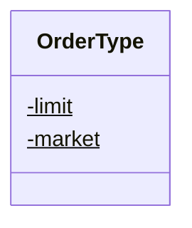

<div id="SideType-class-diagram"></div>

##### `SideType` class diagram

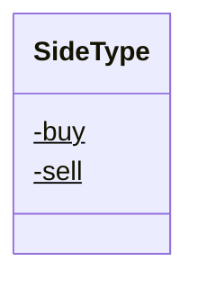

<div id="TriggerType-class-diagram"></div>

##### `TriggerType` class diagram

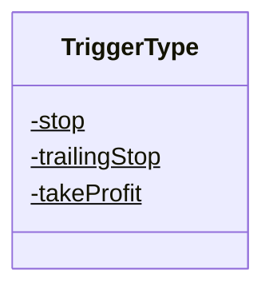

<div id="Client-class-diagram"></div>

##### `Client` class diagram

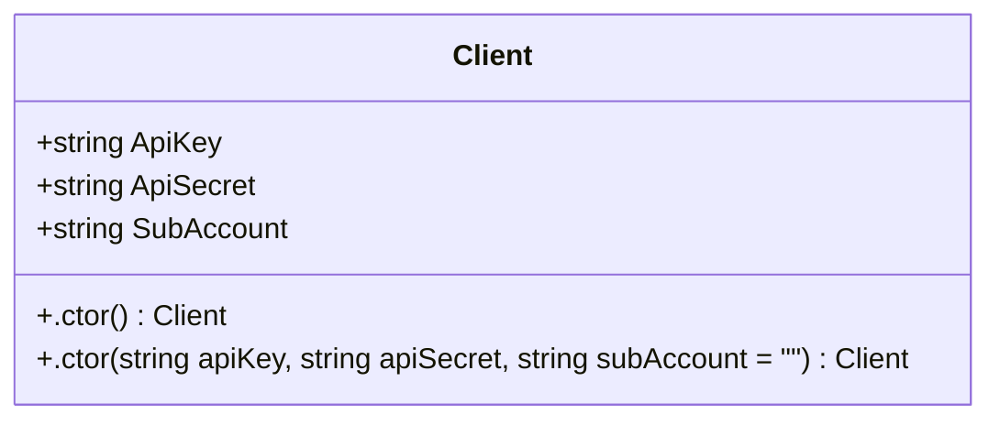

<div id="FtxRestApi-class-diagram"></div>

##### `FtxRestApi` class diagram

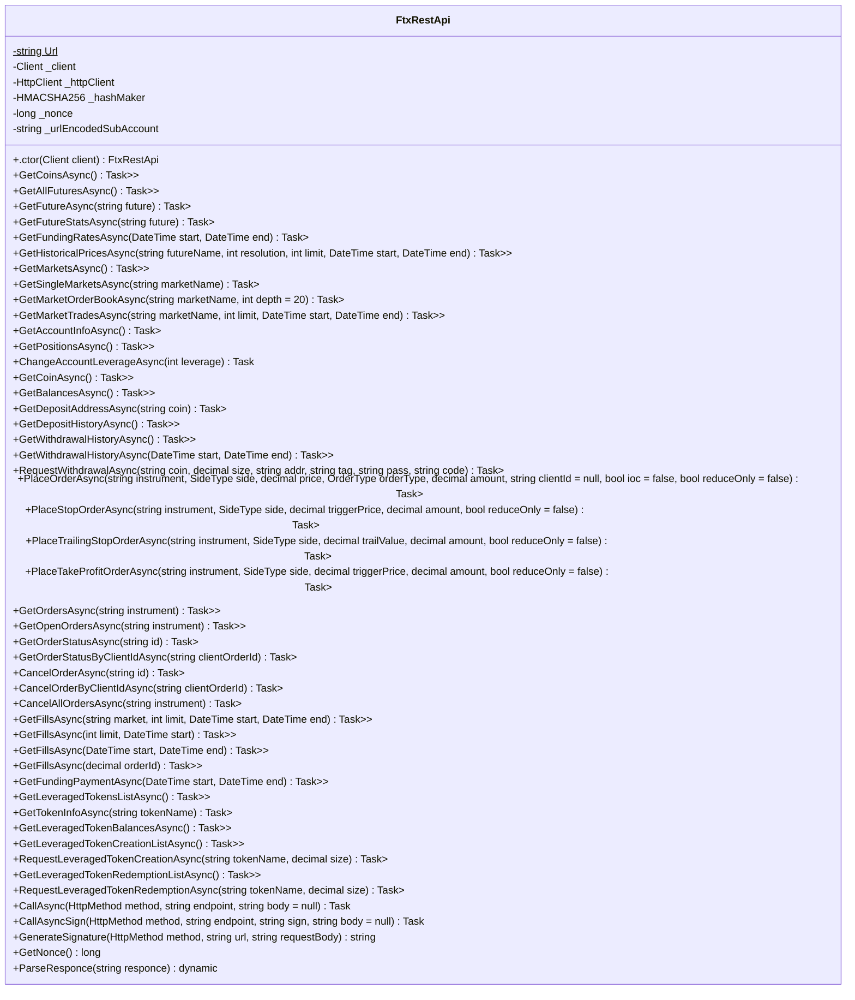

<div id="LeveragedToken-class-diagram"></div>

##### `LeveragedToken` class diagram

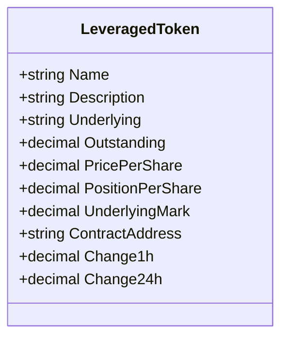

<div id="LeveragedTokenBalance-class-diagram"></div>

##### `LeveragedTokenBalance` class diagram

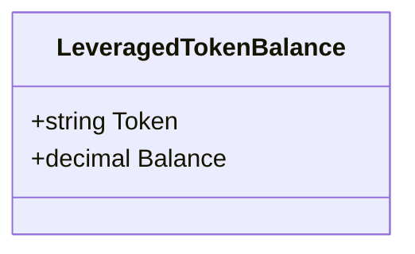

<div id="LeveragedTokenCreation-class-diagram"></div>

##### `LeveragedTokenCreation` class diagram

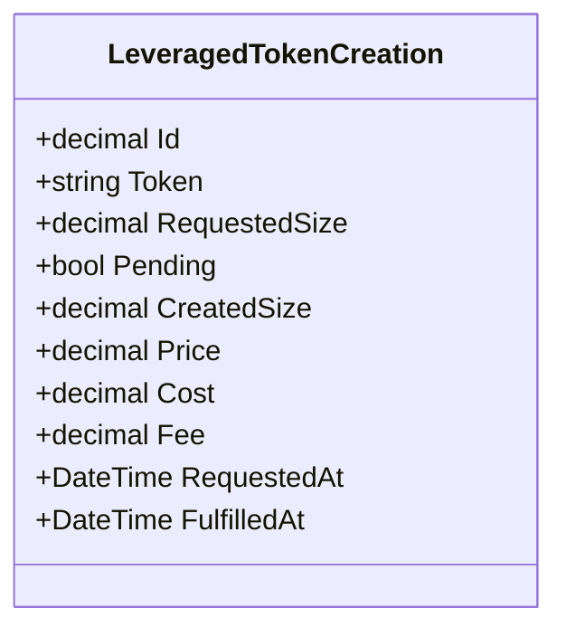

<div id="LeveragedTokenCreationRequest-class-diagram"></div>

##### `LeveragedTokenCreationRequest` class diagram

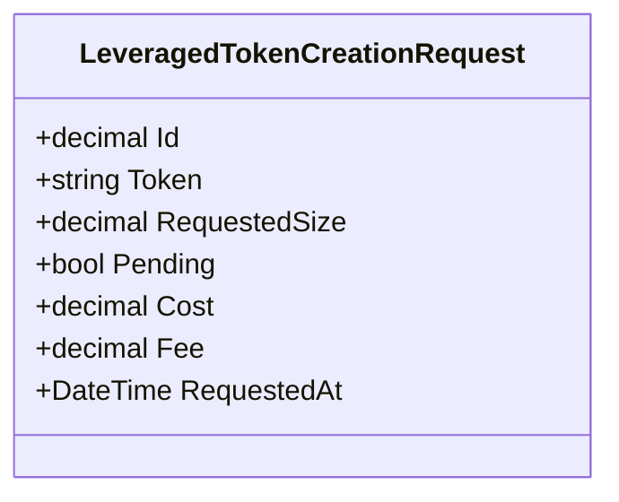

<div id="LeveragedTokenRedemption-class-diagram"></div>

##### `LeveragedTokenRedemption` class diagram

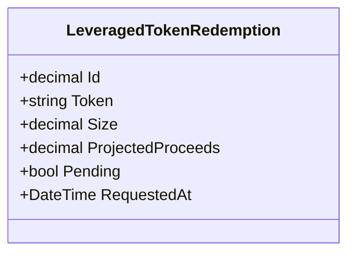

<div id="LeveragedTokenRedemptionRequest-class-diagram"></div>

##### `LeveragedTokenRedemptionRequest` class diagram

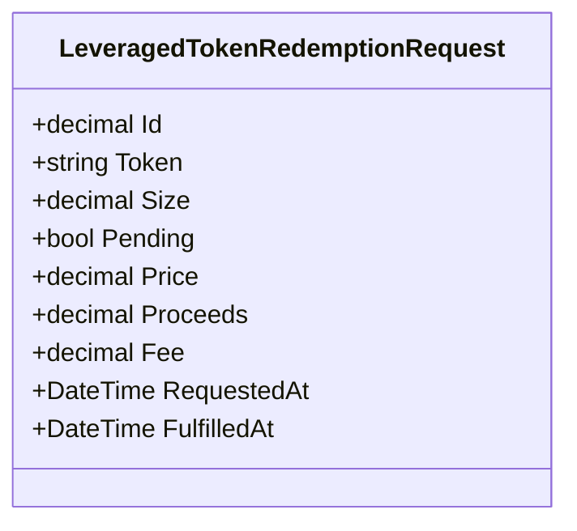

<div id="Market-class-diagram"></div>

##### `Market` class diagram

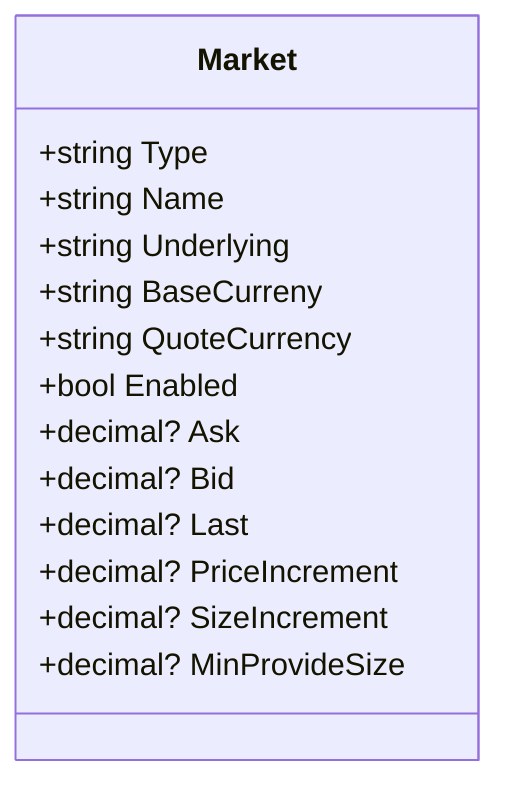

<div id="Orderbook-class-diagram"></div>

##### `Orderbook` class diagram

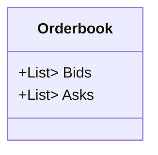

<div id="Trade-class-diagram"></div>

##### `Trade` class diagram

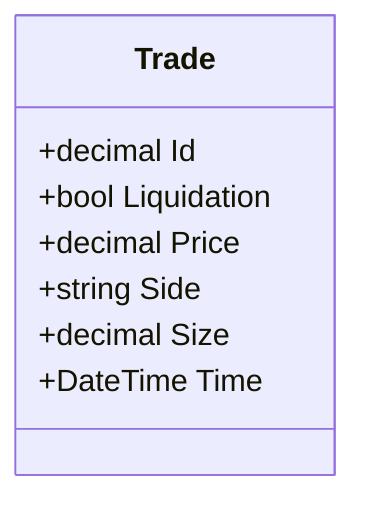

<div id="AccountInfo-class-diagram"></div>

##### `AccountInfo` class diagram

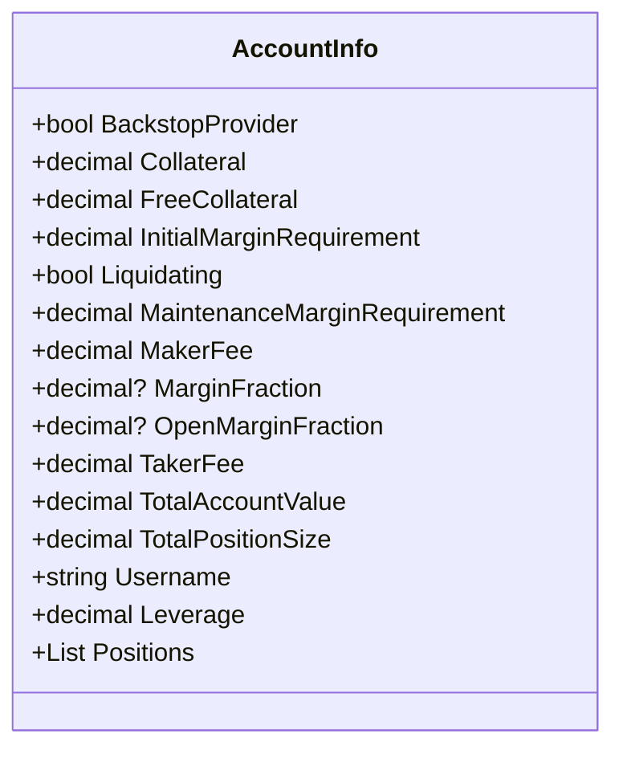

<div id="AccountLeverage-class-diagram"></div>

##### `AccountLeverage` class diagram

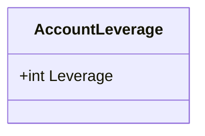

<div id="Balance-class-diagram"></div>

##### `Balance` class diagram

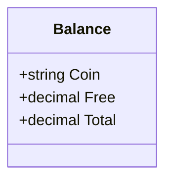

<div id="Candle-class-diagram"></div>

##### `Candle` class diagram

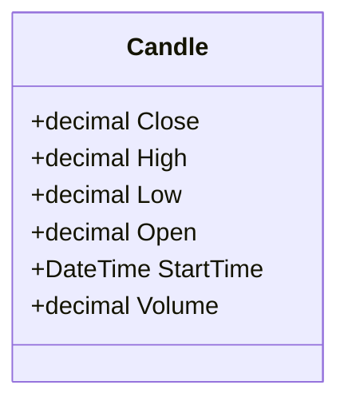

<div id="Coin-class-diagram"></div>

##### `Coin` class diagram

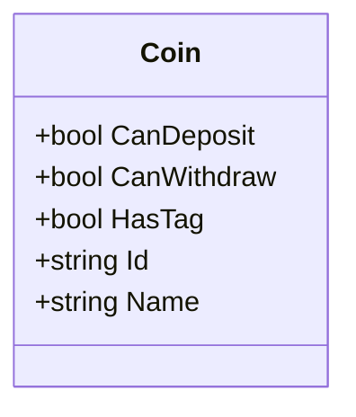

<div id="DepositAddress-class-diagram"></div>

##### `DepositAddress` class diagram

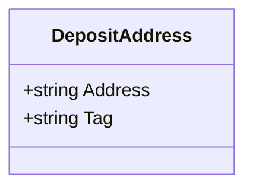

<div id="DepositHistory-class-diagram"></div>

##### `DepositHistory` class diagram

```mermaid
classDiagram
class DepositHistory{
    +string Coin
    +decimal Confirmations
    +DateTime ConfirmedTime
    +decimal Fee
    +decimal Id
    +DateTime SentTime
    +decimal Size
    +string Status
    +DateTime Time
    +string TxId
    +string Notes
}

```

<div id="Fill-class-diagram"></div>

##### `Fill` class diagram

```mermaid
classDiagram
class Fill{
    +decimal Fee
    +string FeeCurrency
    +decimal FeeRate
    +string Future
    +decimal Id
    +string Liquidity
    +string Market
    +string BaseCurrency
    +string QuoteCurrency
    +decimal? OrderId
    +decimal? TradeId
    +decimal Price
    +string Side
    +decimal Size
    +DateTime Time
    +string Type
}

```

<div id="FtxResult&lt;T&gt;-class-diagram"></div>

##### `FtxResult<T>` class diagram

```mermaid
classDiagram
class FtxResult<T>{
    +bool Success
    +T Result
    +string Error
}

```

<div id="FundingPayment-class-diagram"></div>

##### `FundingPayment` class diagram

```mermaid
classDiagram
class FundingPayment{
    +string Future
    +decimal Id
    +decimal Payment
    +DateTime Time
}

```

<div id="FundingRate-class-diagram"></div>

##### `FundingRate` class diagram

```mermaid
classDiagram
class FundingRate{
    +string Future
    +decimal Rate
    +DateTime Time
}

```

<div id="Future-class-diagram"></div>

##### `Future` class diagram

```mermaid
classDiagram
class Future{
    +decimal Ask
    +decimal Bid
    +decimal Change1h
    +decimal Change24h
    +decimal ChangeBod
    +decimal VolumeUsd24h
    +decimal Volume
    +string Description
    +bool Enabled
    +bool Expired
    +string Expiry
    +decimal Index
    +decimal ImfFactor
    +decimal Last
    +decimal LowerBound
    +decimal Mark
    +string Name
    +bool Perpetual
    +decimal PositionLimitWeight
    +bool PostOnly
    +decimal PriceIncrement
    +decimal SizeIncrement
    +string Underlying
    +decimal UpperBound
    +string Type
}

```

<div id="FutureStats-class-diagram"></div>

##### `FutureStats` class diagram

```mermaid
classDiagram
class FutureStats{
    +decimal Volume
    +decimal NextFundingRate
    +string NextFundingTime
    +decimal ExpirationPrice
    +decimal PredictedExpirationPrice
    +decimal OpenInterest
    +decimal StrikePrice
}

```

<div id="Order-class-diagram"></div>

##### `Order` class diagram

```mermaid
classDiagram
class Order{
    +DateTime CreatedAt
    +decimal? FilledSize
    +string Future
    +decimal? Id
    +string Market
    +decimal? Price
    +decimal? AvgFillPrice
    +decimal? RemainingSize
    +string Side
    +decimal? Size
    +string Status
    +string Type
    +bool ReduceOnly
    +bool Ioc
    +bool PostOnly
    +string ClientId
}

```

<div id="OrderStatus-class-diagram"></div>

##### `OrderStatus` class diagram

```mermaid
classDiagram
class OrderStatus{
    +DateTime CreatedAt
    +decimal? FilledSize
    +string Future
    +decimal? Id
    +string Market
    +decimal? Price
    +decimal? AvgFillPrice
    +decimal? RemainingSize
    +string Side
    +decimal? Size
    +string Status
    +string Type
    +bool ReduceOnly
    +bool Ioc
    +bool PostOnly
    +string ClientId
}

```

<div id="Position-class-diagram"></div>

##### `Position` class diagram

```mermaid
classDiagram
class Position{
    +decimal? CollateralUsed
    +decimal? Cost
    +decimal? EntryPrice
    +decimal? EstimatedLiquidationPrice
    +string Future
    +decimal? InitialMarginRequirement
    +decimal? LongOrderSize
    +decimal? MaintenanceMarginRequirement
    +decimal? NetSize
    +decimal? OpenSize
    +decimal? RealizedPnl
    +decimal? ShortOrderSize
    +string Side
    +decimal? Size
    +decimal? UnrealizedPnl
}

```

<div id="TriggerOrder-class-diagram"></div>

##### `TriggerOrder` class diagram

```mermaid
classDiagram
class TriggerOrder{
    +DateTime CreatedAt
    +string Future
    +decimal? Id
    +string Market
    +decimal? TriggerPrice
    +decimal? OrderId
    +string Side
    +decimal? Size
    +string Status
    +string Type
    +decimal? OrderPrice
    +string Error
    +DateTime? TriggeredAt
    +bool ReduceOnly
    +string OrderType
    +bool RetryUntilFilled
}

```

<div id="WithdrawalHistory-class-diagram"></div>

##### `WithdrawalHistory` class diagram

```mermaid
classDiagram
class WithdrawalHistory{
    +string Coin
    +string Address
    +string Tag
    +decimal Fee
    +decimal Id
    +decimal Size
    +string Status
    +string Time
    +string TxId
    +string Notes
    +string Method
}

```

<div id="DataAction&lt;T&gt;-class-diagram"></div>

##### `DataAction<T>` class diagram

```mermaid
classDiagram
class DataAction<T>{
    +T Data
    +string Action
}

```

<div id="FtxOrderBook-class-diagram"></div>

##### `FtxOrderBook` class diagram

```mermaid
classDiagram
class FtxOrderBook{
    +double time
    +long checksum
    +string action
    +List<double?[]> bids
    +List<double?[]> asks
    +string id
    +Copy() FtxOrderBook
    +GetTime() DateTimeOffset
}

```

<div id="FtxOrderBookHelper-class-diagram"></div>

##### `FtxOrderBookHelper` class diagram

```mermaid
classDiagram
class FtxOrderBookHelper{
    +GetFtxOrderBookPrice(double?[] array)$ double?
    +GetFtxOrderBookVolume(double?[] array)$ double?
}

```

<div id="FtxTicker-class-diagram"></div>

##### `FtxTicker` class diagram

```mermaid
classDiagram
class FtxTicker{
    +double bid
    +double ask
    +double bidSize
    +double askSize
    +double last
    +double time
    +string id
    +GetTime() DateTimeOffset
}

```

<div id="FtxWebsocketReceive-class-diagram"></div>

##### `FtxWebsocketReceive` class diagram

```mermaid
classDiagram
class FtxWebsocketReceive{
    -string Partial$
    -string Update$
    +string Channel
    +string Type
    +string Market
    +string ErrorMessage
}

```

<div id="FtxWebsocketReceive&lt;T&gt;-class-diagram"></div>

##### `FtxWebsocketReceive<T>` class diagram

```mermaid
classDiagram
class FtxWebsocketReceive<T>{
    +T Data
}

```

<div id="MarketState.FutureState-class-diagram"></div>

##### `MarketState.FutureState` class diagram

```mermaid
classDiagram
class FutureState{
    +string name
    +string underlying
    +string description
    +string type
    +DateTime? expiry
    +bool perpetual
    +bool expired
    +bool enabled
    +bool postOnly
    +double imfFactor
    +string underlyingDescription
    +string expiryDescription
    +DateTime? moveStart
    +double positionLimitWeight
    +string group
}

```

<div id="MarketState-class-diagram"></div>

##### `MarketState` class diagram

```mermaid
classDiagram
class MarketState{
    -string SpotType$
    -string FutureType$
    +string name
    +bool enabled
    +bool postOnly
    +double priceIncrement
    +double sizeIncrement
    +string type
    +string baseCurrency
    +string quoteCurrency
    +bool restricted
    +string underlying
    +bool highLeverageFeeExempt
    +FutureState future
    +string id
}

```

<div id="FtxRestApiFactory-class-diagram"></div>

##### `FtxRestApiFactory` class diagram

```mermaid
classDiagram
class FtxRestApiFactory{
    +CreateClient(string apiKey, string apiSecret, string subAccount = "")$ FtxRestApi
}

```

<div id="Util-class-diagram"></div>

##### `Util` class diagram

```mermaid
classDiagram
class Util{
    -DateTime _epochTime$
    +GetMillisecondsFromEpochStart()$ long
    +GetMillisecondsFromEpochStart(DateTime time)$ long
    +GetSecondsFromEpochStart(DateTime time)$ long
}

```

<div id="FtxSenderClientWebSocket-class-diagram"></div>

##### `FtxSenderClientWebSocket` class diagram

```mermaid
classDiagram
class FtxSenderClientWebSocket{
    +SendFtxPing(ClientWebSocket webSocket)$ Task
    +SubscribeFtxChannel(ClientWebSocket webSocket, string channel, string market)$ Task
    +SubscribeFtxChannel(ClientWebSocket webSocket, string channel)$ Task
    +UnSubscribeFtxChannel(ClientWebSocket webSocket, string channel)$ Task
    +UnSubscribeFtxChannel(ClientWebSocket webSocket, string channel, string market)$ Task
}

```

<div id="FtxWsMarkets-class-diagram"></div>

##### `FtxWsMarkets` class diagram

```mermaid
classDiagram
class FtxWsMarkets{
    -ILogger<FtxWsMarkets> _logger
    -FtxWebsocketEngine _engine
    -Dictionary<string, MarketState> _data
    -object _sync
    -Func<List<MarketState>, Task> ReceiveUpdates
    +string Url$
    +.ctor(ILogger<FtxWsMarkets> logger) FtxWsMarkets
    +Start() void
    +Stop() void
    +GetMarketStateById(string id, string type = null) MarketState
    +GetMarketState(string type = null) List<MarketState>
    +Dispose() void
    +Connect(ClientWebSocket webSocket) Task
    +Receive(ClientWebSocket webSocket, string msg) Task
    +SendPing(ClientWebSocket webSocket) Task
    +OnReceiveUpdates(List<MarketState> markets) Task
}

```

<div id="FtxWsOrderBooks-class-diagram"></div>

##### `FtxWsOrderBooks` class diagram

```mermaid
classDiagram
class FtxWsOrderBooks{
    -ILogger<FtxWsOrderBooks> _logger
    -FtxWebsocketEngine _engine
    -Dictionary<string, FtxOrderBook> _data
    -object _sync
    -IReadOnlyCollection<string> _marketList
    -Func<FtxOrderBook, Task> ReceiveUpdates
    +string Url$
    +.ctor(ILogger<FtxWsOrderBooks> logger, IReadOnlyCollection<string> marketList) FtxWsOrderBooks
    +Start() void
    +Stop() void
    +GetOrderBookById(string id) FtxOrderBook
    +GetOrderBooks() List<FtxOrderBook>
    +Dispose() void
    +Reset(string market) Task
    +Subscribe(string market) Task
    +Unsubscribe(string market) Task
    +Connect(ClientWebSocket webSocket) Task
    +Receive(ClientWebSocket webSocket, string msg) Task
    +SendPing(ClientWebSocket webSocket) Task
    +OnReceiveUpdates(FtxOrderBook orderBook) Task
}

```

<div id="FtxWsPrices-class-diagram"></div>

##### `FtxWsPrices` class diagram

```mermaid
classDiagram
class FtxWsPrices{
    -ILogger<FtxWsPrices> _logger
    -IReadOnlyCollection<string> _marketList
    -FtxWebsocketEngine _engine
    -Dictionary<string, FtxTicker> _data
    -object _sync
    -Func<FtxTicker, Task> ReceiveUpdates
    +string Url$
    +.ctor(ILogger<FtxWsPrices> logger, IReadOnlyCollection<string> marketList) FtxWsPrices
    +Start() void
    +Stop() void
    +GetMarketStateById(string id) FtxTicker
    +GetPrices() List<FtxTicker>
    +Dispose() void
    +Reset(string market) Task
    +Connect(ClientWebSocket webSocket) Task
    +Receive(ClientWebSocket webSocket, string msg) Task
    +SendPing(ClientWebSocket webSocket) Task
    +OnReceiveUpdates(FtxTicker price) Task
}

```

<div id="FtxWebsocketEngine-class-diagram"></div>

##### `FtxWebsocketEngine` class diagram

```mermaid
classDiagram
class FtxWebsocketEngine{
    +.ctor(string name, string url, int pingIntervalMSec, int silenceDisconnectIntervalMSec, ILogger logger) FtxWebsocketEngine
    +InitHeaders(ClientWebSocket clientWebSocket) void
}

```

<div id="ResultId.Data-class-diagram"></div>

##### `ResultId.Data` class diagram

```mermaid
classDiagram
class Data{
    +string id
}

```

<div id="Program-class-diagram"></div>

##### `Program` class diagram

```mermaid
classDiagram
class Program{
    -object consoleLock$
    -int receiveChunkSize$
    -bool verbose$
    +Main(string[] args)$ Task
    +TestRestApi()$ Task
    +TestWebSocket()$ void
    +UseFtxWsPrices(ILoggerFactory loggerFactory)$ void
    +UseFtxWsOrderBooks(ILoggerFactory loggerFactory)$ void
    +UseFtxWsMarkets(ILoggerFactory loggerFactory)$ void
    +UseWebSocket(ILogger<Program> logger)$ void
    +ReceiveFromFtx(ClientWebSocket webSocket, string msg)$ Task
    +SendPingFtx(ClientWebSocket webSocket)$ Task
    +ConnectFtx(ClientWebSocket webSocket)$ Task
}

```

<div id="ResultId-class-diagram"></div>

##### `ResultId` class diagram

```mermaid
classDiagram
class ResultId{
    +Data result
}

```

*This file is maintained by a bot.*

<!-- markdownlint-restore -->
